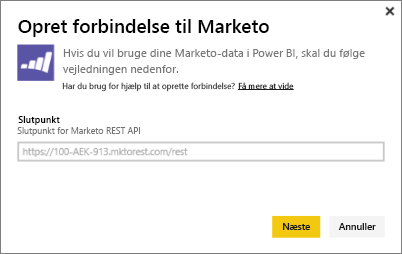
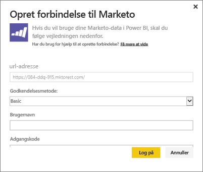
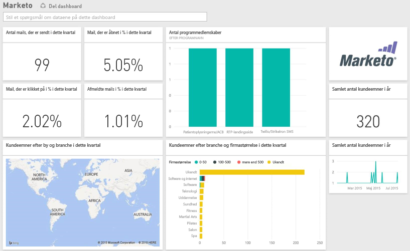

# Opret forbindelse til Marketo med Power BI
Power BI-indholdspakken til Marketo giver dig mulighed at få indsigt i din Marketo-konto med data om kundeemner og de tilhørende aktiviteter. Når du opretter denne forbindelse, hentes dine data, og du får automatisk et dashboard og relaterede rapporter baseret på disse data.

Opret forbindelse til [Marketo-indholdspakken](https://app.powerbi.com/getdata/services/marketo) til Power BI.

## Sådan opretter du forbindelse
1. Vælg **Hent data** nederst i venstre navigationsrude.
   
   
2. Vælg **Hent** i feltet **Tjenester**.
   
    
3. Vælg **Marketo** \> **Hent**.
   
   
4. Angiv det Marketo REST-slutpunkt, der er leveret til dig af Marketo eller Marketo-administratoren, og vælg Næste.
   
   
   
   Læs mere om Marketo REST-slutpunktet: [http://developers.marketo.com/documentation/rest/endpoint-url/ ](http://developers.marketo.com/documentation/rest/endpoint-url/).
5. Angiv kunde-id'et som **brugernavnet** og kundehemmeligheden som **adgangskoden** ved hjælp af den **grundlæggende** godkendelsesmetode. Kunde-id og kundehemmelighed er tilgængelige i Marketo eller kan fås fra administratoren af Marketo ([http://developers.marketo.com/documentation/rest/custom-service/](http://developers.marketo.com/documentation/rest/custom-service/)). 
   
   
   
   Det giver *Marketo for Power BI*-indholdspakken adgang til dine [Marketo-analysedata](https://powerbi.microsoft.com/integrations/marketo) og giver dig mulighed for at analysere dataene i Power BI. Dataene opdateres én gang om dagen.
6. Når du har forbindelse til din Marketo-konto, indlæses et dashboard med alle dine data:
   
   

**Hvad nu?**

* Prøv [at stille et spørgsmål i feltet Spørgsmål og svar](power-bi-q-and-a.md) øverst i dashboard'et
* [Rediger felterne](service-dashboard-edit-tile.md) i dashboard'et.
* [Vælg et felt](service-dashboard-tiles.md) for at åbne den underliggende rapport.
* Dit datasæt vil være planlagt til daglig opdatering. Du kan dog ændre tidsplanen for opdatering eller forsøge at opdatere efter behov ved hjælp af **Opdater nu**

## Følgende er inkluderet
Følgende data er tilgængelige fra Marketo i Power BI, hvor aktiviteten fandt sted mellem dags dato og for et år siden:

| Tabelnavn | Beskrivelse |
| --- | --- |
| EmailActivities |Data om mail, der er sendt til kundeemner/kontakter med detaljerede oplysninger om enheder, kategorier, antal og procentdel af manglende levering, antal og procentdel af klik, antal og procentdel af åbnede samt programnavn. Mailaktiviteterne som vist i Power BI er en rapport om absolut leveringsevne for mail. Der anvendes ikke nogen yderligere logik på dataene. Du kan se nogle forskellige resultater mellem Marketo-klienten og Power BI på grund af dette. |
| ProgramActivites |Data om programmer, der har fået en ændring af Status. Dette omfatter oplysninger som: årsag, succes, antal og procentdel af programkøb og antal og procentdel af programsucces. |
| WebPageActivities |Data fra brugerbesøg på webside, herunder søgeagent, brugeragent, webside og tidspunkt på dagen. |
| Datetable |Datoer fra dags dato og det sidste år.  Gør det muligt at analysere dine Marketo-data efter dato. |
| Leads |Oplysninger om kundeemner såsom virksomhed, indtægtsstørrelse, antal medarbejdere, land, industri, point for kundeemner og status for kundeemner. Kundeemner hentes på baggrund af deres forekomst i dataene for mail-, program- og websideaktiviteter. |

Alle datoer er i UTC. Alt efter hvilken tidszone din konto er i, kan datoer variere (som det på tilsvarende måde ses i Marketo-klienten)

## Systemkrav
* Den Marketo-konto, du bruger til at oprette forbindelse, har tilladelse til at få adgang til kundeemner og aktiviteter.
* Tilstrækkelige tilgængelige API-kald til at oprette forbindelse til dataene.  Marketo har en API til hver enkelt konto.  Når grænsen er nået, kan du ikke indlæse data i Power BI. 

**Oplysninger om API-grænser**

Import af data fra Marketo bruger Marketo API'er. Hver Marketo-kunde har en samlet grænse på 10.000 API-kald pr. dag, der er delt mellem alle programmer, som bruger Marketo API'erne. Du må bruge API'erne til andre integrationer samt Power BI-integrationen. Du kan få flere oplysninger om API'erne her: <http://developers.marketo.com/documentation/rest/>.

Mængden af API-kald, som Power BI foretager til Marketo, afhænger af datamængden på din Marketo-konto. Power BI importerer alle kundeemner og aktiviteter for det sidste år. Her er et eksempel på data fra Marketo og mængden af API-kald, der bruges af Power BI, når du importerer:  

| Datatype | Antal rækker | API-kald |
| --- | --- | --- |
| Oplysninger om kundeemner |15.000 |50 |
| Mailaktiviteter |150.000 |1.000 |
| Programaktiviteter |15.000 |100 |
| Webaktiviteter |150.000 |1.000 |
| Programændringer |7.500 |50 |
| **Samlet antal API-opkald** | |**2.200** |

## Næste trin
[Kom i gang med Power BI](service-get-started.md)

[Hent data til Power BI](service-get-data.md)

[Power BI-blog: Overvåg og analysér dine Marketo-data med Power BI](http://blogs.msdn.com/b/powerbi/archive/2015/03/19/monitor-and-analyze-your-marketo-data-with-power-bi.aspx)

