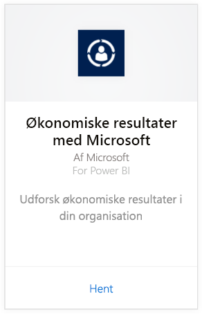
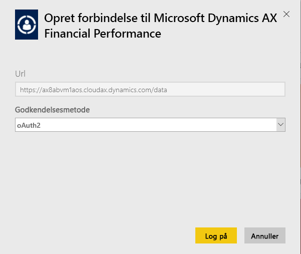
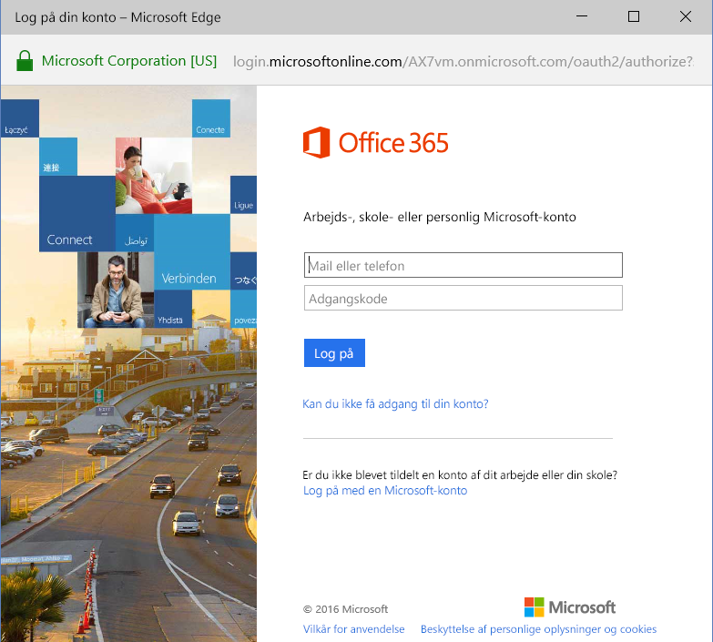
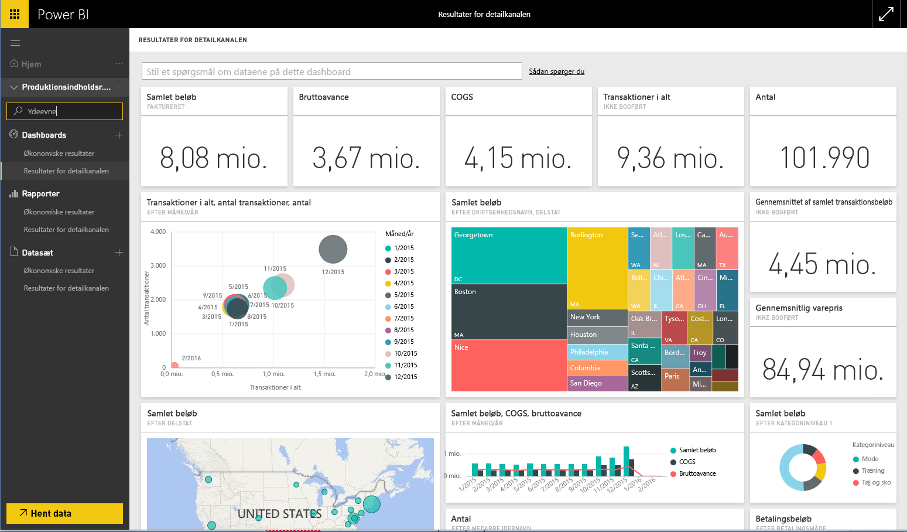

# Opret forbindelse til Microsoft Dynamics AX-indholdspakken med Power BI
Microsoft Dynamics AX har tre Power BI-indholdspakker målrettet mod forskellige virksomhedsbrugere. Indholdspakken Financial Performance, som er udviklet specielt til økonomidirektører, giver adgang til indsigt i organisationens økonomiske resultater. Indholdspakken Retail Channel Performance, som er rettet mod kanalledere, fokuserer på salgsresultater for at forudsige tendenser og skabe indsigt ved at trække direkte fra detail- og handelsdata. Cost Management er designet til driftschefer og økonomidirektører og giver oplysninger om driftsresultaterne.

Opret forbindelse til Microsoft Dynamics AX-indholdspakken [Retail Channel Performance](https://app.powerbi.com/getdata/services/dynamics-ax-retail-channel-performance), [Financial Performance](https://app.powerbi.com/getdata/services/dynamics-ax-financial-performance) eller [Cost Management](https://app.powerbi.com/getdata/services/dynamics-ax-cost-management) til Power BI.

## Sådan opretter du forbindelse
1. Vælg **Hent data** nederst i venstre navigationsrude.
   
   
2. Vælg **Hent** i feltet **Tjenester**.
   
   
3. Vælg en af Dynamics AX-indholdspakkerne, og vælg **Hent**.
   
   
4. Angiv webadressen til dit Dynamics AX 7-miljø. Se detaljer om at [finde de pågældende parametre](#FindingParams) nedenfor.
   
   
5. Som **Godkendelsesmetode** skal du vælge **oAuth2** \> **Log på**. Angiv dine Dynamics AX-legitimationsoplysninger, når du bliver bedt om dem.
   
    
   
    
6. Efter godkendelsen starter importprocessen automatisk. Når processen er fuldført, vises et nyt dashboard samt en ny rapport og model i navigationsruden. Vælg dashboardet for at få vist de importerede data.
   
     

**Hvad nu?**

* Prøv [at stille et spørgsmål i feltet Spørgsmål og svar](consumer/end-user-q-and-a.md) øverst i dashboard'et
* [Rediger felterne](service-dashboard-edit-tile.md) i dashboard'et.
* [Vælg et felt](consumer/end-user-tiles.md) for at åbne den underliggende rapport.
* Selvom dit datasæt opdateres dagligt, kan du ændre tidsplanen for opdatering eller prøve at opdatere det efter behov ved hjælp af **Opdater nu**

## Det følgende er inkluderet
Indholdspakken bruger Dynamics AX 7 OData-feedet, til at importere data, som relaterer til resultater for henholdsvis detailkanalen (Retail Channel Performance), økonomi (Financial Performance) og omkostningsstyring (Cost Management).

## Systemkrav
Denne indholdspakke kræver en webadresse til Dynamics AX 7-miljøet, og brugeren skal have adgang til OData-feedet.

## Sådan finder du parametre

Webadressen til Dynamics AX 7-miljøet kan findes i browseren, når brugeren logger på. Du skal blot kopiere webadressen for Dynamics AX-rodmiljøet til Power BI-dialogboksen.

## Fejlfinding
Det kan tage et stykke tid at indlæse dataene afhængigt af størrelsen på din forekomst. Hvis du får vist tomme rapporter i Power BI, skal du bekræfte, at du har adgang til de OData-tabeller, der kræves for rapporterne.

## Næste trin
[Kom i gang med Power BI](service-get-started.md)

[Hent data i Power BI](service-get-data.md)

