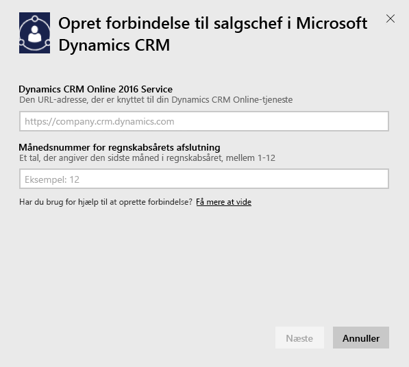
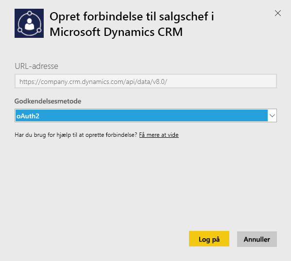
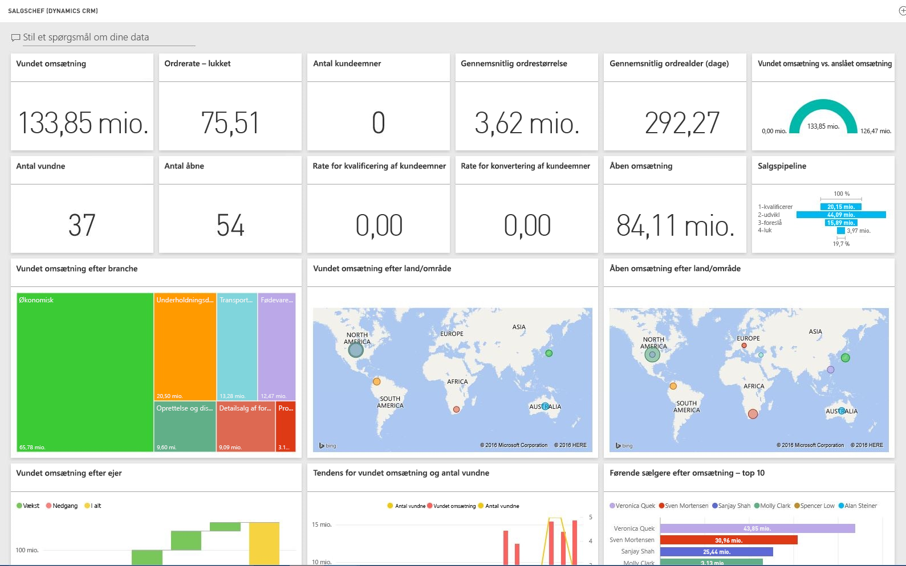

# Opret forbindelse til Microsoft Dynamics CRM med Power BI
Med Microsoft Dynamics CRM Online til Power BI kan du nemt få adgang til og analysere dine data. Power BI bruger OData-feedet til at oprette en beskrivende model med alle de enheder og -mål, der skal bruges, som f.eks konti, aktiviteter, salgsmuligheder, produkt, kundeemner, brugere og meget mere. Når du har installeret appen, kan du få vist dashboardet og rapporterne i Power BI-tjenesten ([https://powerbi.com](https://powerbi.com)) og i Power BI-mobilappsene. 

Opret forbindelse til [Salgschef](https://msit.powerbi.com/groups/me/getdata/services/dynamics-crm-sales-manager) eller [Service Manager](https://msit.powerbi.com/groups/me/getdata/services/dynamics-crm-customer-service) i Dynamics CRM Online. Læs mere om [Dynamics CRM Online-integration](https://powerbi.microsoft.com/integrations/microsoft-dynamicscrm) med Power BI.

Denne forbindelse kræver **Microsoft Dynamics CRM Online 2016 eller nyere**. Der er flere oplysninger om [kravene](#Requirements) nedenfor.

## Sådan opretter du forbindelse
[!INCLUDE [powerbi-service-apps-get-more-apps](./includes/powerbi-service-apps-get-more-apps.md)]

1. Vælg **Microsoft Dynamics CRM Salgschef** eller **Microsoft Dynamics CRM Service Manager**, og klik på **Opret forbindelse**.
   
   
2. Angiv den URL-adresse til tjeneste, som er knyttet til din konto.  Dette vil være i formatet `https://company.crm.dynamics.com`. Du kan se flere detaljer [nedenfor](#FindingParams).
   
   
3. Når du bliver spurgt, kan du angive dine legitimationsoplysninger (dette trin kan springes over, hvis du allerede er logget på med din browser). Til godkendelsesmetode kan du angive **oAuth2** og klikke på **Log på**:
   
   
4. Når du har forbindelse, får du vist et dashboard, der er tilpasset en Salgschef eller Service Manager, og som er udfyldt med dine egne data:
   
   

## Få vist Microsoft Dynamics CRM-dashboard og -rapporter
[!INCLUDE [powerbi-service-apps-open-app](./includes/powerbi-service-apps-open-app.md)]

[!INCLUDE [powerbi-service-apps-open-app](./includes/powerbi-service-apps-what-now.md)]

## Følgende er inkluderet
I afsnittene nedenfor er det detaljeret beskrevet, hvad der er inkluderet for personerne [Salgschef](#Sales) og [Service Manager](#Service).

Bemærk, at data desuden er begrænset på baggrund af den sikkerhedsrolle, der er tildelt Dynamics CRM Online-brugeren.

Dashboards og rapporter er beregnet til at angive driftsmæssig rapportering om data i nærmeste fremtid med fokus på et team eller en gruppe. Hver forespørgsel er begrænset til at hente højst 100 K poster fra Dynamics CRM Online. Hvis grænsen overskrides på grund af en stor mængde data i din organisation, mislykkes klargøringen, da dataopdatering af Dynamics CRM Online afbrydes. Hvis din konto er for stor, bør du overveje at oprette forbindelse via Power BI Desktop for at oprette en brugerdefineret løsning.

### Salgschef
Dashboardet og rapporterne indeholder vigtige målinger som f.eks.:  

* Accepteret indtægt   
* Vindingsfrekvens   
* Åben indtægt   
* Mistet indtægt   
* Forventet indtægt  
* Gennemsnitlig deal-størrelse og meget mere.  

De indeholder også nøglediagrammer som f.eks.:  

* Tendens for accepteret og mistet indtægt, tendens for accepteret indtægt over for anslået indtægt  
* Accepteret indtægt efter forskellige dimensioner som f.eks. branche, område, distrikt   
* Førende sælgere efter indtægt, aktiviteter   
* Top konti, top vundne/mistede deals    
* Tendens inden for nye kundeemner, salgspipeline og meget mere.   

Disse målinger og diagrammer giver en forståelse af, hvordan salgsorganisationens klarer sig og analyserer salgspipelines for hele salgsteamet.

Følgende tabel viser de CRM-enheder, der er tilgængelige for tjenesten, og indeholder også oplysninger om de filtre, der er anvendt til hver enkelt af enhedens poster.

| CRM-enhed | Anvendte filtre |
| --- | --- |
| Konto |Alle konti, der er relateret til salgsmuligheder, som er blevet ændret inden for de sidste 365 dage. |
| Aktivitet |Alle aktiviteter, der er ændret inden for de sidste 90 dage   [modifiedon] > i dag – 90 dage |
| Afdeling |Alle afdelinger, som ikke er deaktiveret   [isdisabled] = falsk |
| Kundeemne |Alle kundeemner, der er ændret inden for de sidste 180 dage   [modifiedon] > i dag – 180 dage |
| Salgsmulighed |Alle salgsmuligheder, der er ændret inden for de sidste 365 dage   [modifiedon] > i dag – 365 dage |
| Produkt til salgsmulighed |Alle produkter til salgsmulighed, der er ændret inden for de sidste 365 dage   [modifiedon] > i dag – 365 dage |
| Produkt |Alle aktive produkter   [statecode] <> 1 |
| Distrikt |Alle distrikter |
| Bruger |Alle aktive brugere og ikke-delegerede administratorer    [isdisabled] = falsk og [accessmode] <> 4 |

### Service Manager
Disse dashboards og rapporter indeholder vigtige målinger som f.eks.:  

* CSAT-procentdel   
* Procentdel for opfyldt SLA   
* Procentdel af eskalerede sager   
* Gennemsnitlig håndteringstid   
* Afsluttede sager i alt  
* Aktive sager i alt  
* Antal gange KB-artiklen er anvendt til sager og meget mere.    

De indeholder også nøglediagrammer som f.eks.:   

* Tendenser inden for sagsvolumen for indgående sager, afsluttede sager, eskalerede sager   
* Sagsvolumen efter forskellige dimensioner som f.eks. oprindelse, placering, prioritet, type  
* Førende efter CSAT-procentdel, procentdel for opfyldt SLA, aktiviteter, afsluttede sager  
* Mest anvendte og mest viste KB-artikler og meget mere.  
    Disse målinger og diagrammer er med til at give en forståelse af, hvordan supportorganisationen klarer sig, og hjælper med at analysere arbejdsbelastningen af aktive sager for hele serviceteamet og i servicekøer.

Følgende tabel viser de CRM-enheder, der er tilgængelige for denne tjeneste, samt detaljer om de filtre, der er anvendt til hver enkelt af enhedens poster.

| CRM-enhed | Anvendte filtre |
| --- | --- |
| Konto |Alle konti, der har relaterede sager, som er blevet ændret inden for de sidste 90 dage. |
| Aktivitet |Alle aktiviteter, der er ændret inden for de sidste 90 dage   [modifiedon] > i dag – 90 dage |
| Sag |Alle kundeemner, der er ændret inden for de sidste 90 dage   [modifiedon] > i dag – 90 dage |
| Aktivitet med afslutning af sager |Alle aktiviteter med afslutning af sager, der er ændret inden for de sidste 90 dage   [modifiedon] > i dag – 90 dage |
| Kontakt |Alle kontakter, der har relaterede sager, som er ændret inden for de sidste 90 dage. |
| Videnartikel |Alle seneste versioner af videnartikler    [islatestversion] = sandt |
| Hændelse med videnartikel |Alle hændelser med videnartikler, der er ændret inden for de sidste 90 dage   [modifiedon] > i dag – 90 dage |
| Kø |Alle aktive køer    [statecode] <> 0 |
| Køelement |Alle sagsrelaterede køelementer, der er oprettet i de sidste 365 dage    [createdon] > i dag – 365 dage og   [objecttypecode] = 112 |
| Bruger |Alle aktive brugere    [isdisabled] = falsk |

## Systemkrav
* En gyldig forekomst af Dynamics CRM Online 2016 eller nyere (Power BI fungerer ikke i CRM-versioner i det lokale miljø). Hvis du ikke har 2016 eller nyere:
* En administrator skal aktivere OData-slutpunktet i indstillingerne for webstedet.
* En konto med mindre end 100 K poster i en af tabellerne. Bemærk, at hvis kontoen har adgang til mere end 100 K poster, mislykkes importen.

## Søgning efter parametre
Adressen til forekomsten kan findes på URL-adresselinjen i browseren. Den har typisk formatet: `https://[instance_name].crm.dynamics.com`.

Power BI understøtter kun Dynamics CRM 2016-slutpunkter. Forbindelsen vil ikke fungere med tidligere versioner af CRM Online. Du kan bruge Power BI Desktop til at oprette direkte forbindelse til din konto.

## Fejlfinding
Hvis du har problemer med at oprette forbindelse, skal du bekræfte:  

* At du angiver den rigtige forekomst af URL-adressen (kontakt administratoren)  
* At forekomsten er CRM Online 2016  
* At OData-slutpunktet er aktiveret  

Prøv desuden at oprette forbindelse direkte i Power BI Desktop med OData-URL-adressen `https://[instance_name].crm.dynamics.com/api/data/v8.0/`.

Hvis du bekræfter, at du har Dynamics CRM Online 2016, men du stadig har problemer med at oprette forbindelse, kan du kontakte din CRM-administrator for at få bekræftet, at du har alle tilgængelige opdateringer.

Hvis du ikke har CRM Online 2016 eller nyere, kan du bruge Power BI Desktop til at oprette direkte forbindelse til din konto.

Hvis du får vist fejlmeddelelsen "Data refresh failed as query exceeded the maximum limit of 100000 records" (Opdatering af data mislykkedes, da forespørgslen overskred den maksimale grænse på 100000 poster), kan du overveje at oprette forbindelse direkte fra Power BI Desktop eller at bruge CRM-løsningsskabelonen.

## Næste trin
* [Hvad er apps i Power BI?](service-install-use-apps.md)
* [Hent data i Power BI](service-get-data.md)
* Har du flere spørgsmål? [Prøv at spørge Power BI-community'et](http://community.powerbi.com/)

