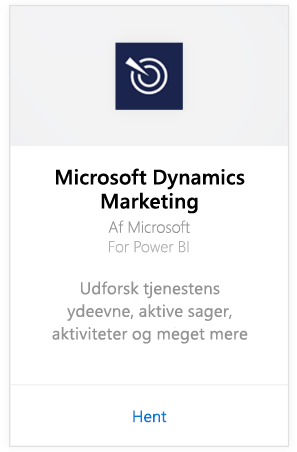
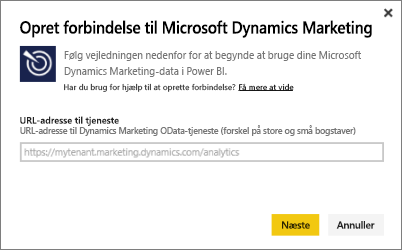
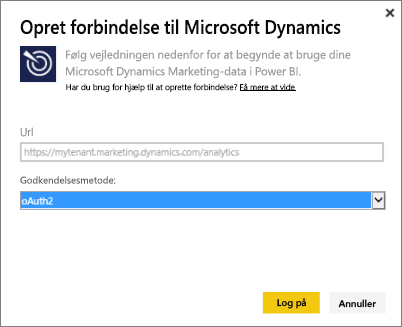
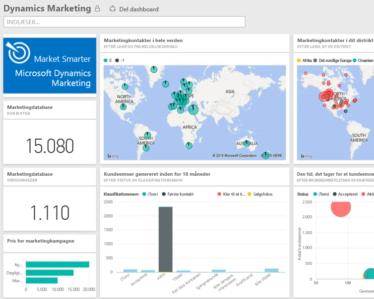

# Opret forbindelse til Microsoft Dynamics Marketing med Power BI
Med Microsoft Dynamics Marketing-indholdspakken til Power BI kan du nemt få adgang til og analysere dine data fra Dynamics Marketing. Indholdspakken bruger en beskrivende model, som lægges oven på OData-feed'et, med alle de enheder og mål, der skal bruges, som f.eks. programmer, kampagner, marketingkontakter og firmaer, kundeemner, kundeemneinteraktioner og kundemnepoint, marketingmails og websteder, funktionsmæssige bemærkninger, budgetter, finansielle transaktioner, nøgletal for ydeevne og meget mere. 

Opret forbindelse til [Dynamics Marketing-indholdspakken](https://app.powerbi.com/getdata/services/microsoft-dynamics-marketing) til Power BI.

>[!NOTE]
>Du skal angive en gyldig URL-adresse til OData for en Dynamics Marketing-forekomst (indholdspakken fungerer ikke med en lokal CRM-version). Se flere krav nedenfor.

## Sådan opretter du forbindelse
1. Vælg Hent data nederst i venstre navigationsrude.
   
    
2. Markér **Hent** i feltet **Tjenester**.
   
    
3. Vælg **Microsoft Dynamics Marketing** \> **Hent**.
   
   
4. Angiv den URL-adresse til OData, som er knyttet til din konto.  Denne vil være i formatet "https://[instance\_name].marketing.dynamics.com/analytics."
   
   
5. Når du bliver spurgt, kan du angive dine legitimationsoplysninger (dette trin kan springes over, hvis du allerede er logget på med din browser). For godkendelsesmetode skal du angive **oAuth2** og klikke på **Log på**:
   
   
6. Når du har forbindelse, får du vist et Dynamics Marketing-dashboard, der er udfyldt med dine egne data. De gule stjerner markerer de nye elementer i venstre navigationsrude.
   
   

**Hvad nu?**

* Prøv [at stille et spørgsmål i feltet Spørgsmål og svar](power-bi-q-and-a.md) øverst i dashboard'et
* [Rediger felterne](service-dashboard-edit-tile.md) i dashboard'et.
* [Vælg et felt](service-dashboard-tiles.md) for at åbne den underliggende rapport.
* Dit datasæt vil være planlagt til daglig opdatering. Du kan dog ændre tidsplanen for opdatering eller forsøge at opdatere efter behov ved hjælp af **Opdater nu**

## Systemkrav
* Du skal angive en gyldig URL-adresse til OData for en Dynamics Marketing-forekomst (indholdspakken fungerer ikke med en lokal CRM-version).  
* En administrator skal aktivere OData-slutpunktet i indstillingerne for webstedet. Du kan finde adressen på OData-slutpunktet ved at gå til **Hjem \> Indstillinger \> Indstillinger for websted** i afsnittet **Organisationsdatatjeneste**.  URL-adressen til OData har formatet:  https://[instance\_name].marketing.dynamics.com/analytics  
* Den brugerkonto/identitet, du bruger til at få adgang til Microsoft Dynamics Marketing, skal være den samme som den, du er tilmeldt til brug med Power BI. Når du logger på Microsoft Dynamics Marketing, bliver du automatisk logget på med det samme id, du bruger til Power BI. Hvis du vil logge på Microsoft Dynamics Marketing med en anden konto, skal du registreres som en Power BI-bruger, der bruger den anden konto. Vi håber at kunne løse dette problem i en kommende version.   

## Fejlfinding
Hvis du ser meddelelsen "Kunne ikke logge på", når du forsøger at oprette forbindelse til din Dynamics CRM-konto, skal du bekræfte, at du logger på Power BI med den samme konto, du vil bruge til at få adgang til CRM Online OData-feed'et. Du kan også prøve at logge på feed'et i din browser, hvis du vil teste den der.

Bed administratoren om at bekræfte den korrekte URL-adresse til OData, og at OData-slutpunktet er aktiveret.

Kontrollér den version af Dynamics Marketing, du bruger – der blev foretaget yderligere rettelser i 18.0 og 18.1. Hvis du stadig har problemer og kører med en ældre version, kan du overveje at opgradere.

Hvis du stadig har problemer, kan du åbne en supportanmodning for at kontakte Power BI-teamet:

* I Power BI-appen skal du vælge spørgsmålstegnet \> **Kontakt support**.
* Fra webstedet for Power BI-support (hvor du læser denne artikel) skal du vælge **Kontakt Support** til højre på siden.

## Næste trin
[Hent Data til Power BI](service-get-data.md)

[Kom i gang med Power BI](service-get-started.md)

