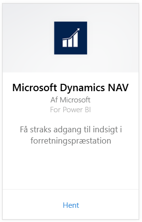
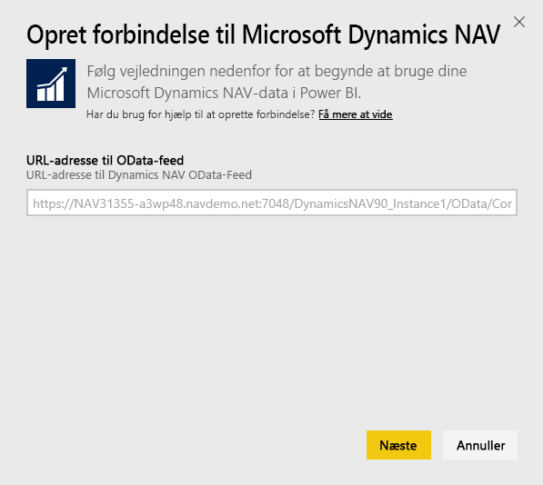
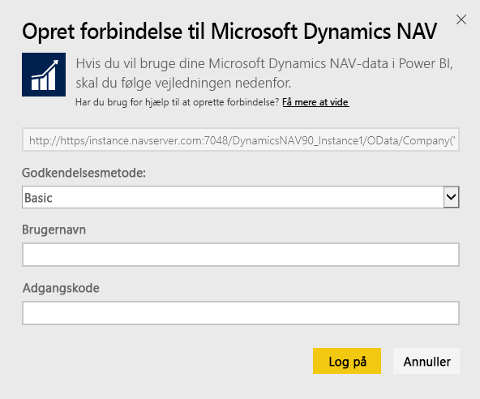
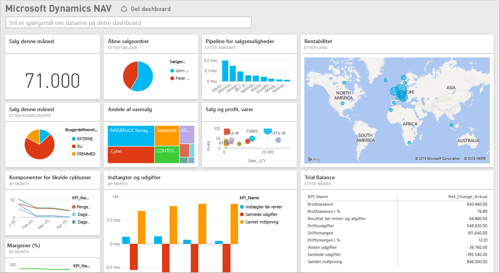

# Opret forbindelse til Microsoft Dynamics NAV med Power BI
Det er nemt at få indsigt i dine Microsoft Dynamics NAV-data med Power BI. Power BI henter dine data, både salg og finans, og opbygger derefter en app med et dashboard og rapporter, der er baseret på disse data. Power BI skal bruge dine tilladelser til de tabeller, som data hentes fra, i dette tilfælde salgs- og finansdata. Flere oplysninger om kravene nedenfor. Når du har installeret appen, kan du få vist dashboardet og rapporterne i Power BI-tjenesten ([https://powerbi.com](https://powerbi.com)) og i Power BI-mobilapperne. 

[Opret forbindelse til Microsoft Dynamics NAV til Power BI](https://app.powerbi.com/getdata/services/microsoft-dynamics-nav), eller få yderligere oplysninger om [Dynamics NAV-integration](https://powerbi.microsoft.com/integrations/microsoft-dynamics-nav) med Power BI.

## Sådan opretter du forbindelse
[!INCLUDE [powerbi-service-apps-get-more-apps](./includes/powerbi-service-apps-get-more-apps.md)]

1. Vælg **Microsoft Dynamics NAV**, og vælg derefter **Hent**.  
   
2. Når du bliver spurgt, skal du angive din Microsoft Dynamics NAV OData URL-adresse. URL-adressen skal ligne følgende mønster:
   
    `https//instance.navserver.com:7048/DynamicsNAV90_Instance1/OData/Company('CRONUS%20International%20Ltd.')`
   
   * "instance.navserver.com" med navn på din NAV-server
   * "DynamicsNAV90\_Instance1" med navn på din NAV-serverforekomst
   * "Company('CRONUS%20International%20Ltd.')" med dit NAV-firmanavn
     
     Det er nemt at hente denne URL-adresse ved i Dynamics NAV at gå til Web-tjenester, finde powerbifinance-webtjenesten og kopiere OData URL-adressen, men udelade "/ powerbifinance" fra URL-adressestrengen.  
     
3. Vælg **Basic**, og angiv dine legitimationsoplysninger til Microsoft Dynamics NAV.
   
    Du skal have legitimationsoplysninger som administrator (eller i det mindste tilladelser til salgs- og finansdata) til din Microsoft Dynamics NAV-konto.  Kun basisgodkendelse (brugernavn og adgangskode) understøttes i øjeblikket.
   
    
4. Power BI henter dine Microsoft Dynamics NAV-data og opretter et brugsklart dashboard og en rapport for dig.   
   

## Få vist dashboardet og rapporterne
[!INCLUDE [powerbi-service-apps-open-app](./includes/powerbi-service-apps-open-app.md)]

[!INCLUDE [powerbi-service-apps-open-app](./includes/powerbi-service-apps-what-now.md)]

## Følgende er inkluderet
Dashboards og rapporter indeholder data fra følgende tabeller (forskel på store og små bogstaver):  

* ItemSalesAndProfit  
* ItemSalesByCustomer  
* powerbifinance  
* SalgDashboard  
* SalesOpportunities  
* SalgOrdrerEfterSælger  
* TopCustomerOverview  

## Systemkrav
Hvis du vil importere dine Microsoft Dynamics NAV-data til Power BI, skal du have tilladelser til de tabeller med salgs- og finansdata, som data hentes fra (angivet ovenfor). Tabellerne skal også indeholde nogle data, tomme tabeller importeres ikke i øjeblikket.

## Fejlfinding
Power BI bruger Microsoft Dynamics NAV's webtjenester til at hente dine data. Hvis du har en stor mængde data i din Microsoft Dynamics NAV-forekomst, er et forslag til at minimere belastningen af din brug af webtjenester at ændre opdateringshyppigheden, så den passer til dit behov. Et andet forslag er at få én administrator til at oprette appen og dele den i stedet for at få hver enkelt administrator til at oprette sin egen.

**"Parametrene blev ikke valideret. Kontrollér, at alle parametrene er gyldige".**  
Hvis du ser denne fejlmeddelelse, når du har skrevet din Microsoft Dynamics NAV URL-adresse. Kontrollér, at følgende betingelser er opfyldt:

* URL-adressen følger nøjagtigt dette mønster:
  
    `https//instance.navserver.com:7048/DynamicsNAV90_Instance1/OData/Company('CRONUS%20International%20Ltd.')`
  
  * "instance.navserver.com" med navn på din NAV-server
  * "DynamicsNAV90\_Instance1" med navn på din NAV-serverforekomst
  * "Company('CRONUS%20International%20Ltd.')" med dit NAV-firmanavn
* Kontrollér, at alle bogstaver er små bogstaver.  
* Kontrollér, at URL-adressen er i 'https'.  
* Kontrollér, at der ikke er nogen efterstillet skråstreg i slutningen af URL-adressen.

**"Det lykkedes ikke at logge på"**  
Hvis du får vist en fejlmeddelelse om "mislykket logon", når du har brugt dine legitimationsoplysninger til Microsoft Dynamics NAV til at logge på, er du muligvis stødt på et af følgende problemer:

* Den konto, du bruger, har ikke tilladelse til at hente Microsoft Dynamics NAV-dataene fra din konto. Kontrollér, at det er en administratorkonto, og prøv igen.
* Den Dynamics NAV-forekomst, du forsøger at oprette forbindelse til, har ikke et gyldigt SSL-certifikat. I dette tilfælde vises en mere detaljeret fejlmeddelelse ("det var ikke muligt at etablere SSL-relation, der er tillid til"). Bemærk, at selvsignerede certifikater ikke understøttes.

**"Ups!"**  
Hvis du får vist fejldialogboksen "Ups!", når du kommer videre fra dialogboksen til godkendelse, støder Power BI på et problem under indlæsning af dataene.

* Kontrollér, at URL-adressen følger mønsteret angivet ovenfor. En almindelig fejl er at angive:
  
    `https//instance.navserver.com:7048/DynamicsNAV90\_Instance1/OData`
  
    Men du skal medtage afsnittet 'Company('CRONUS%20International%20Ltd.')' med dit NAV-firmanavn:
  
    `https//instance.navserver.com:7048/DynamicsNAV90\_Instance1/OData/Company('CRONUS%20International%20Ltd.')`

## Næste trin
* [Hvad er apps i Power BI?](service-install-use-apps.md)
* [Hent data i Power BI](service-get-data.md)
* Har du flere spørgsmål? [Prøv at spørge Power BI-community'et](http://community.powerbi.com/)

