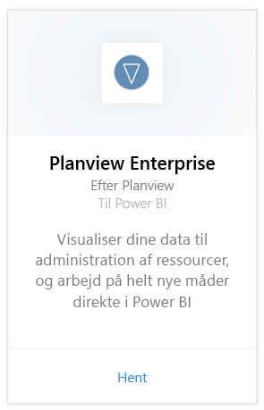
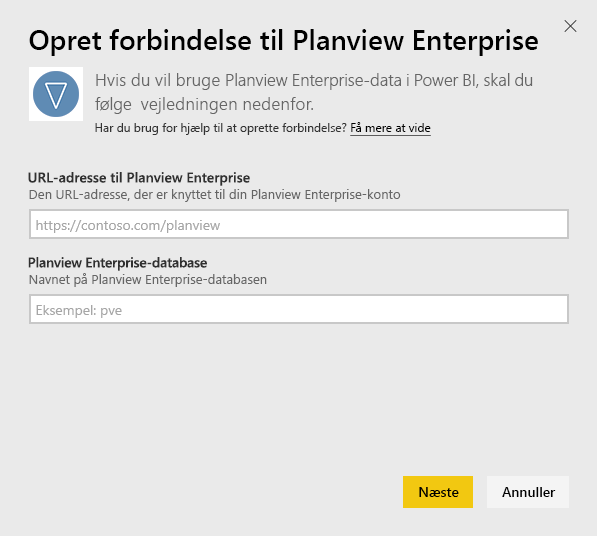
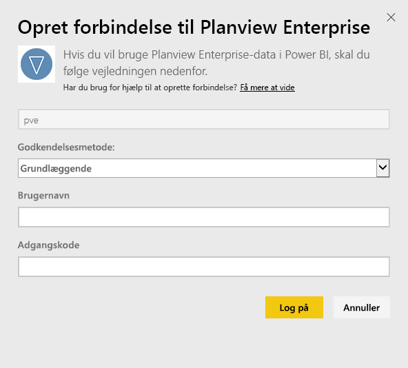
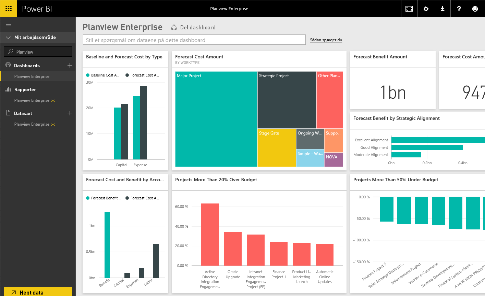

# Opret forbindelse til Planview Enterprise med Power BI
Med indholdspakken til Planview Enterprise kan du visualisere dine data til administration af ressourcer og arbejde på helt nye måder direkte i Power BI. Brug dine legitimationsoplysninger til at logge på Planview Enterprise for at se dine porteføljeinvesteringer, få et overblik over, hvor du er over og under budgettet samt for at se, hvor godt dine projekter følger virksomhedens strategiske prioriteringer. Du kan også udvide det alternative dashboard og de alternative rapporter for at få indblik i det, der er vigtigst for dig.

Opret forbindelse til [indholdspakken til Planview Enterprise i Power BI](https://app.powerbi.com/getdata/services/planview-enterprise)

>[!NOTE]
>Hvis du vil importere dine Planview Enterprise-data i Power BI, skal du være Planview Enterprise-bruger og have funktionen Rapporteringsportalfremviser aktiveret som en del af din rolle. Se flere krav nedenfor.

## Sådan opretter du forbindelse
1. Vælg **Hent data** nederst i venstre navigationsrude.
   
    
2. I feltet **Tjenester** skal du vælge **Hent**.
   
    
3. Vælg **Planview Enterprise** på Power BI-siden, og vælg derefter **Hent**:  
    
4. I tekstfeltet til URL-adressen for Planview Enterprise skal du angive URL-adressen for den Planview Enterprise-server, du vil bruge. Angiv navnet på Planview Enterprise-databasen i tekstfeltet til Planview Enterprise-databasen, og klik derefter på Næste.  
    
5. Vælg **Basic** på listen Godkendelsesmetode, hvis ikke den allerede er valgt. Angiv **Brugernavn** og **Adgangskode** for din konto, og vælg **Log på**.  
   
6. I ruden til venstre skal du vælge Planview Enterprise på listen over dashboards.  
     I Power BI importeres Planview Enterprise-data til dashboardet. Bemærk, at det kan tage et stykke tid at indlæse dataene.  
    

**Hvad nu?**

* Prøv [at stille et spørgsmål i feltet Spørgsmål og svar](service-q-and-a.md) øverst i dashboardet
* [Rediger felterne](service-dashboard-edit-tile.md) i dashboardet.
* [Vælg et felt](service-dashboard-tiles.md) for at åbne den underliggende rapport.
* Dit datasæt vil være planlagt til daglig opdatering. Du kan dog ændre tidsplanen for opdatering eller forsøge at opdatere efter behov ved brug af **Opdater nu**

## Systemkrav
Hvis du vil importere dine Planview Enterprise-data i Power BI, skal du være Planview Enterprise-bruger og have funktionen Rapporteringsportalfremviser aktiveret som en del af din rolle. Se flere krav nedenfor.

Denne procedure forudsætter, at du allerede er logget på Microsoft Power BI-hjemmesiden med en Power BI-konto. Hvis du ikke har en Power BI-konto, skal du oprette en ny gratis Power BI-konto på Power BI-hjemmesiden og derefter klikke på Hent data.

## Næste trin:

[Introduktion til Power BI](service-get-started.md)

[Hent data til Power BI](service-get-data.md)