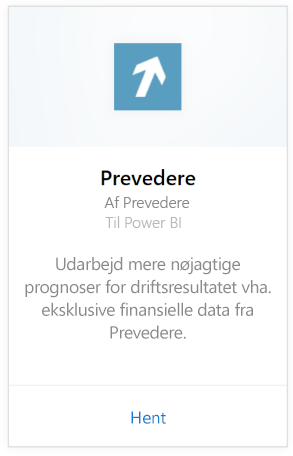
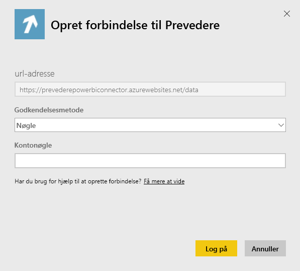
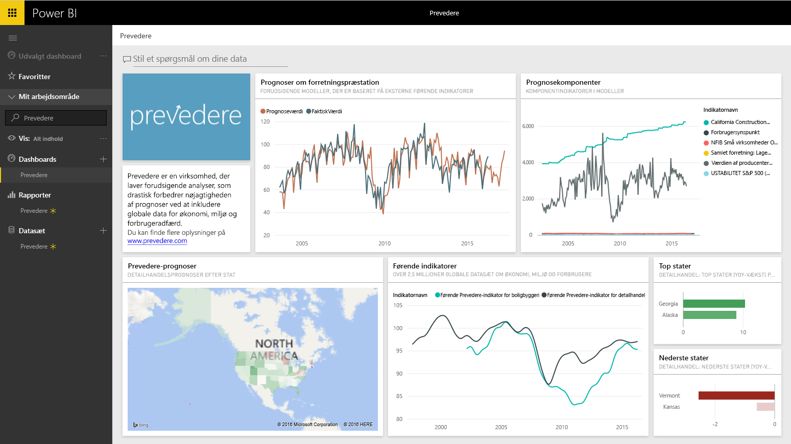

# Opret forbindelse til Prevedere med Power BI
Få adgang til eksklusive og vigtige økonomiske oplysninger, der sikkert og proaktivt kan drive din virksomhed fremad.

Opret forbindelse til [Prevedere-indholdspakken](https://app.powerbi.com/getdata/services/prevedere) til Power BI.

>[!NOTE]
>Hvis du ikke er eksisterende Prevedere-bruger, skal du bruge [prøvenøglen](https://prevederepowerbiconnector.azurewebsites.net/static/learnmore.html) for at prøve det.

## Sådan opretter du forbindelse
1. Vælg **Hent data** nederst i venstre navigationsrude.
   
   
2. Vælg **Hent** i feltet **Tjenester**.
   
   
3. Vælg **Prevedere** og derefter **Hent**.
   
   
4. Vælg **Nøgle** som **Godkendelsesmetode**, og angiv din Prevedere API-nøgle.
   
    
5. Vælg **Log på** for at starte importprocessen. Når processen er færdig, vises et nyt dashboard samt rapport og model i navigationsruden. Vælg dashboardet for at få vist de importerede data.
   
     

**Hvad nu?**

* Prøv [at stille et spørgsmål i feltet Spørgsmål og svar](power-bi-q-and-a.md) øverst i dashboard'et
* [Rediger felterne](service-dashboard-edit-tile.md) i dashboard'et.
* [Vælg et felt](service-dashboard-tiles.md) for at åbne den underliggende rapport.
* Dit datasæt vil være planlagt til daglig opdatering. Du kan dog ændre tidsplanen for opdatering eller forsøge at opdatere efter behov ved hjælp af **Opdater nu**

## Følgende er inkluderet
Indholdspakken skaffer indsigt i dine salgsprognoser, prognosemodeller, overordnede indikatorer og meget mere.

## Systemkrav
Denne indholdspakke kræver adgang til en Prevedere API-nøgle eller prøvenøglen (se nedenfor).

## Sådan finder du parametre

Eksisterende kunder har adgang til deres data ved hjælp af deres API-nøgle. Hvis du endnu ikke er kunde, kan du se et udsnit af dataene og analyserne ved hjælp af [prøvenøglen](https://prevederepowerbiconnector.azurewebsites.net/static/learnmore.html).

## Fejlfinding
Det kan tage et stykke tid at indlæse dataene afhængigt af størrelsen på din forekomst.

## Næste trin
[Kom i gang med Power BI](service-get-started.md)

[Hent data i Power BI](service-get-data.md)

