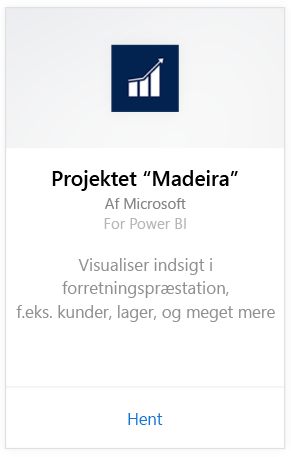
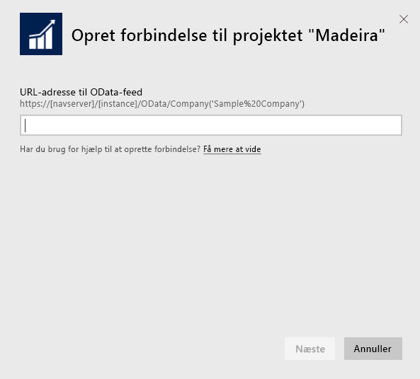
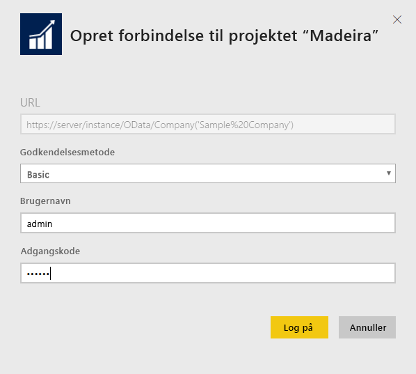
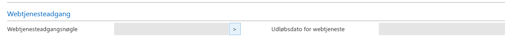
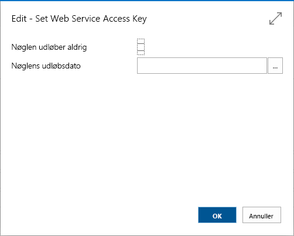
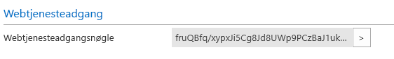

# Opret forbindelse til projektet "Madeira" med Power BI
Det er let at få indblik i dataene for projektet "Madeira" med Power BI og indholdspakken til projektet "Madeira". I Power BI hentes dine data, både salgs- og finansdata, og derefter bygges en app med et brugerdefineret dashboard og rapporter, der er baseret på disse data.
Opret forbindelse til projektet "Madeira" til Power BI, eller læs mere om, hvordan projektet "Madeira" integreres med Power BI.

>[!NOTE]
>Denne indholdspakke kræver tilladelser til de tabeller, dataene hentes fra, i dette tilfælde salgs- og finansdata. Der er flere oplysninger om kravene [nedenfor](#Requirements).

Opret forbindelse til [analyseindholdspakken til projektet "Madeira"](https://app.powerbi.com/getdata/services/project-madeira) til Power BI.

## Sådan opretter du forbindelse
1. Vælg **Hent data** nederst i venstre navigationsrude.  
    
2. I feltet **Tjenester** skal du vælge **Hent**.  
    
3. Vælg **projektet "Madeira"**, og vælg derefter **Hent**.  
    
4. Når du bliver bedt om det, skal du angive URL-adressen til projektet "Madeira". URL-adressen skal følge dette mønster https://mycronusus.projectmadeira.com:7048/NAV/OData/Company('CRONUS%20US') med firmanavnet for projektet "Madeira" præcist. Bemærk, at der er ingen efterstillet skråstreg til sidst, og forbindelsen skal være https. Se, hvordan du finder denne URL-adresse, [nedenfor](#FindingParams).  
   
    
5. Når du bliver bedt om det, skal du vælge Basic som godkendelsesmetode, angive mailadressen for projektet "Madeira" som brugernavn og derefter angive webtjenesteadgangsnøglen for din konto til projektet "Madeira" som adgangskode. Hvis du er allerede er logget på projektet "Madeira" browseren, bliver du muligvis ikke bedt om at angive legitimationsoplysninger. Se, hvordan du opretter denne adgangsnøgle, [nedenfor](#FindingParams).  
   
    >[!NOTE]
    >Du skal være superbruger på projektet "Madeira".
   
   
6. Når der er oprettet forbindelse, indlæses der automatisk et dashboard, en rapport og et datasæt. Når processen er fuldført, opdateres felterne med data fra din konto.  
   
    

**Hvad nu?**

* Prøv [at stille et spørgsmål i feltet Spørgsmål og svar](power-bi-q-and-a.md) øverst i dashboard'et
* [Rediger felterne](service-dashboard-edit-tile.md) i dashboard'et.
* [Vælg et felt](service-dashboard-tiles.md) for at åbne den underliggende rapport.
* Dit datasæt vil være planlagt til daglig opdatering. Du kan dog ændre tidsplanen for opdatering eller forsøge at opdatere efter behov ved hjælp af **Opdater nu**

## Systemkrav
Hvis du vil importere dine data for projektet "Madeira" i Power BI, skal du have tilladelser til de tabeller med salgs- og finansdata, som dataene hentes fra. Alle tabeller (forskel på store og små bogstaver), der kræves til indholdspakken, omfatter:  
 
    ´´´ 
    - ItemSalesAndProfit  
    - ItemSalesByCustomer  
    - powerbifinance  
    - SalesDashboard  
    - SalesOpportunities  
    - SalesOrdersBySalesPerson  
    - TopCustomerOverview  
    ´´´ 

## Sådan finder du parametre
**Hentning af den rette URL-adresse** En nem måde at hente denne URL-adresse på i projektet "Madeira" er at gå til Web Services, finde powerbifinance-webtjenesten og kopiere OData-URL-adressen (højreklik og kopiér genvej), men udelade delen "/ powerbifinance..." fra den URL-adressestreng.

**Webtjenesteadgangsnøgler** Hvis du vil anvende data fra projektet "Madeira", skal du oprette en webtjenesteadgangsnøgle til din brugerkonto. På projektet "Madeira" skal du søge efter siden Brugere og derefter åbne kortet for din brugerkonto. Her kan du oprette en ny webtjenesteadgangsnøgle og kopiere den til feltet Adgangskode på siden for Power BI-forbindelsen.

Når du begynder at bruge webtjenesteadgangsnøgler, skal du bruge dem fremover, og derfor skal du vælge OK i den viste meddelelse.
Når du opretter nøglen, kan du vælge, om den skal udløbe på en bestemt dato eller ej.

Når du klikker på OK, oprettes der en nøgle, så du kan kopiere den til feltet Adgangskode på siden for Power BI-forbindelsen.

## Fejlfinding
Power BI-dashboardet er baseret på de udgivne webtjenester, der er angivet ovenfor, og det viser data fra demovirksomheden eller din egen virksomhed, hvis du importerer data fra din aktuelle økonomiløsning. Hvis der går noget galt, indeholder dette afsnit midlertidige løsninger til de mest almindelige problemer.

**"Parametrene blev ikke valideret. Kontrollér, at alle parametrene er gyldige".**

Hvis du får vist denne fejl, når du har angivet URL-adressen til projektet "Madeira", skal du kontrollere, om følgende betingelser er opfyldt:  

   - URL-adressen følger dette mønster præcist: https://*mycronusus*.projectmadeira.com:7048/NAV/OData/Company('*CRONUS%20US*')  
   - Slet eventuel tekst efter firmanavnet i parentes  
   - Kontrollér, at der ikke er nogen efterstillet skråstreg i slutningen af URL-adressen.  
   - Kontrollér, at URL-adressen benytter en sikker forbindelse, som angivet af den URL-adresse, der starter med https.  

**"Logon mislykkedes"** Hvis du får vist fejlmeddelelsen "Logon mislykkedes", når du logger på dashboardet vha. legitimationsoplysningerne til projektet "Madeira", kan det skyldes et af følgende problemer:  

   - Den konto, du bruger, har ikke tilladelse til at læse data for projektet "Madeira" fra din konto. Kontrollér din brugerkonto for projektet "Madeira", og sørg for, at du har brugt den rette webtjenesteadgangsnøgle som adgangskode, og prøv derefter igen.  
   - Den instans for projektet "Madeira", du prøver at oprette forbindelse til, har ikke et gyldigt SSL-certifikat. I dette tilfælde vises en mere detaljeret fejlmeddelelse ("det var ikke muligt at etablere en SSL-relation, der er tillid til"). Bemærk, at selvsignerede certifikater ikke understøttes.  

**"Ups"** Hvis du får vist en "Oops"-fejldialogboks, når du bekræfter godkendelsesdialogboksen, skyldes det som oftest et problem med at oprette forbindelse til dataene for indholdspakken. Bekræft, at URL-adressen følger det mønster, der blev angivet tidligere:  
    https://*mycronusus*.projectmadeira.com:7048/NAV/OData/Company('*CRONUS%20US*')

Det er en almindelig fejl at angive den fulde URL-adresse for en bestemt webtjeneste:  
    https://*mycronusus*.projectmadeira.com:7048/NAV/OData/Company('*CRONUS%20US*')/powerbifinance

Eller du har glemt at angive firmanavnet:   
    https://*mycronusus*.projectmadeira.com:7048/NAV/OData/

## Næste trin
[Kom i gang med Power BI](service-get-started.md)

[Power BI – Grundlæggende begreber](service-basic-concepts.md)

