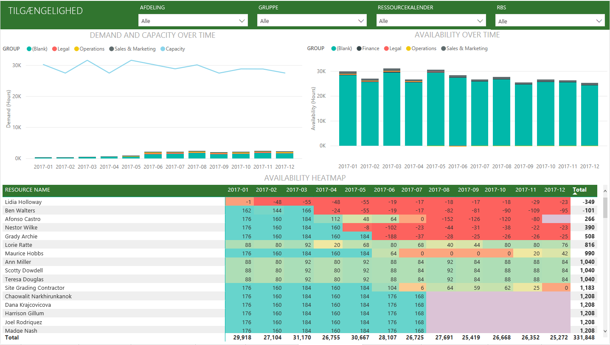

# Opret forbindelse til Project Online med Power BI
Microsoft Project Online er en fleksibel onlineløsning til projektporteføljestyring (PPM) og det daglige arbejde. Project Online gør det muligt for organisationer at komme i gang, prioritere investeringer i projektporteføljen og levere den tilsigtede forretningsværdi. Til Project Online-indholdspakken til Power BI får du mulighed at få ny viden fra Project Online for at hjælpe med at administrere projekter, porteføljer og ressourcer.

Opret forbindelse til [Project Online-indholdspakken](https://app.powerbi.com/getdata/services/project-online) til Power BI.

## Sådan opretter du forbindelse
1. Vælg **Hent data** nederst i venstre navigationsrude.
   
    
2. Vælg **Hent** i feltet **Tjenester**.
   
   
3. Vælg **Microsoft Project Online** \> **Hent**.
   
   
4. I tekstfeltet **URL-adresse til Project Web App** skal du angive URL-adressen til den Project Web App (PWA), du vil oprette forbindelse til, og trykke på **Næste**. Bemærk, at dette kan afvige fra eksemplet, hvis du har et brugerdefineret domæne. I tekstboksen **PWA-sprog på webstedet** skal du skrive det tal, der svarer til dit PWA-sprog på webstedet. Skriv det enkelte ciffer, '1' for engelsk, '2' for fransk, '3' for tysk, '4' for portugisisk (Brasilien), '5' for portugisisk (Portugal) og '6' for spansk. 
   
    
5. Som godkendelsesmetode skal du vælge **oAuth2** \> **Log på**. Når du bliver spurgt, skal du angive dine legitimationsoplysninger til Project Online og følge godkendelsesprocessen.
   
    
    
Bemærk, at du skal have Oversigtsfremviser-, Oversigtsleder- eller Administratortilladelser til den Project Web App, du opretter forbindelse til.

6. Du får vist en meddelelse, der indikerer, at dine data indlæses. Afhængigt af størrelsen på din konto kan det tage noget tid. Når Power BI har importeret dataene, vises der et nyt dashboard, 13 rapporter og et datasæt i venstre navigationsrude. Dette er standarddashboardet, som Power BI oprettede for at vise dine data. Du kan ændre dette dashboard til at vise data på din foretrukne måde.

   

7. Når dit dashboard og rapporter er klar, kan du gå videre og begynde at udforske dataene i dit Project Online! Indholdspakken leveres med 13 omfattende og detaljerede rapporter til oversigt over portefølje (6 rapportsider), oversigt over ressource (5 rapportsider) og projektstatus (2 rapportsider). 

   
   
   
   
   

**Hvad nu?**

* Prøv [at stille et spørgsmål i feltet Spørgsmål og svar](consumer/end-user-q-and-a.md) øverst i dashboard'et
* [Rediger felterne](service-dashboard-edit-tile.md) i dashboard'et.
* [Vælg et felt](consumer/end-user-tiles.md) for at åbne den underliggende rapport.
* Selvom dit datasæt opdateres dagligt, kan du ændre tidsplanen for opdatering eller prøve at opdatere det efter behov ved hjælp af **Opdater nu**

**Udvid indholdspakken**

Download [GitHub PBIT-filen](https://github.com/OfficeDev/Project-Power-BI-Content-Packs) for at tilpasse og opdatere indholdspakken yderligere

## Næste trin
[Kom i gang med Power BI](service-get-started.md)

[Hent data i Power BI](service-get-data.md)

