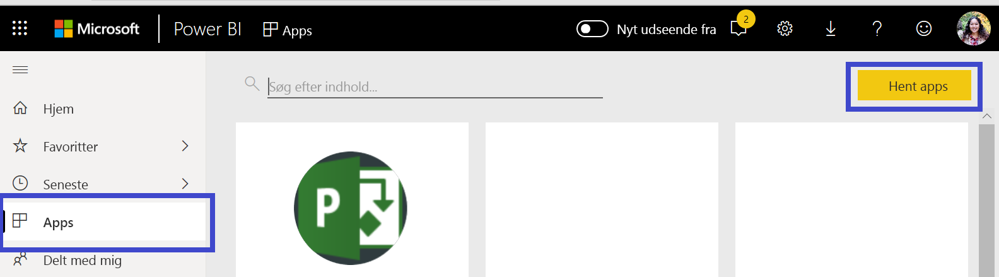
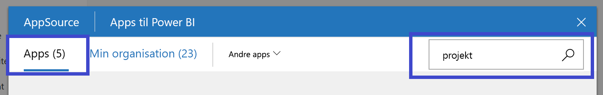

# Opret forbindelse til Project Web App med Power BI
Microsoft Project Web App er en fleksibel onlineløsning til projektporteføljestyring (PPM) og det daglige arbejde. Project Web App gør det muligt for organisationer at komme i gang, prioritere investeringer i projektporteføljen og levere den tilsigtede forretningsværdi. Med Project Web App-skabelonappen til Power BI får du indsigt fra Project Web App, som kan hjælpe dig med at administrere projekter, porteføljer og ressourcer.

Opret forbindelse til [Project Web App-skabelonappen](https://appsource.microsoft.com/product/power-bi/pbi_msprojectonline.pbi-microsoftprojectwebapp) til Power BI.

## Sådan opretter du forbindelse

1. Vælg **Apps** i navigationsruden > vælg **Hent apps** i øverste højre hjørne.

    

2. I feltet **Tjenester** skal du vælge **Hent**.
   
   
3. I AppSource skal du vælge fanen **Apps** og søge/vælge **Microsoft Project Web App**.
   
4. Du får vist en meddelelse med teksten **Vil du installere denne Power BI-app?** . Vælg **Installér**. 

   
5. I ruden **Apps** skal du vælge feltet **Microsoft Project Web App**. 
   
   
6. Under **Kom i gang med din nye app** skal du vælge **Opret forbindelse til data**.
   
   
7. I tekstfeltet **URL-adresse til Project Web App** skal du angive URL-adressen til den PWA (Project Web App), du vil oprette forbindelse til.  Bemærk, at dette kan afvige fra eksemplet, hvis du har et brugerdefineret domæne. I tekstboksen **PWA-sprog på webstedet** skal du skrive det tal, der svarer til dit PWA-sprog på webstedet. Skriv det enkelte ciffer, '1' for engelsk, '2' for fransk, '3' for tysk, '4' for portugisisk (Brasilien), '5' for portugisisk (Portugal) og '6' for spansk. 
   
   
8. Som godkendelsesmetode skal du vælge **oAuth2** \> **Log på**. Når du bliver spurgt, skal du angive dine legitimationsoplysninger til Project Web App og følge godkendelsesprocessen.

    > [!NOTE]
    > Du skal have Oversigtsfremviser-, Oversigtsleder- eller Administratortilladelser til den Project Web App, du opretter forbindelse til.

9. Du får vist en meddelelse, der indikerer, at dine data indlæses. Afhængigt af størrelsen på din konto kan det tage noget tid. Når Power BI importerer dataene, får du vist indholdet af dit nye arbejdsområde. Det kan være nødvendigt at opdatere datasættet for at få de nyeste opdateringer. 

    Når Power BI har importeret dataene, får du vist rapporten med 13 sider og datasættet i navigationsruden. 

10. Når dine rapporter er klar, kan du gå videre og begynde at udforske dataene i Project Web App. Skabelonappen leveres med 13 omfattende og detaljerede rapporter til oversigt over portefølje (6 rapportsider), oversigt over ressource (5 rapportsider) og projektstatus (2 rapportsider). 

    
   
    
   
    

**Hvad nu?**

* Selvom dit datasæt opdateres dagligt, kan du ændre tidsplanen for opdatering eller prøve at opdatere det efter behov ved hjælp af **Opdater nu**.

**Udvid skabelonappen**

Download [GitHub PBIT-filen](https://github.com/OfficeDev/Project-Power-BI-Content-Packs) for at tilpasse og opdatere indholdspakken yderligere.

## De næste trin
[Kom i gang med Power BI](service-get-started.md)

[Hent data i Power BI](service-get-data.md)

