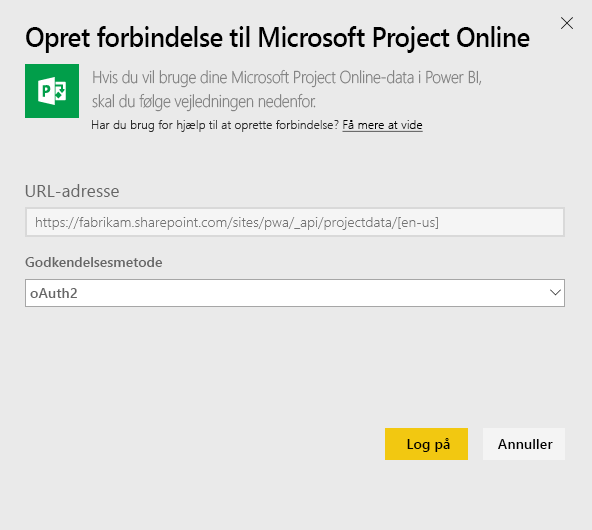
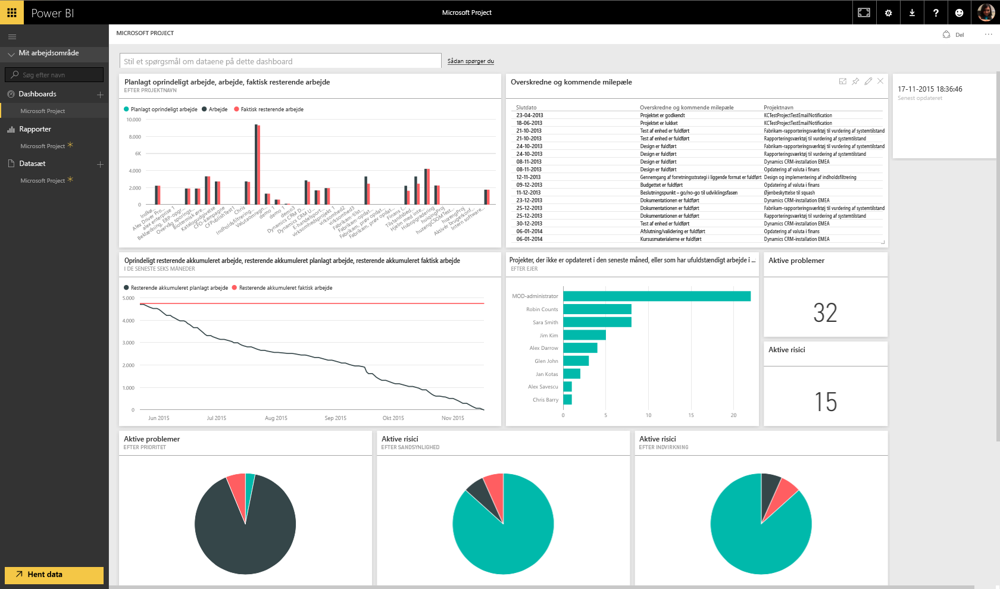

# Opret forbindelse til Project Online med Power BI
Microsoft Project Online er en fleksibel onlineløsning til projektporteføljestyring (PPM) og det daglige arbejde. Project Online gør det muligt for organisationer at komme i gang, prioritere investeringer i projektporteføljen og levere den tilsigtede forretningsværdi. Project Online-indholdspakken til Power BI giver dig mulighed for at udforske projektdataene med køreklare metrikværdier som f.eks. porteføljestatus og projektoverholdelse.

Opret forbindelse til [Project Online-indholdspakken](https://app.powerbi.com/getdata/services/project-online) til Power BI.

## Sådan opretter du forbindelse
1. Vælg **Hent data** nederst i venstre navigationsrude.
   
    
2. Vælg **Hent** i feltet **Tjenester**.
   
   
3. Vælg **Microsoft Project Online** \> **Hent**.
   
   
4. I tekstfeltet **URL-adresse til Project Web App** skal du angive URL-adressen til den Project Web App (PWA), du vil oprette forbindelse til, og trykke på **Næste**. Bemærk, at dette kan afvige fra eksemplet, hvis du har et brugerdefineret domæne.
   
    
5. Som Godkendelsesmetode skal du vælge **oAuth2** \> **Log på**. Når du bliver spurgt, skal du angive dine legitimationsoplysninger til Project Online og følge godkendelsesprocessen.
   
    
    
Bemærk, at du skal have Oversigtsfremviser-, Oversigtsleder- eller Administratortilladelser til den Project Web App, du opretter forbindelse til.

6. Du får vist en meddelelse, der indikerer, at dine data indlæses. Afhængigt af størrelsen på din konto kan det tage noget tid. Når Power BI har importeret dataene, vises der et nyt dashboard, en rapport og et datasæt i venstre navigationsrude. Dette er standarddashboardet, som Power BI oprettede for at vise dine data. Du kan ændre dette dashboard for at vise dine data, som du ønsker.
   
   

**Hvad nu?**

* Prøv [at stille et spørgsmål i feltet Spørgsmål og svar](power-bi-q-and-a.md) øverst i dashboard'et
* [Rediger felterne](service-dashboard-edit-tile.md) i dashboard'et.
* [Vælg et felt](service-dashboard-tiles.md) for at åbne den underliggende rapport.
* Dit datasæt vil være planlagt til daglig opdatering. Du kan dog ændre tidsplanen for opdatering eller forsøge at opdatere efter behov ved hjælp af **Opdater nu**

## Næste trin
[Kom i gang med Power BI](service-get-started.md)

[Hent data i Power BI](service-get-data.md)

