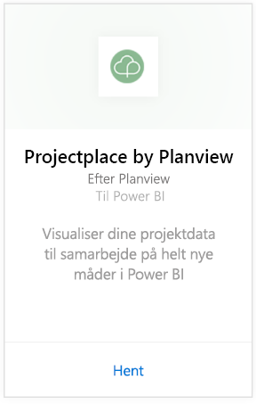
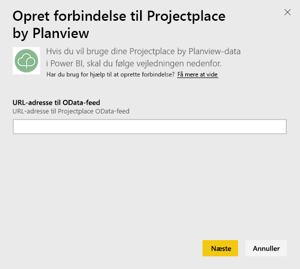
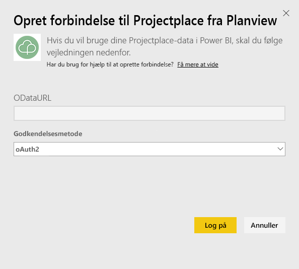
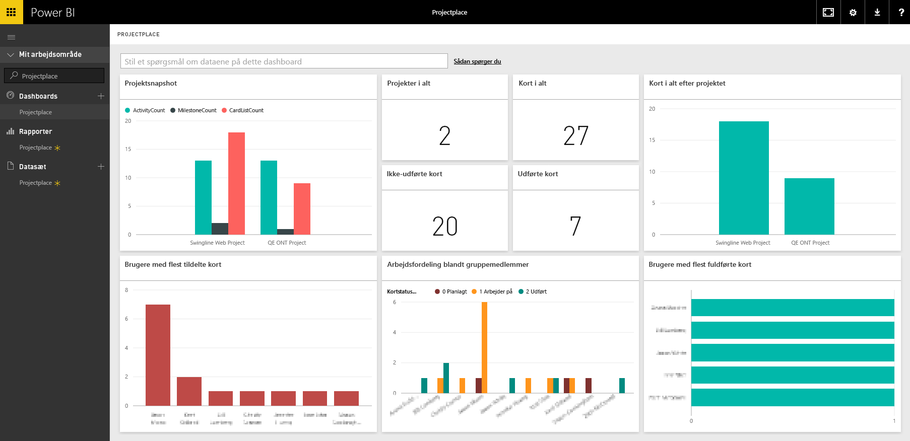

# Opret forbindelse til Projectplace fra Planview med Power BI
Med indholdspakken til Projectplace fra Planview kan du visualisere dine samarbejdsprojektdata på helt nye måder direkte i Power BI. Brug dine legitimationsoplysninger for logon til Projectplace til at få en interaktiv visning af de vigtigste projektstatistikker, find ud af, hvem der er dine mest aktive og produktive teammedlemmer, og identificer sårbare kort og aktiviteter på tværs af projekter på din Projectplace-konto. Du kan også udvide standarddashboardet og rapporter for at få den viden, der er vigtigst for dig.

[Opret forbindelse til indholdspakken til Projectplace i Power BI](https://app.powerbi.com/getdata/services/projectplace)

>[!NOTE]
>For at kunne importere dine Projectplace-data i Power BI skal du være Projectplace-bruger. Se flere krav nedenfor.

## Sådan opretter du forbindelse
1. Vælg **Hent data** nederst i venstre navigationsrude.
   
    
2. Vælg **Hent** i feltet **Tjenester**.
   
    
3. Vælg **Projectplace fra Planview** på Power BI-siden, og vælg derefter **Hent**:  
   
    
4. Angiv URL-adressen til den Projectplace OData-feed, du vil bruge, i tekstfeltet URL-adresse til OData-feed, som du kan se på følgende billede:
   
    
5. Vælg **OAuth** på listen Godkendelsesmetode, hvis ikke den allerede er valgt. Tryk på **Log på**, og gå igennem indlogningsforløbet.  
   
   
6. Vælg **Projectplace** i venstre rude på listen over dashboards. Power BI importerer Projectplace-data til dashboardet. Bemærk, at det kan tage et stykke tid at indlæse dataene.  
   
    Dashboardet indeholder felter, der viser data fra din Projectplace-database. Billedet nedenfor viser et eksempel på standarddashboardet til Projectplace i Power BI.
   
    

**Hvad nu?**

* Prøv [at stille et spørgsmål i feltet Spørgsmål og svar](consumer/end-user-q-and-a.md) øverst i dashboard'et
* [Rediger felterne](service-dashboard-edit-tile.md) i dashboard'et.
* [Vælg et felt](consumer/end-user-tiles.md) for at åbne den underliggende rapport.
* Selvom dit datasæt opdateres dagligt, kan du ændre tidsplanen for opdatering eller prøve at opdatere det efter behov ved hjælp af **Opdater nu**

## Systemkrav
For at kunne importere dine Projectplace-data i Power BI skal du være Projectplace-bruger. Denne procedure forudsætter, at du allerede er logget på Microsoft Power BI-hjemmesiden med en Power BI-konto. Hvis du ikke har en Power BI-konto, kan du gå til [powerbi.com](https://powerbi.microsoft.com/get-started/). Under **Power BI – Cloudsamarbejde og -deling** skal du vælge **Prøv gratis**. Klik derefter på **Hent Data**.

## Næste trin
[Hvad er Power BI?](power-bi-overview.md)

[Grundlæggende begreber for designere i Power BI-tjenesten](service-basic-concepts.md)

