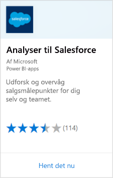
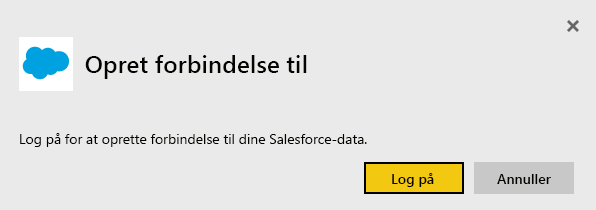
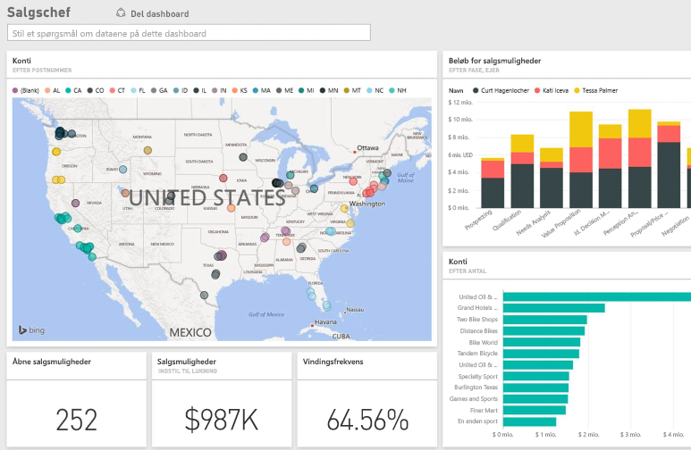

# Opret forbindelse til Salesforce med Power BI
Med Power BI kan du kan nemt oprette forbindelse til din konto på Salesforce.com. Når du opretter denne forbindelse, hentes dine data, du får automatisk et dashboard og rapporter baseret på dine data.

Opret forbindelse til [Salesforce-indholdspakken](https://app.powerbi.com/getdata/services/salesforce) til Power BI, eller læs mere om [Salesforce-integration](https://powerbi.microsoft.com/integrations/salesforce) med Power BI.

## Sådan opretter du forbindelse
1. Vælg **Hent data** nederst i venstre navigationsrude.
   
    
2. Vælg **Hent** i feltet **Tjenester**.
   
    
3. Klik på **Salesforce**, og vælg **Hent**.  
   
   
4. Vælg **Log på** for at starte logonflowet.
   
    
5. Angiv dine Salesforce-legitimationsoplysninger, når du bliver bedt om det. Klik på **Tillad**, så Power BI kan få adgang til dine grundlæggende Salesforce-oplysninger og -data.
   
   
6. Konfigurer, hvad du vil importere til Power BI, ved hjælp af rullelisteindstillingen:
   
   * **Dashboard**
     
     Vælg et foruddefineret dashboard, der er baseret på en karakter (f.eks. **Salgschef**). Disse dashboards henter bestemte sæt af standarddata fra Salesforce og medtager ikke brugerdefinerede felter.
     
     
   * **Rapporter**
     
     Vælg en eller flere brugerdefinerede rapporter fra din Salesforce-konto. Disse rapporter stemmer overens med dine visninger i Salesforce og kan indeholde data fra brugerdefinerede felter eller objekter.
     
     
     
     Hvis du ikke kan se nogen rapporter, kan du tilføje eller oprette dem i din Salesforce-konto og prøve at oprette forbindelse igen.
7. Klik på **Tilslut** for at starte importprocessen. Under importen får du vist en meddelelse om, at importen er i gang. Når importen er fuldført, får du vist et dashboard, en rapport og et datasæt for dine Salesforce-data, som er angivet i navigationsruden til venstre.
   
   

Du kan ændre dette dashboard for at få vist dine data, som du ønsker. Du kan stille spørgsmål i sektionen med spørgsmål og svar – eller klikke på et felt for at [åbne den underliggende rapport](consumer/end-user-tiles.md) og [ændre felterne](service-dashboard-edit-tile.md) i dashboardet.

**Hvad nu?**

* Prøv [at stille et spørgsmål i feltet Spørgsmål og svar](consumer/end-user-q-and-a.md) øverst i dashboard'et
* [Rediger felterne](service-dashboard-edit-tile.md) i dashboardet <<<<<<< HEAD
* [Vælg et felt](consumer/end-user-tiles.md) for at åbne den underliggende rapport =======
* [Vælg et felt](service-dashboard-tiles.md) for at åbne den underliggende rapport
>>>>>>> 66fe62d8f200efd9cfeb465eeb5f370dbbaa63be
* Selvom dit datasæt opdateres dagligt, kan du ændre tidsplanen for opdatering eller prøve at opdatere det efter behov ved hjælp af **Opdater nu**

## Systemkrav og overvejelser
- Forbindelse til en Salesforce-produktionskonto, der har adgang til API aktiveret
- Tilladelse tildelt til Power BI-appen under logon
- Kontoen har tilstrækkelige API-kald til at trække og opdatere dataene
- Der kræves et gyldigt godkendelsestoken for at opdatere. Sørg for, at du har importeret fem eller færre Salesforce-datasæt, da Salesforce har en begrænsning på fem godkendelsestokens pr. program
- Salesforce Reports-API'en har en begrænsning, der understøtter op til 2.000 rækker med data.

## Fejlfinding
Hvis der opstår fejl, skal du gennemse ovenstående krav. Bemærk også, at muligheden for at logge på et brugerdefineret domæne eller et sandkassedomæne ikke understøttes i øjeblikket.

### Meddelelsen "Der kan ikke oprettes forbindelse til fjernserveren"

Hvis du får meddelelsen "Der kan ikke oprettes forbindelse til fjernserveren" under forsøg på at oprette forbindelse til din Salesforce-konto, kan du se denne løsning på Outsystems-forummet: [Salesforce Connector Log In Error Message: Unable to connect to the remote server](https://www.outsystems.com/forums/Forum_TopicView.aspx?TopicId=17674&TopicName=log-in-error-message-unable-to-connect-to-the-remote-server&)

## Næste trin
[Hvad er Power BI?](power-bi-overview.md)

[Hent data](service-get-data.md)

