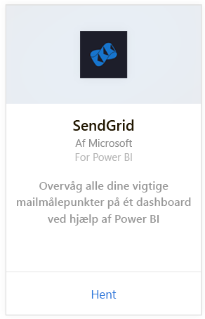
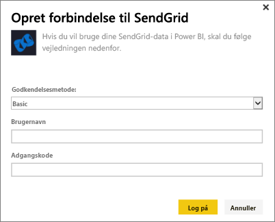
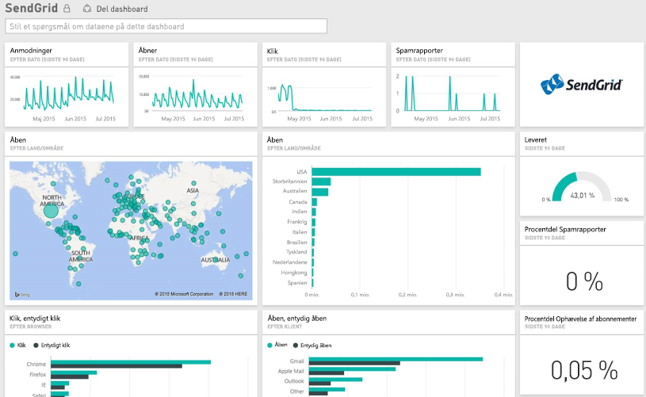

# Opret forbindelse til SendGrid med Power BI
Med Power BI-indholdspakken til SendGrid kan du udtrække indsigt og statistikker fra din SendGrid-konto. Ved hjælp af SendGrid-indholdspakken kan du visualisere SendGrid-statistikkerne i et dashboard.

[!INCLUDE [include-short-name](./includes/service-deprecate-content-packs.md)]

Opret forbindelse til [SendGrid-indholdspakken](https://app.powerbi.com/getdata/services/sendgrid) til Power BI.

## Sådan opretter du forbindelse
1. Vælg **Hent data** nederst i venstre navigationsrude.
   
    
2. I feltet **Tjenester** skal du vælge **Hent**.
   
    
3. Vælg **SendGrid**-indholdspakken, og klik på **Hent**.
   
    
4. Når du bliver spurgt, skal du angive SendGrid-brugernavn og -adgangskode. Vælg **Log på**.
   
   
5. Når Power BI har importeret dataene, får du vist et nyt dashboard, en ny rapport og et nyt datasæt i venstre navigationsrude, der er udfyldt med mailstatistikken for de seneste 90 dage. Nye elementer er markeret med en gul stjerne \*.
   
   

**Hvad nu?**

* Prøv [at stille et spørgsmål i feltet Spørgsmål og svar](consumer/end-user-q-and-a.md) øverst i dashboard'et
* [Rediger felterne](service-dashboard-edit-tile.md) i dashboard'et.
* [Vælg et felt](consumer/end-user-tiles.md) for at åbne den underliggende rapport.
* Selvom dit datasæt opdateres dagligt, kan du ændre tidsplanen for opdatering eller prøve at opdatere det efter behov ved hjælp af **Opdater nu**

## Det følgende er inkluderet
Følgende målepunkter er tilgængelige i SendGrid-dashboardet:

* Overordnet mailstatistik – anmodninger, leveret, afvist, blokeret spam, spamrapport osv.
* Mailstatistik efter kategori
* Mailstatistik efter geografi
* Mailstatistik efter internetudbyder
* Mailstatistik efter enhed, klient, browser

## Næste trin
[Hvad er Power BI?](power-bi-overview.md)

[Hent data](service-get-data.md)

