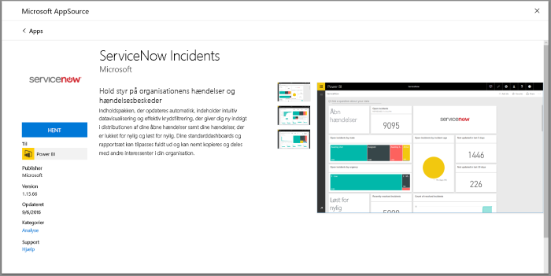
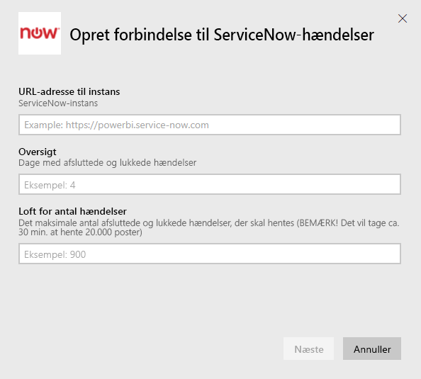
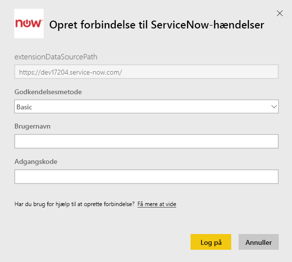
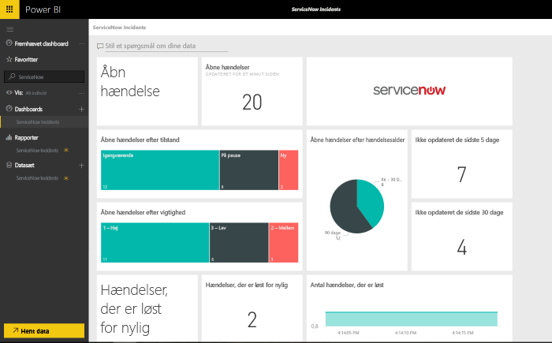

# Opret forbindelse til ServiceNow med Power BI til rapportering af hændelser
ServiceNow byder på flere produkter og løsninger, herunder forretningsrelateret og driftsrelateret administration samt IT-administration, som kan hjælpe med at forbedre din virksomhed. Denne indholdspakke indeholder flere rapporter og giver dig indsigt i dine åbne, seneste løste og nyligt lukkede hændelser.  

Opret forbindelse til Power BI-indholdspakken til [ServiceNow Incidents](https://app.powerbi.com/getdata/services/servicenow).

## Sådan opretter du forbindelse
1. Vælg **Hent data** nederst i venstre navigationsrude.
   
    
2. I feltet **Tjenester** skal du vælge **Hent**.
   
    
3. Vælg **ServiceNow Incidents** \> **Hent**.
   
   
4. Angiv URL-adressen til din forekomst af ServiceNow og intervallet af dage/poster, der skal importeres. Bemærk, så snart én grænse nås, stopper importen.
   
   
5. Angiv dine legitimationsoplysninger til ServiceNow **Basic**, når du bliver bedt om det. Bemærk, at enkeltlogon ikke understøttes i dag. Du kan se flere oplysninger om systemkravene nedenfor.
   
   
6. Når logonflowet er fuldført, starter importprocessen. Når processen er fuldført, vises et nyt dashboard samt en ny rapport og model i navigationsruden. Vælg dashboardet for at få vist de importerede data.
   
    

**Hvad nu?**

* Prøv [at stille et spørgsmål i feltet Spørgsmål og svar](service-q-and-a.md) øverst i dashboardet
* [Rediger felterne](service-dashboard-edit-tile.md) i dashboardet.
* [Vælg et felt](service-dashboard-tiles.md) for at åbne den underliggende rapport.
* Dit datasæt vil være planlagt til daglig opdatering. Du kan dog ændre tidsplanen for opdatering eller forsøge at opdatere efter behov ved brug af **Opdater nu**

## Systemkrav
For at oprette forbindelse skal du bruge:  

* En konto, der kan få adgang til yourorganization.service-now.com med basisgodkendelse (enkeltlogon understøttes ikke i denne version).  
* Kontoen skal have rollen rest_service og læseadgang til hændelsestabellen.  

## Fejlfinding
Hvis du oplever en fejl i forbindelse med legitimationsoplysningerne under indlæsningen, skal du gennemse adgangskravene ovenfor. Hvis du har de nødvendige tilladelser og stadig oplever problemer, skal du kontakte din ServiceNow-administrator for at sikre, at du har eventuelle yderligere tilladelser, der kan være nødvendige, til din brugerdefinerede forekomst.

Hvis du oplever lange indlæsningstider, skal du gennemse antallet af hændelser og antallet af dage, du har angivet under oprettelse af forbindelsen, og overveje at reducere dem.

## Næste trin
[Introduktion til Power BI](service-get-started.md)

[Power BI – Grundlæggende begreber](service-basic-concepts.md)

