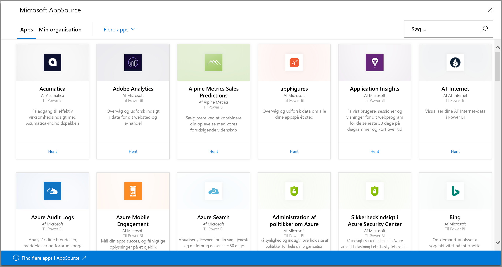
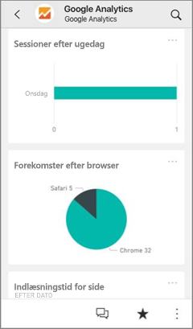
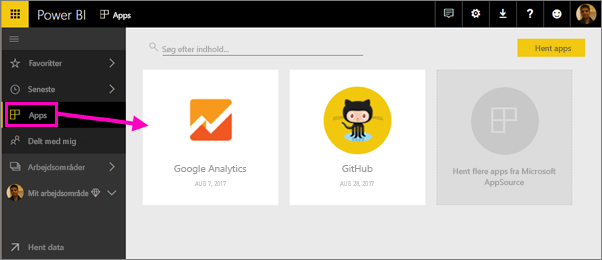
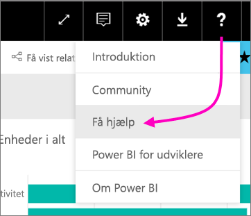

# Opret forbindelse til de tjenester, du bruger med Power BI
Med Power BI kan du oprette forbindelse til mange af de tjenester, du bruger til at køre din virksomhed, f.eks. Salesforce, Microsoft Dynamics CRM og Google Analytics. Power BI starter med at bruge dine legitimationsoplysninger til at oprette forbindelse til tjenesten. Den opretter et *arbejdsområde* i Power BI med et dashboard og et sæt Power BI-rapporter, der automatisk viser dine data og giver visuel indsigt om din virksomhed.

>[!IMPORTANT]
>Indholdspakker til tjenesten erstattes af [skabelonapps](https://docs.microsoft.com/power-bi/service-template-apps-overview). En række indholdspakker er allerede blevet frarådet fra og med den 25. september 2019. Alle frarådede indholdspakker, du har installeret, forbliver på din konto, men der findes ingen dokumentation og ydes ingen support til dem, og det er heller ikke muligt at installere dem igen.

Log på Power BI for at få vist alle de [tjenester, du kan oprette forbindelse til](https://app.powerbi.com/getdata/services). 

Når du har installeret appen, kan du få vist dashboardet og rapporterne i appen og arbejdsområdet i Power BI-tjenesten ([https://app.powerbi.com](https://app.powerbi.com)). Du kan også få dem vist i Power BI-mobilappsene. Du kan redigere dashboardet og rapporterne i arbejdsområdet, så de opfylder din organisations behov, og derefter distribuere dem til dine kolleger som en *app*. 

## Kom i gang
[!INCLUDE [powerbi-service-apps-get-more-apps](./includes/powerbi-service-apps-get-more-apps.md)]

## Rediger dashboardet og rapporterne
Når importen er fuldført, vises den nye app vises på siden Apps.

1. Vælg **Apps** i navigationsruden > vælg appen.
   
     
2. Du kan stille et spørgsmål ved at skrive det i feltet til spørgsmål og svar eller klikke på et felt for at åbne den underliggende rapport. 
   
    
   
    Rediger dashboardet og rapporten, så de passer til organisationens behov. [Distribuer derefter din app til dine kolleger](service-create-distribute-apps.md)

## Det følgende er inkluderet
Når du har forbindelse til en tjeneste, kan du se en app og et arbejdsområde, der er oprettet for nylig med et dashboard, rapporter og datasæt. Dataene fra tjenesten fokuserer på et bestemt scenarie, og det indeholder ikke nødvendigvis alle oplysninger fra tjenesten. Der er planlagt automatisk opdatering af dataene én gang om dagen. Du kan styre tidsplanen ved at vælge datasættet.

Du kan også [oprette forbindelse til mange tjenester i Power BI Desktop](desktop-data-sources.md), f.eks Google Analytics, og oprette dine egne tilpassede dashboards og rapporter.  

Hvis du vil have flere oplysninger om, hvordan du opretter forbindelse til bestemte tjenester, kan du se de enkelte Hjælp-sider.

## Fejlfinding
**Tomme felter**  
Når Power BI opretter forbindelse til tjenesten første gang, kan du evt. se et tomt sæt felter på dashboardet. Hvis du stadig kan se et tomt dashboard efter to timer, er der sandsynligvis ikke oprettet forbindelse. Hvis du ikke får vist en fejlmeddelelse, der indeholder oplysninger om, hvordan du løser problemet, skal du oprette en supportanmodning.

* Vælg ikonet med spørgsmålstegnet ( **?** ) i øverste højre hjørne > **Få hjælp**.
  
    

**Manglende oplysninger**  
Dashboardet og rapporterne inkluderer indhold fra tjenesten, der fokuserer på et bestemt scenarie. Hvis du søger en bestemt metrikværdi i appen, og du ikke kan se den, kan du tilføje en ide på siden til [Power BI-support](https://support.powerbi.com/forums/265200-power-bi).

## Foreslag til tjenester
Bruger en tjeneste, du vil foreslå til en Power BI-app? Gå til siden [Support til Power BI](https://support.powerbi.com/forums/265200-power-bi), og giv os besked.

Hvis du er interesseret i at oprette skabelonprogrammer, som du selv distribuerer, skal du se [Opret et skabelonprogram i Power BI](service-template-apps-create.md). Power BI-partnere kan udarbejde Power BI-programmer med kun lidt eller ingen kode og udrulle dem til Power BI-kunder. 

## Næste trin
* [Distribuer apps til dine kolleger](service-create-distribute-apps.md)
* [Opret nye arbejdsområder i Power BI](service-create-the-new-workspaces.md)
* Har du spørgsmål? [Prøv at spørge Power BI-community'et](https://community.powerbi.com/)
* Har du flere spørgsmål? [Prøv at spørge Power BI-community'et](https://community.powerbi.com/)

