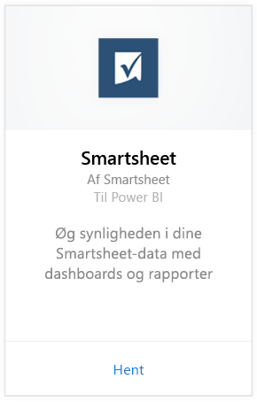
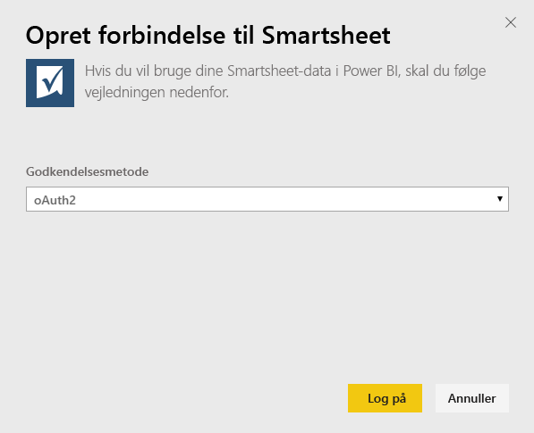
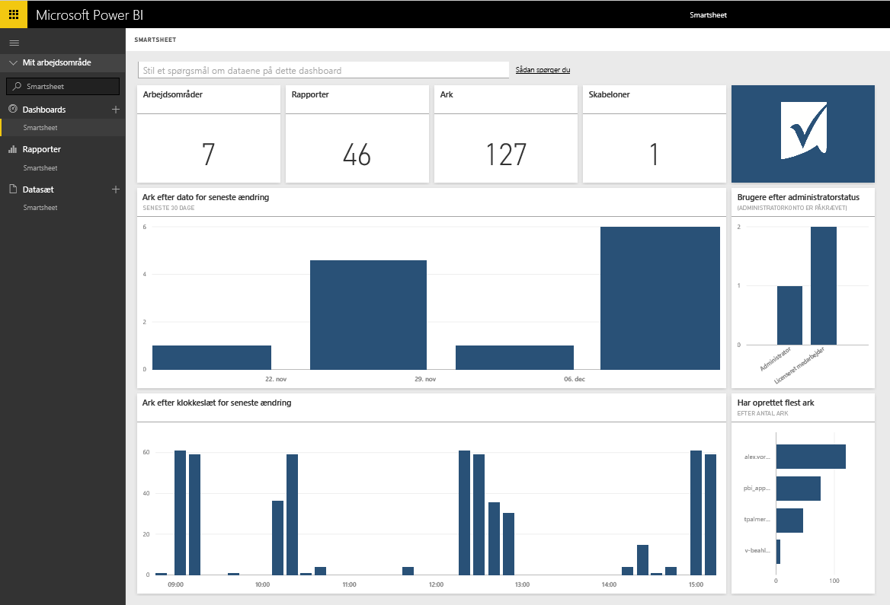

# Opret forbindelse til Smartsheet med Power BI
Smartsheet byder på en nem platform til samarbejde og fildeling. Smartsheet-indholdspakken til Power BI indeholder et dashboard, rapporter og datasæt, som viser en oversigt over din Smartsheet-konto. Du kan også bruge [Power BI Desktop](desktop-connect-to-data.md) til at oprette forbindelse direkte til individuelle ark i din konto. 

Opret forbindelse til [Smartsheet-indholdspakken](https://app.powerbi.com/groups/me/getdata/services/smartsheet) til Power BI.

>[!NOTE]
>Smartsheet-administratorkontoen er at foretrække til oprettelse af forbindelse og indlæsning af Power BI-indholdspakken, da den har ekstra adgang.

## Sådan opretter du forbindelse
1. Vælg **Hent data** nederst i venstre navigationsrude.
   
   
2. I feltet **Tjenester** skal du vælge **Hent**.
   
    
3. Vælg **Smartsheet \> Hent**.
   
   
4. Til Godkendelsesmetode skal du vælge **oAuth2\> Log på**.
   
   Når du bliver spurgt, skal du angive dine legitimationsoplysninger til Smartsheet og følge godkendelsesprocessen.
   
   
   
   
5. Efter import af data i Power BI får du vist et nyt dashboard og datasæt samt en ny rapport i venstre navigationsrude. Nye elementer er markeret med en gul stjerne \*, vælg posten Smartsheet.
   
   

**Hvad nu?**

* Prøv [at stille et spørgsmål i feltet Spørgsmål og svar](consumer/end-user-q-and-a.md) øverst i dashboard'et
* [Rediger felterne](service-dashboard-edit-tile.md) i dashboard'et.
* [Vælg et felt](consumer/end-user-tiles.md) for at åbne den underliggende rapport.
* Selvom dit datasæt opdateres dagligt, kan du ændre tidsplanen for opdatering eller prøve at opdatere det efter behov ved hjælp af **Opdater nu**

## Det følgende er inkluderet
Smartsheet-indholdspakken til Power BI indeholder et overblik over din Smartsheet-konto, f.eks det antal arbejdsområder, rapporter og ark, du har, når disse er blevet redigeret osv. Administratorer kan også se nogle oplysninger om brugerne i deres system, f.eks oprettere af øverste ark.  

Du kan også bruge Smartsheet-forbindelseskomponenten i [Power BI Desktop](desktop-connect-to-data.md) til at oprette direkte forbindelse til individuelle ark i din konto.  

## Næste trin:

[Hvad er Power BI?](power-bi-overview.md)

[Hent data til Power BI](service-get-data.md)