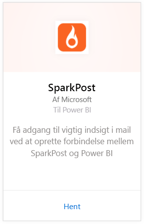
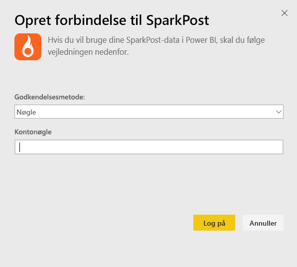
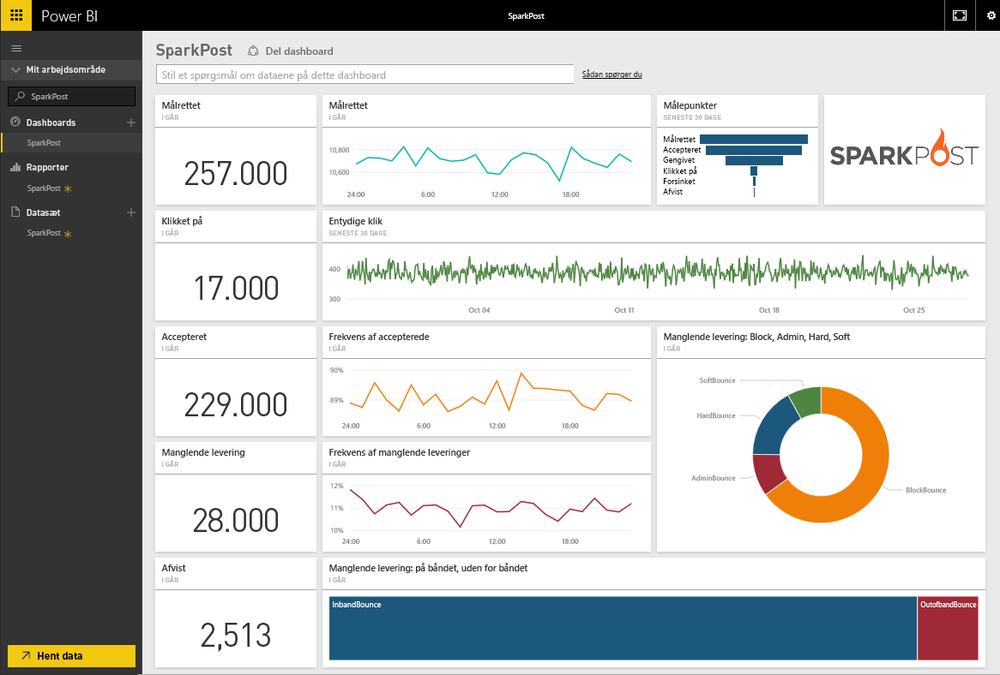
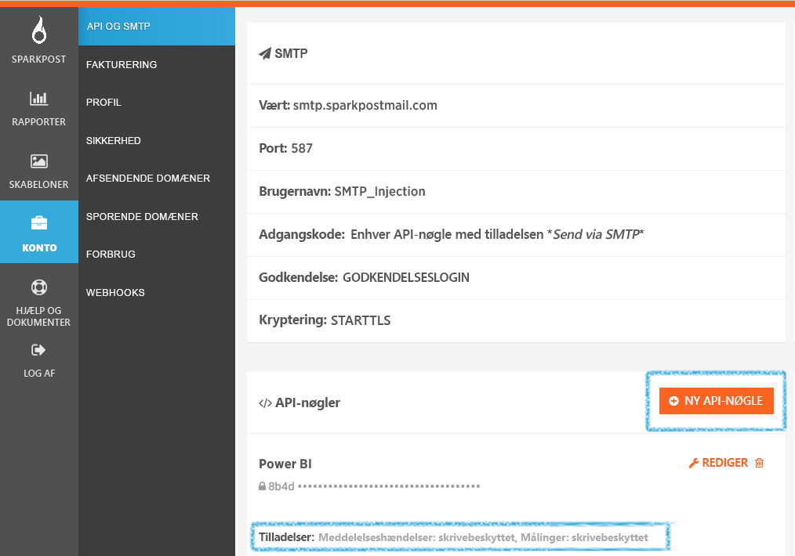

# Opret forbindelse til SparkPost med Power BI
Power BI-indholdspakken til SparkPost giver dig mulighed at udtrække værdifulde datasæt fra din SparkPost-konto til ét dashboard fuld af indsigt. Ved hjælp af SparkPost-indholdspakken kan du visualisere dine overordnede mailstatistikker, herunder domæner, kampagner og engagement efter internetudbyder.

Opret forbindelse til [SparkPost-indholdspakken til Power BI](https://app.powerbi.com/getdata/services/spark-post).

## Sådan opretter du forbindelse
1. Vælg **Hent data** nederst i venstre navigationsrude.
   
   
2. Vælg **Hent** i feltet **Tjenester**.
   
   
3. Vælg **SparkPost**-indholdspakken, og klik på **Hent**. 
   
   
4. Når du bliver spurgt, skal du angive din SparkPost API-nøgle og vælge Log på. Se detaljer om, hvordan du [finder disse parametre](#FindingParams), nedenfor.
   
   
5. Dine data begynder at indlæses, og afhængigt af størrelsen på kontoen kan det tage et stykke tid. Når Power BI har importeret dataene, får du vist standarddashboardet, rapporten og datasættet i venstre navigationsrude, der er udfyldt med mailstatistikken for de seneste 90 dage. Nye elementer er markeret med en gul stjerne \*.
   
   

**Hvad nu?**

* Prøv at [stille et spørgsmål i feltet Spørgsmål og svar](service-q-and-a.md) øverst i dashboardet
* [Rediger felterne](service-dashboard-edit-tile.md) i dashboardet.
* [Vælg et felt](service-dashboard-tiles.md) for at åbne den underliggende rapport.
* Dit datasæt vil være planlagt til daglig opdatering. Du kan dog ændre tidsplanen for opdatering eller forsøge at opdatere efter behov ved hjælp af **Opdater nu**

## Følgende er inkluderet
SparkPost-indholdspakken til Power BI indeholder oplysninger om entydige klik, tal om accepterede mails, ikke leverede mails, forsinkede mails, afviste mails og meget mere.

## Sådan finder du parametre
Indholdspakken anvender en API-nøgle til at oprette forbindelse mellem din SparkPost-konto og Power BI. Du kan finde din API-nøgle i din konto under Account \> API & SMTP (flere oplysninger [her](https://support.sparkpost.com/customer/portal/articles/1933377-create-api-keys)). Vi foreslår, at du bruger en API-nøgle med tilladelser til `Message Events: Read-only `og `Metrics: Read-only`

