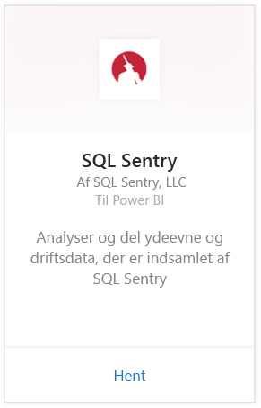
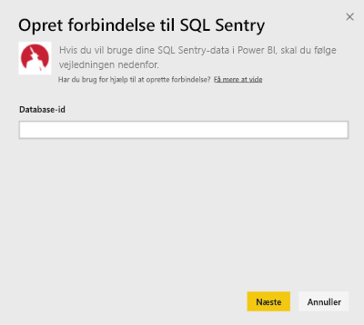
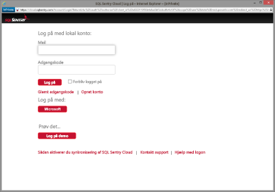
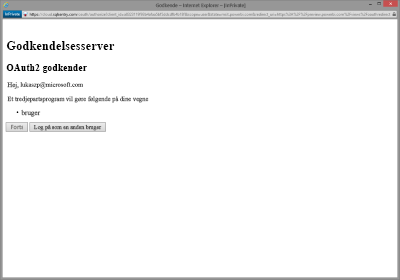
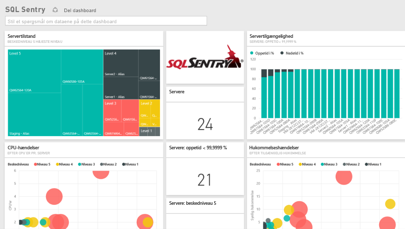
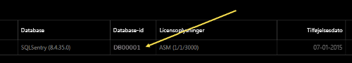
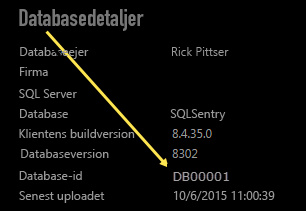

# Opret forbindelse til SQL Sentry med Power BI
Det er nemt at analysere dine ydelsesdata indsamlet af SQL Sentry med Power BI. Power BI henter dine data og opretter derefter et standarddashboard og relaterede rapporter baseret på disse data.

Opret forbindelse til [SQL Sentry-indholdspakken](https://app.powerbi.com/groups/me/getdata/services/sql-sentry) til Power BI.

>[!NOTE]
>Adgang til en SQL Sentry-konto, du bruger til at oprette forbindelse til http://cloud.sqlsentry.com, og et database-id, du vil overvåge, er påkrævet for at oprette forbindelse.  Vejledning til at finde database-id'et er nedenfor.

## Sådan opretter du forbindelse
1. Vælg **Hent data** nederst i venstre navigationsrude.
   
   
2. Markér **Hent** i feltet **Tjenester**.
   
    
3. Vælg **SQL Sentry  \> Hent**.
   
   
4. Angiv **Database-id** for databasen, som du vil overvåge i Power BI. Se flere oplysninger om at [finde dette](#FindingParams) nedenfor.
   
   
5. Til Godkendelsesmetode skal du vælge **oAuth2\> Log på**.
   
   Når du bliver spurgt, skal du angive dine legitimationsoplysninger til cloud.sqlsentry.com og følge SQL Sentry-godkendelsesprocessen.
   
   
   
   Første gang du opretter forbindelse, beder Power BI dig om at tillade skrivebeskyttet adgang til din konto. Vælg Tillad for at starte importprocessen.  Importprocessen kan tage nogle minutter afhængigt af mængden af data på din konto.
   
   
6. Når Power BI har importeret dataene, vises der et nyt dashboard, en ny rapport og et nyt datasæt i venstre navigationsrude. Nye elementer er markeret med en gul stjerne \*:
   
   
7. Vælg SQL Sentry-dashboardet.
   
   Dette er standarddashboardet, som Power BI opretter for at vise data. Du kan ændre dette dashboard til at vise data på din foretrukne måde.
   
   

**Hvad nu?**

* Prøv [at stille et spørgsmål i feltet Spørgsmål og svar](power-bi-q-and-a.md) øverst i dashboard'et
* [Rediger felterne](service-dashboard-edit-tile.md) i dashboard'et.
* [Vælg et felt](service-dashboard-tiles.md) for at åbne den underliggende rapport.
* Dit datasæt vil være planlagt til daglig opdatering. Du kan dog ændre tidsplanen for opdatering eller forsøge at opdatere efter behov ved hjælp af **Opdater nu**

## Det følgende er inkluderet
Følgende data er tilgængelige fra SQL Sentry i Power BI:

| Tabelnavn | Beskrivelse |
| --- | --- |
| Forbindelse |Denne tabel indeholder oplysninger om dine SQL Sentry-definerede forbindelser. |
| Dato  |Denne tabel indeholder datoer fra dags dato og tilbage til den tidligste dato, hvorfra ydelsesdata blev indsamlet og opbevaret. |
| Nedetid  |Denne tabel indeholder oplysninger relateret til med din nedetid og oppetid for hver server, der overvåges i dit miljø. |
| Hukommelsesbrug  |Denne tabel indholder data om, hvor meget tilgængelig eller ledig hukommelse der er på hver af dine servere.  |
| Server  |Denne tabel indeholder poster for hver server i dit miljø. |
| Servertilstand  |Denne tabel indeholder data for alle hændelser genereret af brugerdefinerede betingelser i dit miljø, herunder alvorsgrad og antal. |

## Sådan finder du parametre
**Database-id** kan findes ved at logge på <https://cloud.sqlsentry.com> i et nyt webbrowservindue.  **Database-id** er angivet på hovedoversigtssiden:

    

**Database-id** vises også på skærmen Databaseoplysninger:

    

## Fejlfinding
Hvis data fra nogle af dine apps ikke vises i Power BI, skal du kontrollere for at sikre, at du bruger det korrekte database-id, og at du har rettighed til at få vist dataene. 

Hvis du ikke er ejeren af SQL Sentry-databasen, der synkroniseres til <https://cloud.sqlsentry.com>, skal du kontakte administratoren for at sikre, at du har rettigheder til at få vist de indsamlede data.

## Næste trin
[Kom i gang med Power BI](service-get-started.md)

[Hent data til Power BI](service-get-data.md)

