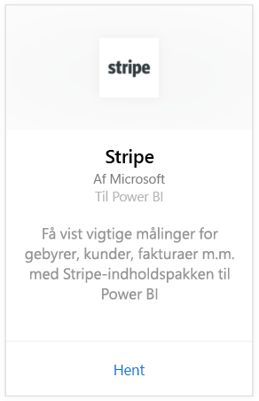
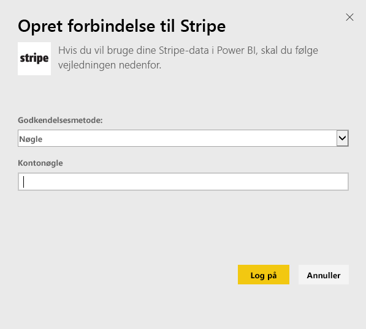
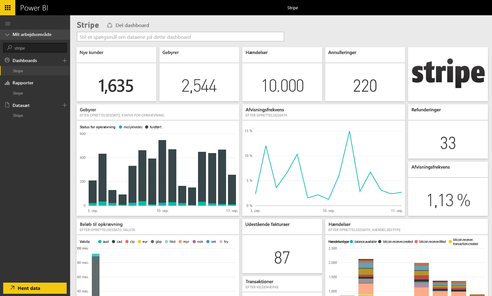

# Opret forbindelse til Stripe med Power BI
Visualiser og udforsk dine Stripe-data i Power BI med Power BI-indholdspakken. Power BI Stripe-indholdspakken trækker data ind om dine kunder, gebyrer, begivenheder og fakturaer. Dataene indeholder de seneste titusinde hændelser og 5.000 gebyrer over de seneste 30 dage. Indholdet opdateres automatisk en gang om dagen med en tidsplan, du styrer. 

Opret forbindelse til [Stripe-indholdspakken til Power BI](https://app.powerbi.com/getdata/services/stripe).

## Sådan opretter du forbindelse
1. Vælg Hent data nederst i venstre navigationsrude.  
   
    
2. I feltet **Tjenester** skal du vælge **Hent**.  
   
      
3. Vælg **Stripe** &gt; **Hent**.  
   
      
4. Angiv din Stripe [API-nøgle](https://dashboard.stripe.com/account/apikeys) for at oprette forbindelse.  
   
    
5. Importprocessen starter automatisk. Når processen er fuldført, vises et nyt dashboard samt en ny rapport og model i navigationsruden og er markeret med en stjerne. Vælg dashboardet for at få vist de importerede data.
   
    

**Hvad nu?**

* Prøv [at stille et spørgsmål i feltet Spørgsmål og svar](power-bi-q-and-a.md) øverst i dashboard'et
* [Rediger felterne](service-dashboard-edit-tile.md) i dashboard'et.
* [Vælg et felt](service-dashboard-tiles.md) for at åbne den underliggende rapport.
* Dit datasæt vil være planlagt til daglig opdatering. Du kan dog ændre tidsplanen for opdatering eller forsøge at opdatere efter behov ved hjælp af **Opdater nu**

## Næste trin
[Kom i gang med Power BI](service-get-started.md)

[Hent data til Power BI](service-get-data.md)

