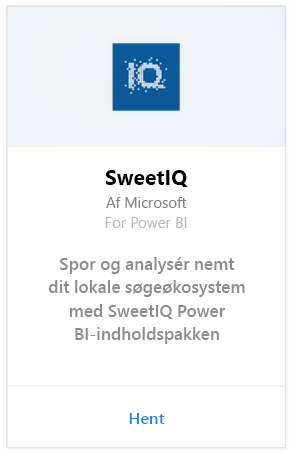
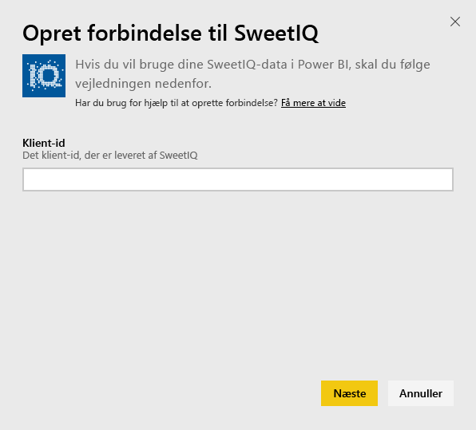
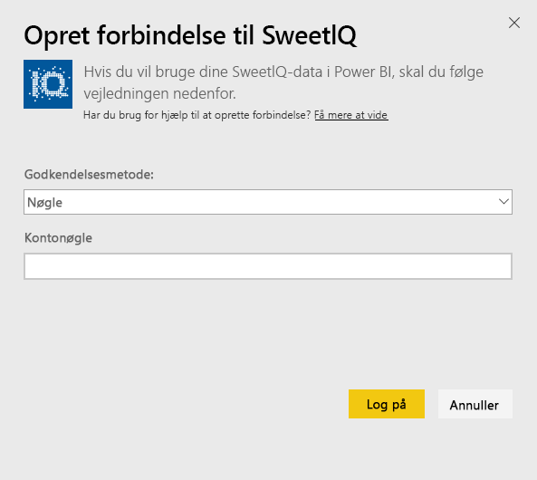
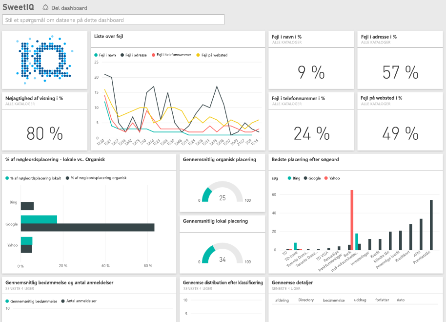

# Opret forbindelse til SweetIQ med Power BI
Power BI-indholdspakken henter data fra din SweetIQ-konto, og der oprettes standardindhold, så du nemt kan udforske dine data. Du kan bruge SweetIQ-indholdspakken til at analysere data om dine placeringer, annoncer, bedømmelser og anmeldelser. Dataene er indstillet til daglig opdatering for at sikre, at de data, du overvåger, er opdateret.

Opret forbindelse til [SweetIQ-indholdspakken](https://app.powerbi.com/groups/me/getdata/services/sweetiq) til Power BI.

## Sådan opretter du forbindelse
1. I navigationsruden til venstre skal du klikke på **Hent data.**
   
    
2. Vælg **SweetIQ**, og klik på **Hent.**
   
    
3. Angiv dit SweetIQ-klient-id. Dette er normalt en alfanumerisk værdi. Du får flere oplysninger om at finde denne værdi nedenfor.
   
    
4. Vælg godkendelsestypen **Nøgle**, og opgiv din Sweet IQ API-nøgle. Dette er normalt en alfanumerisk værdi. Se nedenfor for at få flere oplysninger om, hvordan du finder denne værdi.
   
    
5. Power BI begynder at indlæse dine data, hvilket kan tage noget tid, afhængigt af størrelsen af dataene i din konto. Når Power BI har importeret dataene, vises der et nyt dashboard og datasæt samt en ny rapport i venstre navigationsrude.
   
    

**Hvad nu?**

* Prøv [at stille et spørgsmål i feltet Spørgsmål og svar](power-bi-q-and-a.md) øverst i dashboard'et
* [Rediger felterne](service-dashboard-edit-tile.md) i dashboard'et.
* [Vælg et felt](service-dashboard-tiles.md) for at åbne den underliggende rapport.
* Dit datasæt vil være planlagt til daglig opdatering. Du kan dog ændre tidsplanen for opdatering eller forsøge at opdatere efter behov ved at bruge **Opdater nu**

## Søg efter parametre
Klient-id'et og API-nøglen til denne indholdspakke er ikke de samme som dit SweetIQ-brugernavn og -adgangskode.

Vælg et klient-id for en af de klienter, din konto har adgang til. Du kan finde listen over klienter under "Klientadministration" i din SweetIQ-konto.

Kontakt administratoren for at få din API-nøgle for at få adgang til dataene for en bestemt klient.

## Næste trin
[Kom i gang med Power BI](service-get-started.md)

[Hent data til Power BI](service-get-data.md)

