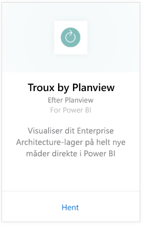
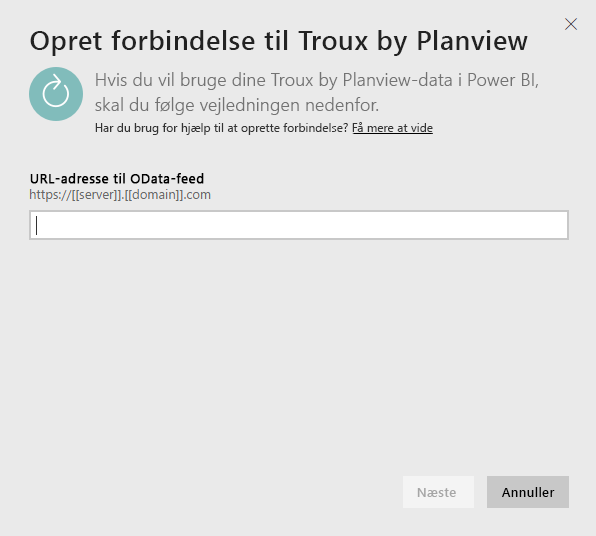
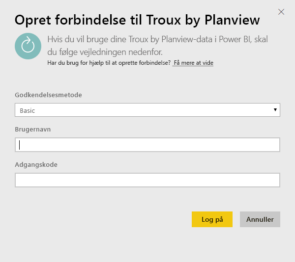
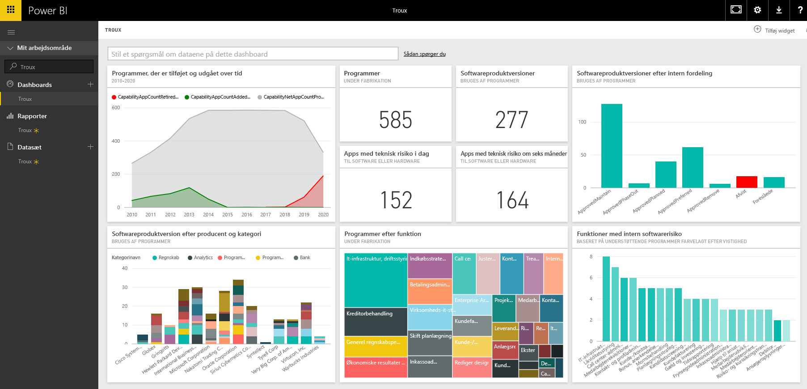

# Opret forbindelse til Troux til Power BI
Med Troux-indholdspakken kan du visualisere dit Enterprise Architecture-lager på helt nye måder direkte i Power BI. Indholdspakken giver dig indsigt i din virksomheds egenskaber, de programmer, der leverer disse egenskaber, og de teknologier, der understøtter disse programmer, som kan tilpasses fuldt ud ved hjælp af Power BI.

Opret forbindelse til [Troux-indholdspakken](https://app.powerbi.com/getdata/services/troux) til Power BI.

## Sådan opretter du forbindelse
1. Vælg **Hent data** nederst i venstre navigationsrude.
   
   
2. Vælg **Hent** i feltet **Tjenester**.
   
   
3. Vælg **Troux** \> **Hent**.
   
   
4. Angiv URL-adressen til dine Troux OData. Se detaljer om, hvordan du [finder de pågældende parametre](#FindingParams), nedenfor.
   
   
5. Som **Godkendelsesmetode** skal du vælge **Grundlæggende** og angive dit brugernavn og din adgangskode (der skelnes mellem små og store bogstaver), og derefter skal du vælge **Log på**.
   
    
6. Efter godkendelsen starter importprocessen automatisk. Når processen er fuldført, vises et nyt dashboard samt en ny rapport og model i navigationsruden. Vælg dashboardet for at få vist de importerede data.
   
     

**Hvad nu?**

* Prøv [at stille et spørgsmål i feltet Spørgsmål og svar](power-bi-q-and-a.md) øverst i dashboard'et
* [Rediger felterne](service-dashboard-edit-tile.md) i dashboard'et.
* [Vælg et felt](service-dashboard-tiles.md) for at åbne den underliggende rapport.
* Dit datasæt vil være planlagt til daglig opdatering. Du kan dog ændre tidsplanen for opdatering eller forsøge at opdatere efter behov ved hjælp af **Opdater nu**

## Systemkrav
Adgang til Troux OData-feed og Troux 9.5.1 eller derover er påkrævet.

## Sådan finder du parametre
Dit kundeplejeteam kan give dig den entydige URL-adresse til dit Troux OData-feed

## Fejlfinding
Hvis du får vist en timeoutfejl, når du har angivet legitimationsoplysninger, skal du prøve at oprette forbindelse igen.

## Næste trin
[Kom i gang med Power BI](service-get-started.md)

[Hent data i Power BI](service-get-data.md)

