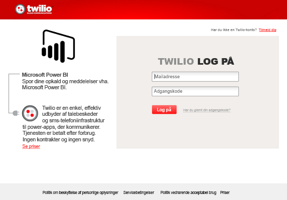

# Opret forbindelse til Twilio med Power BI
Med Microsoft Twilio-indholdspakken til Power BI kan du hente data ind i Power BI, og der oprettes et [Twilio-dashboard](https://powerbi.microsoft.com/integrations/twilio) og en rapport, der viser indsigt i dine data. Du kan også oprette brugerdefinerede rapporter og dashboard på det datasæt, Power BI opretter. Dataene opdateres en gang om dagen, så du altid ser på de seneste data.

Opret forbindelse til [Twilio-indholdspakken](https://app.powerbi.com/getdata/services/twilio) til Power BI.

## Sådan opretter du forbindelse
1. Vælg **Hent data** nederst i venstre navigationsrude.
   
    
2. Vælg **Hent** i feltet **Tjenester**.
   
    
3. Vælg **Twilio** \> **Hent**.
   
   
4. Som **Godkendelsesmetode** skal du vælge **oAuth2** \> Log på. Når du bliver bedt om det, skal du angive dine legitimationsoplysninger til Twilio og tillade, at Power BI-programmet får adgang til dine data.
   
   
5. Dette starter importen af dine data fra din Twilio-konto, og dit dashboard vil blive udfyldt med dine opkald og meddelelser inden for de seneste 30 dage. 
   
   

**Hvad nu?**

* Prøv [at stille et spørgsmål i feltet Spørgsmål og svar](power-bi-q-and-a.md) øverst i dashboard'et
* [Rediger felterne](service-dashboard-edit-tile.md) i dashboard'et.
* [Vælg et felt](service-dashboard-tiles.md) for at åbne den underliggende rapport.
* Dit datasæt vil være planlagt til daglig opdatering. Du kan dog ændre tidsplanen for opdatering eller forsøge at opdatere efter behov ved hjælp af **Opdater nu**

## Følgende er inkluderet
Oplysninger om alle opkald og meddelelser inden for de seneste 30 dage. Du kan udføre alle mulige analyser og samling af disse data.

En række allerede samlede statistikker, som du kan holde øje med. Dette samling omfatter:

        All Time Calls Count  
        All Time Calls Duration  
        All Time Calls Price  
        All Time Messages Price  
        All Time Messages Count  
        All Time Count of Phone Numbers  
        All Time Price of Phone Numbers  
        All Time Twilio Client Calls Price  
        All Time Twilio Client Calls Duration  
        All Time Twilio Client Calls Count  
        All Time Total Price  
        All Time Inbound Calls Price  
        All Time Inbound Calls Duration  
        All Time Inbound Calls Count  
        All Time Outbound Calls Price  
        All Time Outbound Calls Duration  
        All Time Outbound Calls Count  
        This Month Calls Price  
        This Month Calls Duration  
        This Month Calls Count  
        This Month Messages Count  
        This Month Messages Price  
        This Month Count of Phone Numbers  
        This Month Price of Phone Numbers  
        This Month Twilio Client Calls Price  
        This Month Twilio Client Calls Duration  
        This Month Twilio Client Calls Count  
        This Month Total Price  
        This Month Inbound Calls Price  
        This Month Inbound Calls Duration  
        This Month Inbound Calls Count  
        This Month Outbound Calls Price  
        This Month Outbound Calls Duration  
        This Month Outbound Calls Count  
        This Month Inbound Messages Price  
        This Month Inbound Messages Count  
        This Month Outbound Messages Price  
        This Month Outbound Messages Count

## Fejlfinding
Hvis du har en meget stor mængde data inden for de sidste 30 dage (hundredtusindvis af transaktioner), kan trinnet til hentning af data mislykkes. Vi har kendskab til problemet og arbejder på at udbedre det. Hvis du er stødt på dette problem, kan du bruge supportlinket øverst på Power BI-siden til at fortælle os det. Så kontakter vi dig for yderligere undersøgelser.

## Næste trin
[Kom i gang med Power BI](service-get-started.md)

[Hent data i Power BI](service-get-data.md)

