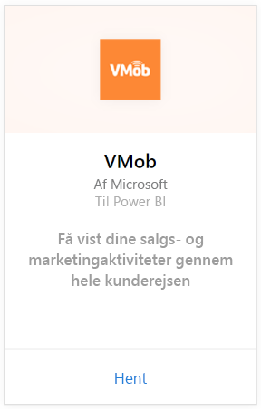
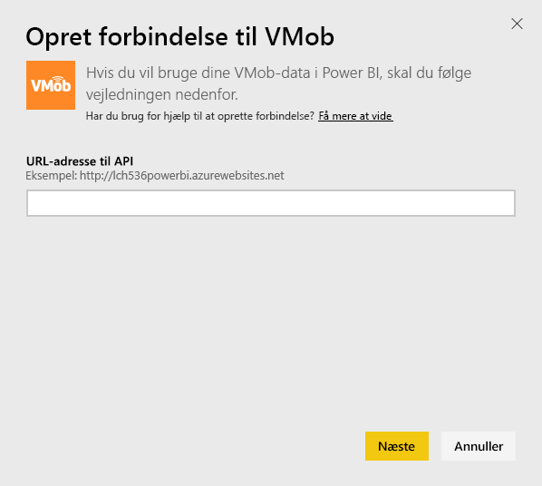
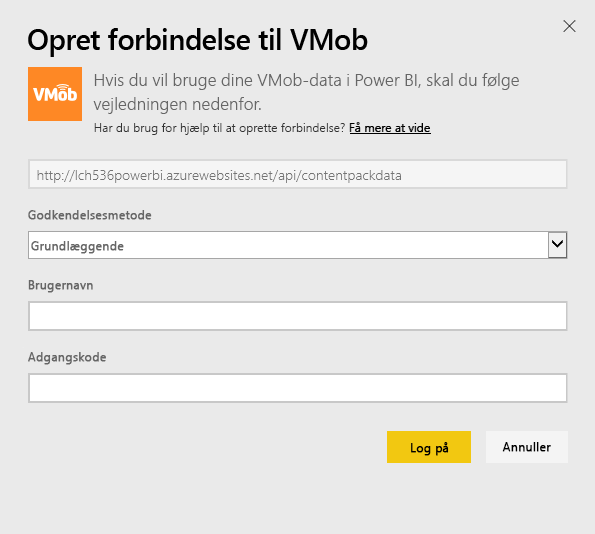
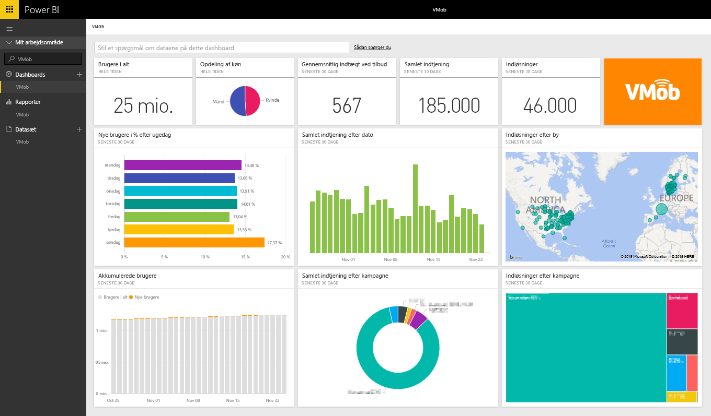

# Opret forbindelse til VMob med Power BI
Det er nemt at spore og udforske dine VMob-data med Power BI og VMob-indholdspakken. Power BI henter følgende data: Brugerstatistik for al tid og de seneste 30 dage, nøgletal for handel for de seneste 30 dage og kampagneresultater for de seneste 30 dage.

Opret forbindelse til [VMob-indholdspakken](https://app.powerbi.com/getdata/services/vmob) til Power BI.

## Sådan opretter du forbindelse
1. Vælg **Hent data** nederst i venstre navigationsrude.
   
    
2. Vælg **Hent** i feltet **Tjenester**.
   
   
3. Vælg **VMob** \> **Hent**.
   
   
4. Når du bliver spurgt, skal du angive din URL-adresse til VMob og klikke på knappen Næste. Denne URL-adresse leveres separat af VMob.
   
    
5. Vælg indstillingen **Grundlæggende** på rullelisten Godkendelsesmetode, angiv dit brugernavn og din adgangskode til VMob, og klik på knappen **Log på**.
   
    
6. Importen starter automatisk, og Power BI henter dine VMob-data for at oprette et dashboard og en rapport til dig, som er klar til brug.
   
   

**Hvad nu?**

* Prøv [at stille et spørgsmål i feltet Spørgsmål og svar](power-bi-q-and-a.md) øverst i dashboard'et
* [Rediger felterne](service-dashboard-edit-tile.md) i dashboard'et.
* [Vælg et felt](service-dashboard-tiles.md) for at åbne den underliggende rapport.
* Dit datasæt vil være planlagt til daglig opdatering. Du kan dog ændre tidsplanen for opdatering eller forsøge at opdatere efter behov ved hjælp af **Opdater nu**

## Næste trin
[Kom i gang med Power BI](service-get-started.md)

[Hent data i Power BI](service-get-data.md)

