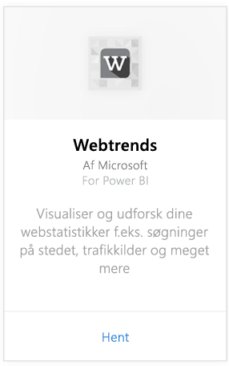
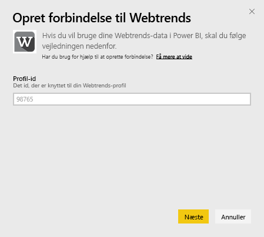
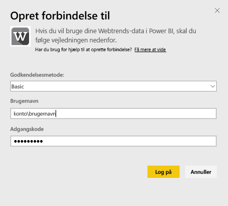
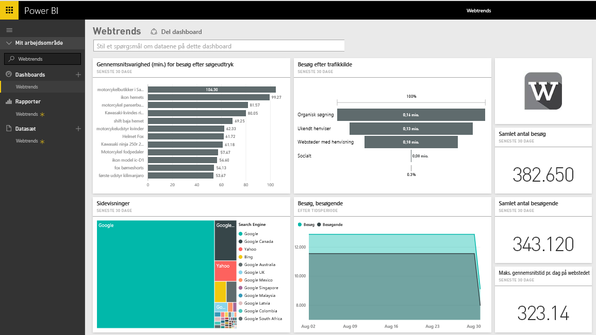
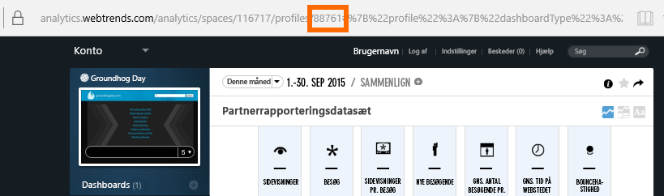
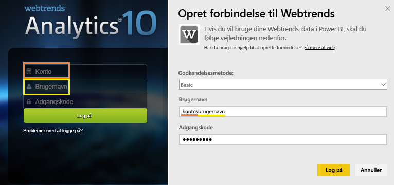

# Opret forbindelse til Webtrends med Power BI
Webtrends-indholdspakken til Power BI indeholder en række køreklare målepunkter, f.eks. samlede sidevisninger og besøg efter trafikkilde. Visualisering af dine Webtrends-data i Power BI starter med at oprette forbindelse til din Webtrends-konto. Du kan bruge det dashboard og de rapporter, som følger med, eller tilpasse dem for at fremhæve de oplysninger, som betyder mest for dig.  Dataene opdateres automatisk én gang dagligt.

Opret forbindelse til [Webtrends-indholdspakken til Power BI.](https://app.powerbi.com/getdata/services/webtrends)

## Sådan opretter du forbindelse
1. Vælg **Hent data** nederst i venstre navigationsrude.
   
   
2. I feltet **Tjenester** skal du vælge **Hent**.
   
   
3. Vælg **Webtrends** \> **Hent**.
   
   
4. Der oprettes forbindelse mellem indholdspakken og et bestemt Webtrends-profil-id. Nedenfor kan du se detaljer om, hvordan du [finder disse parametre](#FindingParams).
   
   
5. Angiv dine Webtrends-legitimationsoplysninger for at oprette forbindelse. Bemærk, at du skal angive din konto og dit brugernavn i feltet Brugernavn. Se [detaljer](#FindingParams) nedenfor.
   
   
6. Efter godkendelsen startes importprocessen automatisk. Når processen er fuldført, vises et nyt dashboard samt en ny rapport og model i navigationsruden. Vælg dashboardet for at få vist de importerede data.
   
   

**Hvad nu?**

* Prøv [at stille et spørgsmål i feltet Spørgsmål og svar](consumer/end-user-q-and-a.md) øverst i dashboard'et
* [Rediger felterne](service-dashboard-edit-tile.md) i dashboard'et.
* [Vælg et felt](consumer/end-user-tiles.md) for at åbne den underliggende rapport.
* Selvom dit datasæt opdateres dagligt, kan du ændre tidsplanen for opdatering eller prøve at opdatere det efter behov ved hjælp af **Opdater nu**

## Det følgende er inkluderet

Der indhentes data fra følgende rapporter i Webtrends-indholdspakken:  

| Navn på rapport | Rapport-id |
| --- | --- |
| Vigtige målepunkter | |
| Søgninger på stedet |34awBVEP0P6 |
| Afslutningssider |7FshY8eP0P6 |
| Næste sider |CTd5rpeP0P6 |
| Forrige sider |aSdOeaUgnP6 |
| Webstedssider |oOEWQj3sUo6 |
| Klikfrekvens i forbindelse med reklamer på stedet |41df19b6d9f |
| Byer |aUuHskcP0P6 |
| Lande |JHWXJNcP0P6 |
| Besøgende |xPcmTDDP0P6 |
| Varighed af besøget |U5KAyqdP0P6 |
| Søgeudtryk |IKYEDxIP0P6 |
| Trafikkilder |JmttAoIP0P6 |
| Søgemaskiner |yGz3gAGP0P6 |
| Indgangssider |i6LrkNVRUo6 |

>[!NOTE]
>I forbindelse med SharePoint-profiler kan navnene på målepunkterne være en smule anderledes end dem, der vises i brugergrænsefladen i Webtrends. Følgende tilknytning er udført for at bevare konsistens mellem SharePoint og Web-profiler:   

    - Sessioner = Besøg  
    - Nye brugere = Nye besøgende  
    - Visninger pr. session = Sidevisninger pr. besøg  
    - Gns. varighed pr. dag pr. bruger = Gns. tid på webstedet pr. besøgende  

## Systemkrav
Indholdspakken skal have adgang til en Webtrends-profil, hvor det [korrekte rapportsæt](#Included) er aktiveret.

## Søgning efter parametre
Du kan se dit Webtrends-profil-id i URL-adressen, når du har valgt en profil:

Dine legitimationsoplysninger er de samme som dem, du angiver, når du logger på Webtrends, men du skal angive din konto og dit brugernavn i den samme linje adskilt af en omvendt skråstreg:

## Fejlfinding
Der kan opstå en fejl under indlæsning af indholdspakken, efter du har angivet dine legitimationsoplysninger. Hvis du ser meddelelsen "Ups" under indlæsningen, skal du gennemse fejlfindingsforslagene nedenfor. Hvis du stadig oplever problemer, skal du indsende en supportanmodning på https://support.powerbi.com

1. Det korrekte profil-id bruges: Se under [Søgning efter parametre](#FindingParams) for at få flere oplysninger.
2. Brugeren har adgang til de rapporter, der er angivet i afsnittet ["Følgende er inkluderet"](#Included)

## Næste trin
[Hvad er Power BI?](power-bi-overview.md)

[Grundlæggende begreber for designere i Power BI-tjenesten](service-basic-concepts.md)

