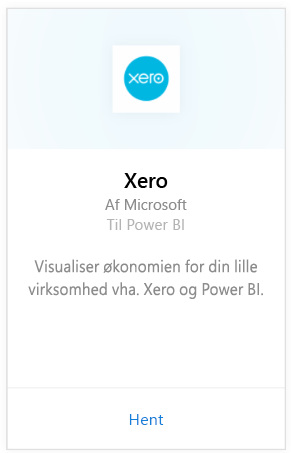
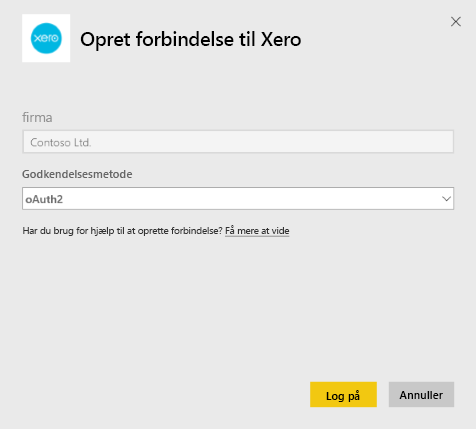
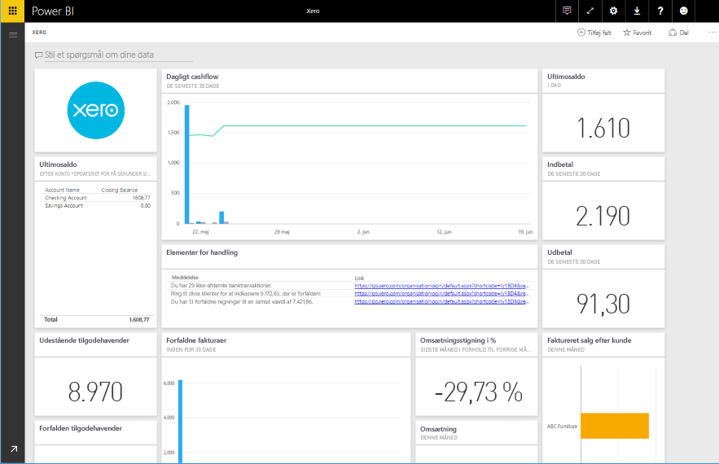

# Opret forbindelse til Xero med Power BI
Xero er en brugervenlig online regnskabssoftware, der er udviklet specielt til små virksomheder. Opret overbevisende visualiseringer baseret på din bogføring i Xero med denne Power BI-indholdspakke. Standarddashboardet indeholder mange metrikværdier for små virksomheder, f.eks. likviditet, indtægter i forhold til udgifter, avancetendens, debitordage og afkastningsgrad.

Opret forbindelse til [Xero-indholdspakken](https://app.powerbi.com/getdata/services/xero) til Power BI, eller få mere at vide om integration af [Xero og Power BI](https://help.xero.com/Power-BI).

## Sådan opretter du forbindelse
1. Vælg **Hent data** nederst i venstre navigationsrude.
   
   
2. Vælg **Hent** i feltet **Tjenester**.
   
   
3. Vælg **Xero** \>  **Hent**.
   
   
4. Angiv et kaldenavn for den organisation, der er knyttet til din Xero-konto. Du kan kalde den hvad som helst. Det er hovedsageligt for at hjælpe brugere med flere Xero-organisationer med at skelne dem fra hinanden. Se detaljer [nedenfor](#FindingParams).
   
   
5. Som **Godkendelsesmetode** skal du vælge **OAuth**, og når du bliver bedt om det, skal du logge på din Xero-konto og vælge den organisation, du vil oprette forbindelse til. Når logonprocessen er fuldført, skal du vælge **Log på** for at starte indlæsningsprocessen.
   
    
   
    
6. Efter godkendelsen starter importprocessen automatisk. Når processen er fuldført, vises et nyt dashboard samt en ny rapport og model i navigationsruden. Vælg dashboardet for at få vist de importerede data.
   
     

**Hvad nu?**

* Prøv [at stille et spørgsmål i feltet Spørgsmål og svar](power-bi-q-and-a.md) øverst i dashboard'et
* [Rediger felterne](service-dashboard-edit-tile.md) i dashboard'et.
* [Vælg et felt](service-dashboard-tiles.md) for at åbne den underliggende rapport.
* Dit datasæt vil være planlagt til daglig opdatering. Du kan dog ændre tidsplanen for opdatering eller forsøge at opdatere efter behov ved hjælp af **Opdater nu**

## Følgende er inkluderet
Indholdspakkens dashboard indeholder felter og metrikværdier, der dækker en lang række områder med tilsvarende rapporter, hvor man kan få flere oplysninger:  

| Område | Dashboardfelter | Rapport |
| --- | --- | --- |
| Penge |Daily cash flow  Cash in  Cash out  Closing balance by account  Closing balance today |Bank Accounts |
| Kunde |Invoiced sales  Invoiced sales by customer  Invoiced sales growth trend  Invoices due  Outstanding receivables  Overdue receivables |Customer  Inventory |
| Leverandør |Billed purchases  Billed purchases by supplier  Billed purchases growth trend   Bills due  Outstanding payables  Overdue payables |Suppliers  Inventory |
| Lager |Monthly sales amount by product |Inventory |
| Resultatopgørelse |Monthly profit and loss  Net profit this fiscal year  Net profit this month  Top expense accounts |Profit and Loss |
| Balance |Total assets  Total liabilities  Equity |Balance Sheet |
| Tilstand |Current ratio  Gross profit percentage   Return on total assets  Total liabilities to equity ratio |Health  Glossary and Technical Notes |

Datasættet indeholder også følgende tabeller til at tilpasse dine rapporter og dashboards:  

* Addresses  
* Alerts  
* Bank Statement Daily Balance  
* Bank Statements  
* Contacts  
* Expense Claims  
* Invoice Line Items  
* Invoices  
* Items  
* Month End  
* Organisation  
* Trial Balance  
* Xero Accounts

## Systemkrav
Følgende roller er påkrævet for at få adgang til Xero-indholdspakken: "Standard + Rapporter" eller "Rådgiver".

## Sådan finder du parametre
Angiv et navn på din organisation, der skal spores i Power BI. Det giver dig mulighed at oprette forbindelse til flere forskellige organisationer. Bemærk, at du ikke kan oprette forbindelse til den samme organisation flere gange, da det påvirker den planlagte opdatering.   

## Fejlfinding
* Xero-brugere skal have følgende roller for at få adgang til Xero-indholdspakken til Power BI: "Standard + Rapporter" eller "Rådgiver". Indholdspakken er afhængig af de brugerbaserede tilladelser til at få adgang til rapportdata via Power BI.  
* Hvis du får vist en fejl noget tid inde i indlæsningen, skal du kontrollere, hvor lang tid det tog, før du fik vist denne fejlmeddelelse. Bemærk, at det adgangstoken, der leveres af Xero, kun er gyldigt i 30 min. Så konti med flere data, end der kan ikke indlæses inden for dette tidsrum, mislykkes. Vi arbejder aktivt for at forbedre dette.
* Under indlæsningen er felterne på dashboardet i en generisk indlæsningstilstand. Dette ændres antageligt ikke, før indlæsningen er fuldført. Hvis du får en meddelelse om, at din indlæsning er fuldført, men felterne stadig er under indlæsning, skal du prøve at opdatere dashboardfelterne ved hjælp af den ... i øverste højre hjørne af dashboardet.
* Hvis din indholdspakke ikke opdateres, skal du kontrollere, om du har oprettet forbindelse til den samme organisation mere end én gang i Power BI. Xero tillader kun en enkelt aktiv forbindelse til en organisation, og du kan få vist en fejl, der angiver, at dine legitimationsoplysninger er ugyldige, hvis du opretter forbindelse til den samme mere end én gang.  
* Hvis du har problemer med at oprette forbindelse til Xero-indholdspakken til Power BI, f.eks. fejlmeddelelser eller meget langsom indlæsning, skal du først rydde din cache/cookies og genstarte browseren, og derefter skal du oprette forbindelse til Power BI igen.  

Hvis du oplever andre problemer, hvis problemet er vedvarende, skal du oprette en supportanmodning på http://support.powerbi.com.

## Næste trin
[Kom i gang med Power BI](service-get-started.md)

[Hent data i Power BI](service-get-data.md)

