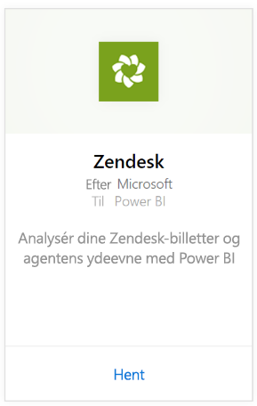
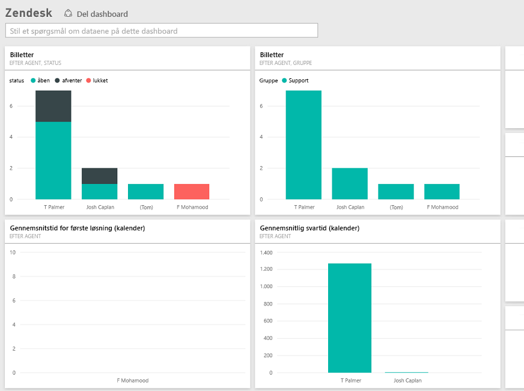

# Opret forbindelse til Zendesk med Power BI
Zendesk-indholdspakken indeholder et Power BI-dashboard og et sæt Power BI-rapporter, der giver indsigt i dine billetvolumener og agentydeevne. Du kan bruge dashboardet og rapporterne, som følger med, eller tilpasse dem for at fremhæve de oplysninger, som betyder mest for dig.  Dataene opdateres automatisk én gang dagligt. 

Opret forbindelse til [Zendesk-indholdspakken](https://app.powerbi.com/getdata/services/zendesk), eller læs mere om [Zendesk-integrationen](https://powerbi.microsoft.com/integrations/zendesk) med Power BI.

>[!NOTE]
>Der kræves en Zendesk-administratorkonto for at oprette forbindelse. Flere oplysninger om [kravene](#Requirements) nedenfor.

## Sådan opretter du forbindelse
1. Vælg **Hent data** nederst i venstre navigationsrude.
   
   
2. I feltet **Tjenester** skal du vælge **Hent**.
   
    
3. Vælg **Zendesk** \> **Hent.**
   
   
4. Angiv den URL-adresse, som er knyttet til din konto. Den skal være i formatet **https://company.zendesk.com**. Du kan se oplysninger om, hvordan du [finder disse parametre](#FindingParams), nedenfor.
   
   
5. Angiv dine Zendesk-legitimationsoplysninger, når du bliver bedt om dem.  Vælg **oAuth 2** som Godkendelsesmetode, og klik på **Log på**. Følg Zendesk-godkendelsesprocessen. (Hvis du er allerede er logget på Zendesk i din browser, bliver du muligvis ikke bedt om legitimationsoplysninger).
   
   > [!NOTE]
   > Denne indholdspakke kræver, at du opretter forbindelse med en Zendesk-administratorkonto. 
   > 
   > 
   
   
6. Klik på **Tillad** for at tillade, at Power BI får adgang til dine Zendesk-data.
   
   
7. Klik på **Opret forbindelse** for at starte importprocessen. Når Power BI har importeret dataene, vises der et nyt dashboard, en ny rapport og et nyt datasæt i venstre navigationsrude. Nye elementer er markeret med en gul stjerne \*.
   
   

**Hvad nu?**

* Prøv [at stille et spørgsmål i feltet Spørgsmål og svar](power-bi-q-and-a.md) øverst i dashboard'et
* [Rediger felterne](service-dashboard-edit-tile.md) i dashboard'et.
* [Vælg et felt](service-dashboard-tiles.md) for at åbne den underliggende rapport.
* Dit datasæt vil være planlagt til daglig opdatering. Du kan dog ændre tidsplanen for opdatering eller forsøge at opdatere efter behov ved hjælp af **Opdater nu**

## Følgende er inkluderet
Power BI-indholdspakken indeholder data om følgende:  

* Brugere (slutbrugere og agenter)  
* Organisationer  
* Grupper  
* Billetter  

Der er også et sæt af målinger, der er blevet beregnet, f.eks. gennemsnitlig ventetid og billetter løst inden for de seneste 7 dage. En komplet liste følger med indholdspakken.

## Systemkrav
Der kræves en Zendesk-administratorkonto for at få adgang til Zendesk-indholdspakken. Hvis du er agent eller slutbruger og er interesseret i at få vist dine Zendesk-data, kan du tilføje et forslag og gennemgå Zendesk-connectoren i [Power BI Desktop](desktop-connect-to-data.md).

## Søg efter parametre
URL-adressen til Zendesk skal være den samme som den URL-adresse, du bruger til at logge på din Zendesk-konto. Hvis du ikke er sikker på din Zendesk URL-adresse, kan du bruge [hjælp til logon](https://www.zendesk.com/login/) i Zendesk.

## Fejlfinding
Hvis du har problemer med at oprette forbindelse, skal du kontrollere din Zendesk URL-adresse og bekræfte, at du bruger en Zendesk-administratorkonto.

## Næste trin
* [Hvad er Power BI?](power-bi-overview.md)
* [Hent data](service-get-data.md)

