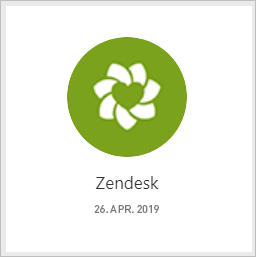
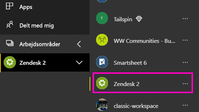

# Opret forbindelse til Zendesk med Power BI

Denne artikel fører dig gennem trække dine data fra din Zendesk-konto med en app i Power BI-skabelon. Zendesk appen giver et Power BI-dashboard og et sæt af Power BI-rapporter, der giver indsigt i dine billetter og agentens ydeevne. Dataene opdateres automatisk én gang dagligt. 

Når du har installeret appen skabelon, kan du tilpasse dashboardet og rapporten for at fremhæve de oplysninger, der betyder mest for dig. Derefter kan du distribuere den som en app til kollegaer i din organisation.

Opret forbindelse til [Zendesk-indholdspakken](https://app.powerbi.com/getdata/services/zendesk), eller læs mere om [Zendesk-integrationen](https://powerbi.microsoft.com/integrations/zendesk) med Power BI.

Når du har installeret appen skabelon, kan du ændre dashboardet og rapporten. Derefter kan du distribuere den som en app til kollegaer i din organisation.

>[!NOTE]
>Du har brug for en Zendesk Admin-konto til at oprette forbindelse. Der er flere oplysninger om [kravene](#system-requirements) nedenfor.

## Sådan opretter du forbindelse

[!INCLUDE [powerbi-service-apps-get-more-apps](./includes/powerbi-service-apps-get-more-apps.md)]

3. Vælg **Zendesk** \> **Hent det nu**.
4. I **installere denne App i Power BI?** Vælg **installere**.
4. I den **Apps** skal du vælge den **Zendesk** felt.

    

6. I **Kom i gang med din nye app**, skal du vælge **forbinde data**.

    

4. Angiv den URL-adresse, som er knyttet til din konto. URL-adressen har formularen **https://company.zendesk.com** . Herunder kan du se detaljer om, hvordan du [finder de pågældende parametre](#finding-parameters).
   
   

5. Angiv dine Zendesk-legitimationsoplysninger, når du bliver bedt om dem.  Vælg **oAuth 2** som Godkendelsesmetode, og klik på **Log på**. Følg Zendesk-godkendelsesprocessen. (Hvis du er allerede logget på Zendesk i din browser, du muligvis ikke spurgt om legitimationsoplysninger.)
   
   > [!NOTE]
   > Denne indholdspakke kræver, at du opretter forbindelse med en Zendesk Admin-konto. 
   > 
   
   
6. Klik på **Tillad** for at tillade, at Power BI får adgang til dine Zendesk-data.
   
   
7. Klik på **Opret forbindelse** for at starte importprocessen. 
8. Når Power BI har importeret dataene, kan du se listen over indhold til din Zendesk-app: et nyt dashboard, rapport og datasæt.
9. Vælg dashboardet for at starte processen udforskning.

    
   
## Rediger og Distribuer din app

Du har installeret appen Zendesk skabelon. Det betyder, at du har også oprettet Zendesk app-arbejdsområdet. Du kan ændre rapporten og dashboardet i arbejdsområdet, og derefter distribuere den som en *app* til kollegaer i din organisation. 

1. For at få vist hele indholdet af det nye Zendesk arbejdsområde i venstre navigationslinje, skal du vælge **arbejdsområder** > **Zendesk**. 

    

    Denne visning er listen over indhold til arbejdsområdet. I det øverste højre hjørne skal du se **Opdater app**. Når du er klar til at distribuere din app til dine kollegaer, er, hvor du vil starte. 

    

2. Vælg **rapporter** og **datasæt** at se de andre elementer i arbejdsområdet.

    Læs om [distribuere apps](service-create-distribute-apps.md) til dine kollegaer.

## Systemkrav
Der kræves en Zendesk-administratorkonto for at få adgang til Zendesk-indholdspakken. Hvis du er en agent eller slutbruger og er interesseret i at få vist dine Zendesk-data, tilføje et forslag og gennemgå Zendesk-connectoren i den [Power BI Desktop](desktop-connect-to-data.md).

## Søgning efter parametre
URL-adressen til Zendesk skal være den samme som den URL-adresse, du bruger til at logge på din Zendesk-konto. Hvis du ikke er sikker på din Zendesk URL-adresse, kan du bruge [hjælp til logon](https://www.zendesk.com/login/) i Zendesk.

## Fejlfinding
Hvis du har problemer med at oprette forbindelse, kontrollere din Zendesk URL-adresse og bekræfte, at du bruger en Zendesk-administratorkonto.

## Næste trin

* [Opret nye arbejdsområder i Power BI](service-create-the-new-workspaces.md)
* [Installér og brug apps i Power BI](consumer/end-user-apps.md)
* [Opret forbindelse til Power BI-apps til eksterne tjenester](service-connect-to-services.md)
* Har du spørgsmål? [Prøv at spørge Power BI-community'et](http://community.powerbi.com/)

