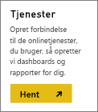
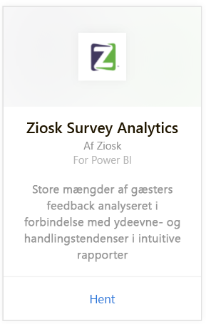
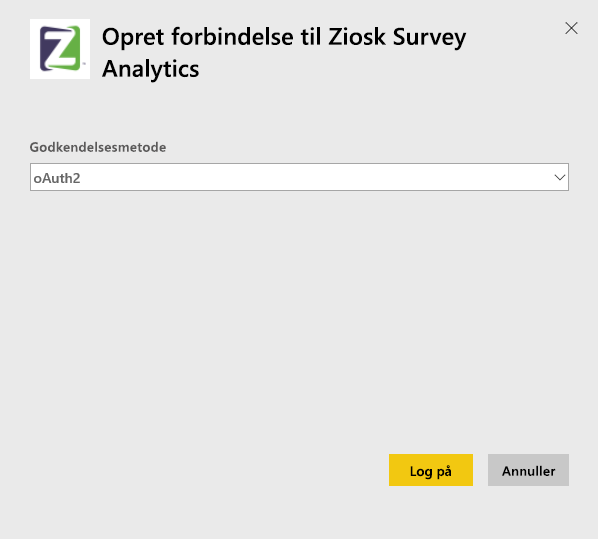
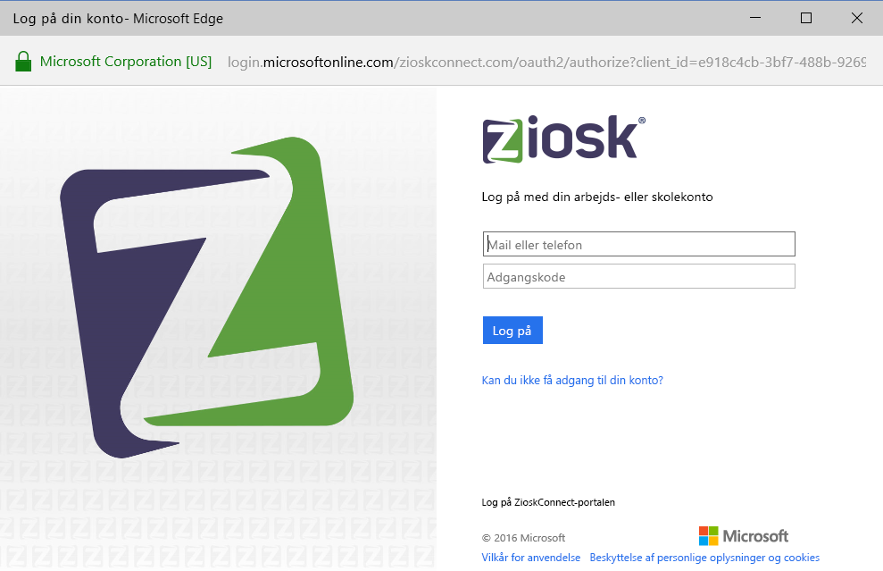
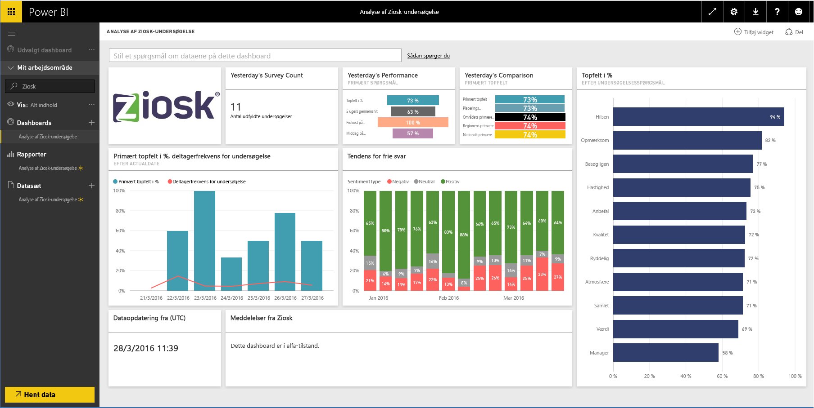

# Opret forbindelse til Ziosk Survey Analytics med Power BI
Ziosk Survey Analytics-indholdspakken til Power BI giver restauranter med Ziosk-tablets uforlignelig adgang til indsigt, der leveres af Ziosk-undersøgelsesdata, herunder segmentering efter dag, placering, medarbejder og meget mere.

Opret forbindelse til [Ziosk Survey Analytics-indholdspakken](https://app.powerbi.com/getdata/services/ziosk-survey-analytics) til Power BI.

## Sådan opretter du forbindelse
1. Vælg **Hent data** nederst i venstre navigationsrude.  
   
    
2. Vælg **Hent** i feltet **Tjenester**.  
   
    
3. Vælg **Ziosk Survey Analytics**, og vælg derefter **Hent**.  
   
    
4. Vælg **OAuth 2** og derefter **Log på**. Når du bliver spurgt, skal du angive dine legitimationsoplysninger til Ziosk.
   
    
   
    
5. Når der er oprettet forbindelse, indlæses der automatisk et dashboard, en rapport og et datasæt. Når det er fuldført, opdateres felterne med data fra din Ziosk-konto.
   
    

**Hvad nu?**

* Prøv at [stille et spørgsmål i feltet Spørgsmål og svar](service-q-and-a.md) øverst i dashboardet
* [Rediger felterne](service-dashboard-edit-tile.md) i dashboardet.
* [Vælg et felt](service-dashboard-tiles.md) for at åbne den underliggende rapport.
* Dit datasæt vil være planlagt til daglig opdatering. Du kan dog ændre tidsplanen for opdatering eller forsøge at opdatere efter behov ved hjælp af **Opdater nu**

## Følgende er inkluderet
Indholdspakken indeholder data fra følgende tabeller:  

    - Alcohol Category (alkoholkategori)  
    - Appetizer Category (forretkategori)  
    - CommentKeywords (KommentarNøgleord)  
    - Date (dato)  
    - Daypart (dagtimer)  
    - Dessert Category (dessertkategori)  
    - FreeForm (kombination)  
    - Kids Category (børnekategori)  
    - Messages (meddelelser)  
    - Premium Content Category (premiumindholdskategori)  
    - Question (spørgsmål)  
    - Store (butik)  
    - Surveys (undersøgelser)  
    - Weekday (ugedag)  

## Systemkrav
Der kræves en Ziosk-konto med rettigheder til at overstående tabeller for at kunne instantiere denne indholdspakke.

## Næste trin
[Introduktion til Power BI](service-get-started.md)

[Power BI – Grundlæggende begreber](service-basic-concepts.md)

