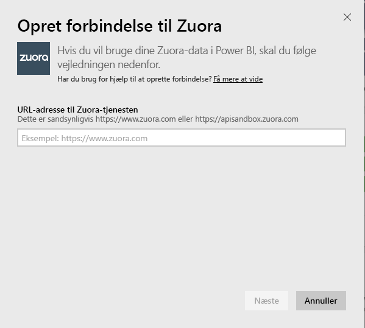
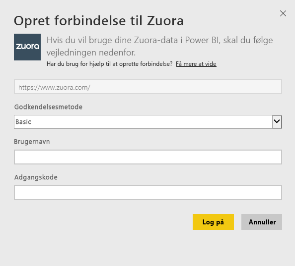
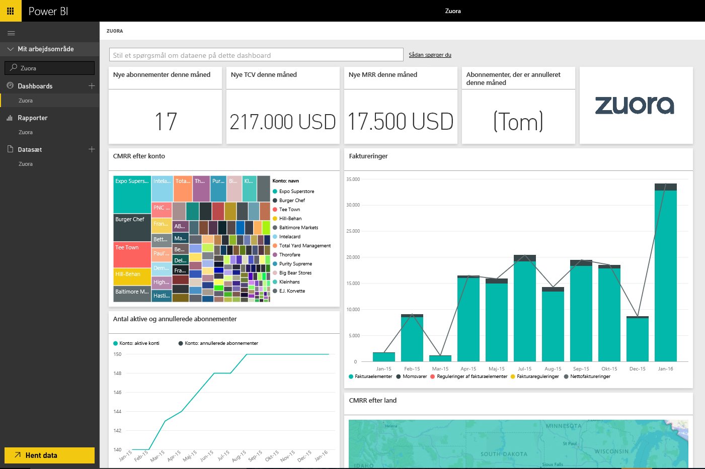

# Opret forbindelse til Zuora med Power BI
Med Zuora til Power BI kan du visualisere vigtige omsætnings-, fakturerings- og abonnementsdata. Brug standarddashboardet og rapporter til at analysere brugstendenser, spore faktureringer og betalinger og overvåge tilbagevendende indtægt eller til at tilpasse dem, så de imødekommer dine særlige behov i forbindelse med dashboard og rapportering.

Opret forbindelse til [Zuora](https://app.powerbi.com/getdata/services/Zuora) til Power BI.

## Sådan opretter du forbindelse
1. Vælg **Hent data** nederst i venstre navigationsrude.

   
2. I feltet **Tjenester** skal du vælge **Hent**.

   
3. Vælg **Zuora** \> **Hent**.

   
4. Angiv URL-adressen til Zuora. Dette vil typisk være "<https://www.zuora.com>" . Du kan se oplysninger om, hvordan [du finder disse parametre](#FindingParams) nedenfor.

   
5. Som **Godkendelsesmetode** skal du vælge **Grundlæggende**, angive dit brugernavn og din adgangskode (der skelnes mellem små og store bogstaver) og derefter vælge **Log på**.

    
6. Efter godkendelsen starter importprocessen automatisk. Når processen er fuldført, vises et nyt dashboard samt en ny rapport og model i navigationsruden. Vælg dashboardet for at få vist de importerede data.

     

**Hvad nu?**

* Prøv [at stille et spørgsmål i feltet Spørgsmål og svar](power-bi-q-and-a.md) øverst i dashboard'et
* [Rediger felterne](service-dashboard-edit-tile.md) i dashboard'et.
* [Vælg et felt](service-dashboard-tiles.md) for at åbne den underliggende rapport.
* Dit datasæt vil være planlagt til daglig opdatering. Du kan dog ændre tidsplanen for opdatering eller forsøge at opdatere efter behov ved hjælp af **Opdater nu**

## Følgende er inkluderet
Indholdspakken bruger Zuora AQUA API til at hente følgende tabeller:

| Tabeller |  |  |
| --- | --- | --- |
| Konto |InvoiceItemAdjustment |Refundering |
| AccountingCode |Betaling |RevenueSchedule |
| AccountingPeriod |PaymentMethod |RevenueScheduleItem |
| BillTo |Produkt |Abonnement |
| DateDim |ProductRatePlan |TaxationItem |
| Faktura |ProductRatePlan |Forbrug |
| InvoiceAdjustment |RatePlan | |
| InvoiceItem |RatePlanCharge | |

Det indeholder også disse beregnede målepunkter:

| Måling | Beskrivelse | Pseudoberegning |
| --- | --- | --- |
| Konto: betalinger |Samlede betalingsbeløb i en bestemt periode, baseret på betalingens ikrafttrædelsesdato. |SUM (Payment.Amount)  WHERE Payment.EffectiveDate =< TimePeriod.EndDate AND    Payment.EffectiveDate >= TimePeriod.StartDate |
| Konto: refunderinger |Samlede refusionsbeløb i en bestemt periode, baseret på datoen for refusionen. Beløbet rapporteres som et negativt tal. |-1*SUM(Refund.Amount) WHERE Refund.RefundDate = < TimePeriod.EndDate AND    Refund.RefundDate >= TimePeriod.StartDate |
| Konto: nettobetalinger |Kontobetalinger plus kontorefusioner i en bestemt periode. |Account.Payments + Account.Refunds |
| Konto: aktive konti |Antallet af konti, der var aktive i en bestemt periode. Abonnementer skal være begyndt før (eller på) tidsperiodens startdato. |COUNT (Account.AccountNumber) WHERE     Subscription.Status != "Expired" AND    Subscription.Status != "Draft" AND    Subscription.SubscriptionStartDate <= TimePeriod.StartDate AND    (Subscription.SubscriptionEndDate > TimePeriod.StartDate OR Subscription.SubscriptionEndDate = null) –evergreen subscription |
| Konto: gennemsnit af tilbagevendende indtægter |Brutto-MRR pr. aktive konto i en bestemt tidsperiode. |Brutto-MRR/Account.ActiveAccounts |
| Konto: annullerede abonnementer |Antallet af konti, der annullerede et abonnement i en bestemt periode. |COUNT (Account.AccountNumber) WHERE Subscription.Status = "Cancelled" AND    Subscription.SubscriptionStartDate <= TimePeriod.StartDate AND    Subscription.CancelledDate >= TimePeriod.StartDate |
| Konto: betalingsfejl |Samlet værdi af betalingsfejl. |SUM (Payment.Amount) WHERE Payment.Status = "Error" |
| Indtægtselement i tidsplanen: resultatafregnet omsætning |Samlet resultatafregnet omsætning i en regnskabsperiode. |SUM (RevenueScheduleItem.Amount) WHERE AccountingPeriod.StartDate = TimePeriod.StartDate |
| Abonnement: nye abonnementer |Antallet af nye abonnementer i en bestemt periode. |COUNT (Subscription.ID) WHERE Subscription.Version = "1" AND    Subscription.CreatedDate <= TimePeriod.EndDate AND    Subscription.CreatedDate >= TimePeriod.StartDate |
| Faktura: fakturaelementer |Samlede gebyrbeløb for fakturaelementer i en bestemt periode. |SUM (InvoiceItem.ChargeAmount) WHERE     Invoice.Status = "Posted" AND    Invoice.InvoiceDate <= TimePeriod.EndDate AND    Invoice.InvoiceDate >= TimePeriod.StartDate |
| Faktura: beskatningsposter |Det samlede beløb for beskatningsposer i en bestemt periode. |SUM (TaxationItem.TaxAmount) WHERE Invoice.Status = "Posted" AND    Invoice.InvoiceDate <= TimePeriod.EndDate AND    Invoice.InvoiceDate >= TimePeriod.StartDate |
| Faktura: reguleringer af fakturaelement |Det samlede reguleringsbeløb for fakturaelementer i en bestemt periode. |SUM (InvoiceItemAdjustment.Amount)  WHERE     Invoice.Status = "Posted" AND    InvoiceItemAdjustment.AdjustmentDate <= TimePeriod.EndDate AND    InvoiceItemAdjustment.AdjustmentDate >= TimePeriod.StartDate |
| Faktura: reguleringer af faktura |Det samlede reguleringsbeløb i en bestemt periode. |SUM (InvoiceAdjustment.Amount)  WHERE     Invoice.Status = "Posted" AND    InvoiceAdjustment.AdjustmentDate <= TimePeriod.EndDate AND    InvoiceAdjustment.AdjustmentDate >= TimePeriod.StartDate |
| Faktura: nettofaktureringer |Summen af fakturaelementer, beskatningsposter, regulering af fakturaelement og reguleringer af faktura i en bestemt periode. |Invoice.InvoiceItems + Invoice.TaxationItems + Invoice.InvoiceItemAdjustments + Invoice.InvoiceAdjustments |
| Faktura: saldo ved fakturas forfald |Summen af bogførte fakturaer. |SUM (Invoice.Balance)  WHERE     Invoice.Status = "Posted" |
| Faktura: bruttofakturering |Summen af gebyrbeløb for fakturaelementer for bogførte fakturaer i en bestemt periode. |SUM (InvoiceItem.ChargeAmount)  WHERE     Invoice.Status = "Posted" AND    Invoice.InvoiceDate <= TimePeriod.EndDate AND    Invoice.InvoiceDate >= TimePeriod.StartDate |
| Faktura: de samlede reguleringer |Summen af behandlede reguleringer af fakturaer og reguleringer af fakturaelementer, der er knyttet til sendte fakturaer. |SUM (InvoiceAdjustment.Amount)  WHERE     Invoice.Status = "Posted" AND    InvoiceAdjustment.Status = "Processed" + SUM (InvoiceItemAdjustment.Amount)  WHERE     Invoice.Status = "Posted" AND    invoiceItemAdjustment.Status = "Processed" |
| Prisoversigt for gebyr: brutto-MRR |Summen af månedlig tilbagevendende indtægt fra abonnementer i en bestemt periode. |SUM (RatePlanCharge.MRR)  WHERE     Subscription.Status != "Expired" AND    Subscription.Status != "Draft" AND    RatePlanCharge.EffectiveStartDate <= TimePeriod.StartDate AND        RatePlanCharge.EffectiveEndDate > TimePeriod.StartDate     OR    RatePlanCharge.EffectiveEndDate = null --evergreen subscription |

## Systemkrav
Adgang til Zuora-API'en er påkrævet.

## Find parametre
Angiv den URL-adresse, du typisk logger på for at få adgang til dine Zuora-data. De gyldige muligheder er:  

* https://www.zuora.com  
* https://www.apisandbox.zuora.com  
* Den URL-adresse, der svarer til din tjenesteforekomst  

## Fejlfinding
Zuora-indholdspakken henter fra mange forskellige dele af din Zuora-konto. Hvis du ikke bruger visse funktioner, vises de tilsvarende felter/rapporter muligvis som tomme. Hvis du har problemer med indlæsning, skal du kontakte Power BI-support.

## Næste trin
[Kom i gang med Power BI](service-get-started.md)

[Hent data i Power BI](service-get-data.md)
