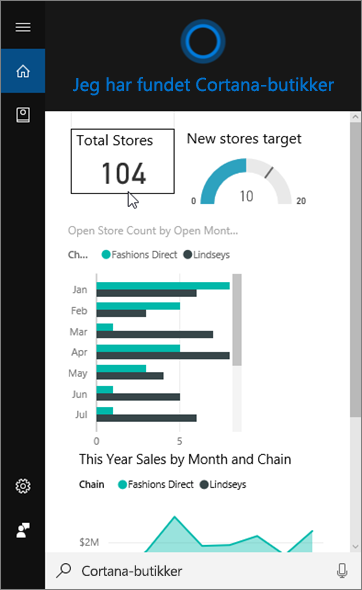
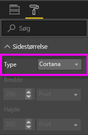
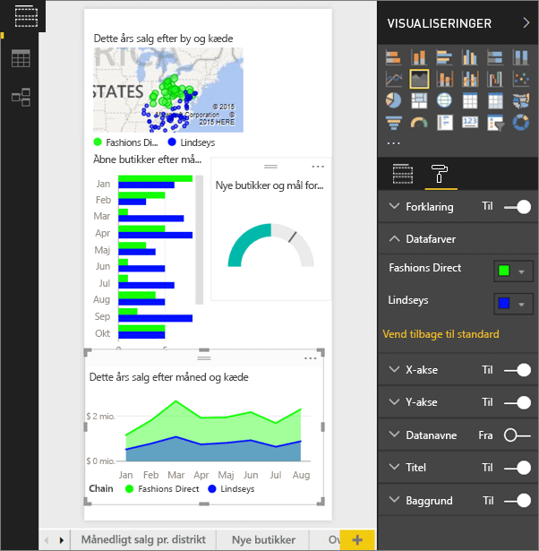
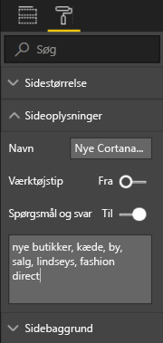
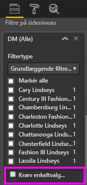

# Du kan bruge Power BI-tjenesten eller Power BI Desktop til at oprette en tilpasset svarside til Cortana
Få det fulde udbytte ud af Power BI ved at oprette særlige rapportsider, *Cortana-svarsider* (optræder undertiden også under benævnelsen *Cortana-svarkort*), udviklet specielt til at besvare Cortana spørgsmål.

> [!IMPORTANT]
> Integration med Cortana udfases i Power BI. Fra og med 11. juni vil Cortana ikke længere fungere for nogen dashboards og rapporter.

## Inden du starter
Du har fire dokumenter, der hjælper dig igennem konfiguration og anvendelse af Cortana til Power BI. Hvis du ikke allerede har gjort det, skal du starte med at læse artikel et. Og artikel to er vigtig, fordi den beskriver nogle trin, du skal tage, før du kan begynde at bruge Cortana-svarsiderne.

**Artikel 1**: [Find ud af, hvordan Cortana og Power BI arbejder sammen](service-cortana-intro.md)

**Artikel 2**: [Søgning efter Power BI-rapporter: Aktivér Windows-integration mellem Cortana og Power BI for rapporter](service-cortana-enable.md)

**Artikel 3**: Denne artikel

**Artikel 4**: [Fejlfinding af problemer](service-cortana-troubleshoot.md)

## Opret en Cortana-svarside, der er udviklet specielt til Cortana
En *Cortana-svarside* i en rapport har en størrelse specielt afpasset til Cortana, så Cortana kan få den vist på skærmen som et svar på et spørgsmål. Sådan opretter du en svarside til Cortana:

1. Det anbefales at starte med en tom rapportside.
2. I ruden **Visualiseringer** skal du vælge malerrulleikonet og vælge **Sidestørrelse** > **Type** > **Cortana**.
   
    
3. Opret et visuelt element eller et sæt af visuelle elementer, der skal vises i Cortana som svar på et bestemt spørgsmål (eller en række spørgsmål).

> [!NOTE]
> Cortanas svarsider understøtter i øjeblikket ikke billeder med statiske billeder. Du kan medtage billeder i tabel- eller matrixvisualiseringer, som dynamisk trækkes ind på baggrund af en URL-adresse i dine data. 
> 
> 

4. Kontrollér, at alle visuelle elementer falder inden for sidens kanter. Rediger eventuelt visningsindstillinger, datamærkater, farver og baggrunde.  
   
    
5. Navngiv siden, og tilføj alternative navne. Cortana bruger disse navne, når der søges efter resultater. I ruden **Visualiseringer** skal du vælge malerkostikonet og vælge **Sideoplysninger**. Aktivér Spørgsmål og svar for dette visuelle element ved at flytte skyderen til **Til**.
   
    
   
   > [!TIP]
   > Undgå at bruge ord, der også er kolonnenavne, for at få bedre resultater.
   > 
   > 
6. Hvis rapporten indeholder sideniveaufiltre, kan du eventuelt angive **Kræv enkeltvalg**. Cortana viser kun denne rapport som et svar, hvis et – og kun ét – af filterelementerne er angivet i spørgsmålet. **Kræv enkeltvalg** findes i bunden i ruden **Filtre**.
   
   > [!NOTE]
   > Du behøver ikke at indstille **Kræv enkeltvalg** for at bede Cortana om at vise en rapport med sideniveaufiltre. "vis salg for Charlotte Lindseys" vil f.eks. vise svarsiden uanset indstillingen Kræver enkeltvalg.
   > 
   > 
   
     
   
      Hvis du beder Cortana om f.eks.:
   
   * "at vise salg efter lagernavn," vises denne svarside ikke, fordi du ikke inkluderede nogen af elementerne i det krævede sideniveaufilter.
   * "at vise salg for Cary Lindseys og Charlotte Lindseys", vises denne svarside ikke, fordi du har angivet mere end ét element fra det nødvendige sideniveaufilter.
   * "at vise salg for Charlotte Lindseys," vises denne svarside.
     
     = "at vise salg", vises denne svarside ikke, fordi du ikke inkluderede nogen af elementerne i det krævede sideniveaufilter.

> [!IMPORTANT]
> Før Cortana kan få adgang til din Cortana-svarside, skal du [Aktivere datasættet for Cortana](service-cortana-enable.md).
> 
> 

## Hvordan sorteres resultaterne af Cortana?
Resultater med svar med en høj score (f.eks et fuldstændigt match på et specificeret sidenavn) vises først som et *bedste match* i Cortana. Der kan forekomme flere bedste match, hvis der er mange Cortana-svarsider i Power BI. Svar med mellemstor eller lav score, f.eks. svar, der ikke er baseret på navnet på en svarside eller et spørgsmål med ord, som ikke er forstået af Power BI, angives som links neden under bedste match i Cortana.

> [!NOTE]
> Når et nyt datasæt eller en tilpasset Cortana-svarside er føjet til Power BI og er aktiveret for Cortana, kan det tage op til en halv time, før resultaterne begynder at blive vist i Cortana. Hvis du logger på og af Windows 10 eller på anden måde genstarter Cortana-processen i Windows 10, vil nyt indhold vises med det samme.
> 
> 

## Næste trin
[Brug af Cortana med Power BI](service-cortana-intro.md)

Kan du stadigvæk ikke få Cortana til at fungere med Power BI?  Prøv [Cortana-fejlfindingsværktøj](service-cortana-troubleshoot.md).

Har du flere spørgsmål? [Prøv at spørge Power BI-community'et](https://community.powerbi.com/)

