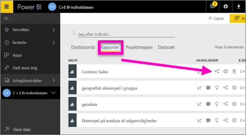
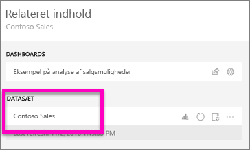
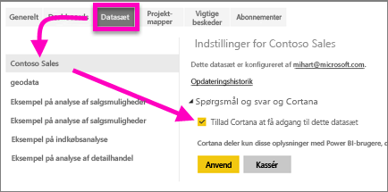
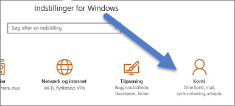
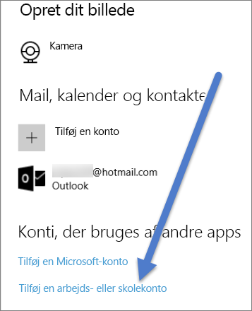

# Gør Cortana i stand til at få adgang til Power BI-rapporter (og deres underliggende datasæt)
Du har læst [Introduktion til Cortana og Power BI](service-cortana-intro.md) (hvis ikke, kan du læse den først og derefter vende tilbage). Og nu vil du selv prøve.  Før du kan stille spørgsmål på naturligt sprog i Cortana og finde svar fra data, der er gemt i Power BI-***rapporter***, er der nogle få krav. Du skal specifikt gøre følgende.

> [!NOTE]
> Hvis du afprøver eksempelvisningen af Cortana- og Power BI-***dashboard***, kan du springe resten af denne artikel over. Der er ingen konfigurationskrav for at sætte Cortana i stand til at søge i dine Power BI-dashboards.
> 
> 

I Power BI-tjenesten

* Aktivér et eller flere datasæt for Cortana (rapporter er baseret på datasæt, så Cortana skal have adgang til disse datasæt).

I Microsoft Windows

* Kontrollér, at du kører Windows 10 version 1511 eller nyere.
* Sørg for, at Power BI og Windows kan "tale" med hinanden. Det betyder, at du skal forbinde din konto med Windows.

## Brug Power BI-tjenesten til at gøre Cortana i stand til at få adgang til rapportsider i Power BI
Det er en nem proces at aktivere rapporter i Power BI, så Cortana kan få adgang til dem.  Du skal blot aktivere rapportens underliggende datasæt ved at vælge "Gør det muligt for Cortana at få adgang til dette datasæt". Derefter vil alle brugere, der har adgang til datasættet i Power BI, via almindelig Power BI-deling, apps og funktioner i indholdspakken, være i stand til at få svar fra rapporten i Cortana i Windows 10.

Du skal logge på Power BI-tjenesten (ikke Power BI Desktop) og gentage disse trin for de datasæt, som Cortana skal have adgang til.

1. Bestem, hvilke datasæt der skal aktiveres. Vælg på listen med rapportindhold den rapport, som Cortana skal have adgang til, og vælg ikonet **Få vist relaterede** .
   
    
2. Det datasæt, der er knyttet til denne rapport, er **Contoso Sales**.
   
    
3. Til højre for datasætnavnet skal du vælge **ellipsen (...) > Indstillinger**.  
   
    
4. Vælg **Spørgsmål og svar og Cortana** > **Tillad Cortana at få adgang til dette datasæt** > **Anvend**.
   
   
   
   I dette eksempel aktiverer vi Cortana på datasættet Contoso Sales.
   
   > [!NOTE]
   > Når et nyt datasæt eller Cortana-svarkort er føjet til Power BI og aktiveret for Cortana, kan det tage op til 30 minutter, før resultater begynder at blive vist. Hvis du logger på og af Windows 10 eller på anden måde genstarter Cortana-processen i Windows 10, kan nyt indhold vises med det samme.
   > 
   > Hvis du aktiverer et datasæt for Cortana, og dette datasæt er en del af en indholdspakke eller app, du ejer, skal du publicere igen, så dine kollegaer også kan bruge det med Cortana.
   > 
   > 

## Føj dine Power BI-legitimationsoplysninger til Windows
Du skal køre Windows 10 version 1511 eller nyere.

1. Find ud af, hvilken Windows 10-version du kører. Åbn **Indstillinger**.
    .

    Vælg derefter **System > Om**. Nederst på skærmen får du vist **Windows-specifikationer > Version**.

   * Hvis du har Windows 10 version 1511 (Windows 10 november 2015-opdatering) indtil 1607, skal du tilføje din arbejds- eller skolekonto og Microsoft-konto (fuldfør trin 2 og 3 nedenfor).
   * Hvis du har Windows 10 version 1607 (Windows 10 juli 2016-opdatering) eller senere, skal du tilføje din arbejds- eller skolekonto (fuldfør kun trin 2 nedenfor).
1. Tilføj din arbejds- eller skolekonto for Cortana.
   
   * Åbn **Indstillinger** > **Konti**.
     
       
   * Rul ned til bunden, og vælg **Tilføj en arbejds- eller skolekonto**. Eller vælg **Adgang til arbejde eller skole > Opret forbindelse** på siden **Konti**.
     
     

Cortana vil bruge denne arbejds- eller skolekonto til at kontrollere, om der i Power BI er potentielle svar på dine spørgsmål i Cortana.

## Næste trin
[Opret Cortana-*svarkort* i Power BI](service-cortana-answer-cards.md)

[Fejlfinding af problemer med integration mellem Cortana og Power BI](service-cortana-troubleshoot.md)

Har du flere spørgsmål? [Prøv at spørge Power BI-community'et](http://community.powerbi.com/)

