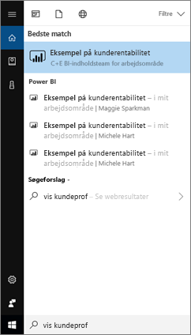
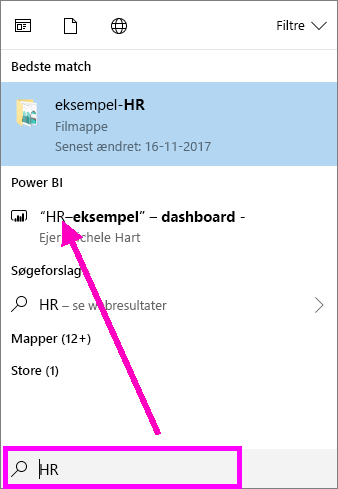
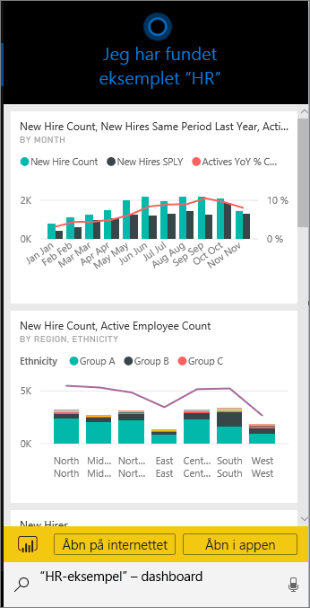
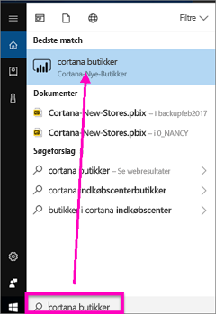
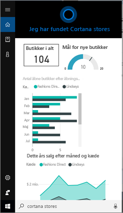
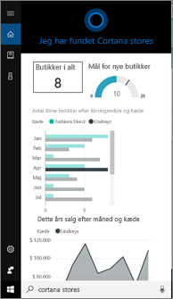
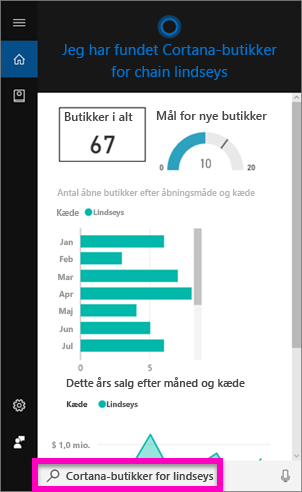
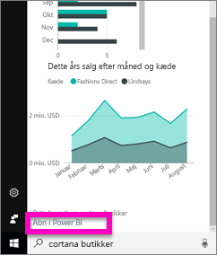
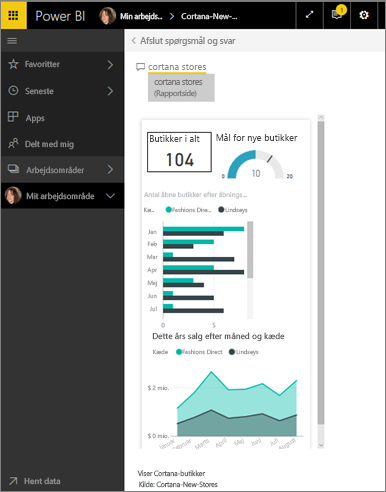

# Find og vis hurtigt dine Power BI-data ved hjælp af Cortana til Power BI
Brug Cortana på tværs af dine Windows 10-enheder for at få omgående svar på vigtige forretningsspørgsmål. Ved at integrere med Power BI kan Cortana hente vigtige oplysninger direkte fra Power BI-dashboards og -rapporter. Alt hvad der kræves, er version Windows 10 November 2015 eller nyere, Cortana, Power BI og adgang til mindst ét datasæt.

## Prøv at opleve den nye *dashboardsøgning* i Cortana til Windows 10
I et stykke tid har du nu kunnet [anvende Cortana til at hente visse typer rapportsider](service-cortana-answer-cards.md). Vi har nu tilføjet en **ny oplevelse** – muligheden for også at hente dashboards. Prøv den, og [send os feedback](mailto:pbicortanasg@microsoft.com). Den *nye oplevelse* vil med tiden blive udvidet til også at indeholde Cortana-søgning efter rapporter.  En af de vigtigste fordele ved den nye oplevelse er, at du ikke behøver gøre noget særligt for at konfigurere den – ingen aktivering af Cortana eller konfiguration af Windows 10 – det virker bare.

> [!NOTE]
> Hvis det ikke "bare virker", kan du finde hjælp i [fejlfindingsartiklen](service-cortana-troubleshoot.md).
> 
> 

Den underliggende teknologi bruger [Microsofts Azure Search Service](). Denne søgetjeneste indeholder ekstra funktioner som for eksempel smart rangordning, fejlkorrektion og automatisk fuldførelse.

Begge Cortana-oplevelser vil findes side om side.

## Dokumentation til Cortana til Power BI
Vi har 4 dokumenter, der fører dig igennem konfiguration og anvendelse af Cortana til Power BI. Denne række artikler fører dig gennem trinnene til

**Artikel 1** (denne artikel): Forstå, hvordan Cortana og Power BI arbejder sammen

**Artikel 2**: [Søg i Power BI-rapporter: Aktivér Windows-integration mellem Cortana og Power BI](service-cortana-enable.md)

**Artikel 3**: [Søg i Power BI-rapporter: Opret særlige *Cortana-svarkort*](service-cortana-answer-cards.md)

**Artikel 4**: [Fejlfinding af problemer](service-cortana-troubleshoot.md)

## Hvordan arbejder Cortana og Power BI sammen?
Når du bruger Cortana til at stille et spørgsmål, kan Power BI kan være et af de steder, Cortana leder efter svar. I Power BI kan Cortana finde omfattende datadrevne svar fra Power BI-rapporter (der indeholder en særlig type rapportside kaldet et *Cortana-svarkort*) og fra Power BI-dashboards.

Hvis Cortana finder en overensstemmelse, vises navnet på dashboardet eller rapportsiden direkte på Cortana-skærmen. Dashboard- eller rapportsiden kan åbnes i Power BI. Rapportsider kan også udforskes direkte i Cortana – de er interaktive.

### Cortana og dashboards (den *nye oplevelse*)
Cortana kan finde svar på dashboards, som du ejer, og dashboards, der er blevet delt med dig. Stil Cortana spørgsmål ved hjælp af titler, nøgleord, navne på ejere, navne på arbejdsområder, appnavne m.m.

Dit spørgsmål skal indeholde mindst 2 ord, før Cortana kan finde et svar. Så hvis du søger på et dashboard, som har et navn med et enkelt ord (Marketing), skal du føje ordet "show" eller "Power BI" eller "<owner name>" til dit spørgsmål, som i "show Marketing" og "michele hart sample". 

Hvis dit dashboard har en titel med mere end ét ord, returner Cortana kun dette dashboard, hvis din søgning stemmer overens med mindst to af ordene, eller hvis dashboardet stemmer overens med et af ordene plus ejerens navn. For et dashboard med navnet "Customer Profitability Sample": 

* vil "show me customer" *ikke* returnere et Power BI-dashboardresultat.   
* "udsagn som f.eks. "show me customer profitability", "customer p", "customer s", "profitability sample", "michele hart sample", "show customer profitability sample" og "show me customer p" *vil* returnere et Power BI-resultat.
* Tilføjelse af ordet "powerbi" tæller med som et af de to påkrævede ord, så "powerbi sample" *vil* returnere et Power BI-resultat. 
  
    

### Cortana og rapporter
 Cortana kan finde svar i rapporter, som indeholder [sider, der er udviklet specielt til visning af Cortana](service-cortana-answer-cards.md). Du skal blot stille spørgsmål ved hjælp af titlen eller nøgleord fra en af disse specialrapportsider.  

Den underliggende teknologi for rapporter er brug af [Microsofts Power BI Spørgsmål og svar](power-bi-q-and-a.md).

Når du stiller et spørgsmål i Cortana, svarer Power BI fra rapportsider, der er udviklet specielt til Cortana. Potentielle svar bestemmes løbende af Cortana direkte fra Cortanas *svarkort*, der allerede er oprettet i Power BI.  Du skal blot åbne et resultat i Power BI for at udforske et svar yderligere.

> [!NOTE]
> Før Cortana kan lede efter svar i Power BI-rapporter, skal du [aktivere denne funktion ved hjælp af Power BI-tjenesten og konfigurere Windows til at kommunikere med Power BI](service-cortana-enable.md).  
> 
> 

## Brug Cortana til at få svar fra Power BI
1. Start i Cortana. Der er mange forskellige måder at *åbne* Cortana på: Vælg ikonet Cortana på proceslinjen (billedet nedenfor), brug stemmekommandoer, eller tryk på søgeikonet på din Windows-mobilenhed.
   
     
2. Når Cortana er klar, kan du skrive eller indtale dit spørgsmål i Cortana-søgelinjen. Cortana viser de tilgængelige resultater. Hvis der er et Power BI-dashboard, der svarer til spørgsmålet, vises det under **Bedste match** eller **Power BI**.
   
     
   
   > [!NOTE]
   > Kun engelsk understøttes på nuværende tidspunkt.
   > 
   > 
3. Vælg dashboardet for at åbne det i Cortana.

    

    Du kan ændre layoutet ved [at redigere *telefonvisningen* af dashboardet](service-create-dashboard-mobile-phone-view.md). 

1. Fra Cortana har du også mulighed for at åbne dashboardet i Power BI-tjenesten eller Power BI – Mobil. Åbn dashboardet i Power BI-tjenesten ved at vælge **Open on web** (Åbn på internettet). 
   
      
4. Lad os bruge Cortana til at søge efter en rapport. Vi skal kende en [rapport, der indeholder en side med et Cortana-svarkort ](service-cortana-answer-cards.md). I dette eksempel indeholder en rapport med navnet "Cortana-New-Stores" et Cortana-svarkort med navnet "cortana stores".  
   
     Skriv eller indtal dit spørgsmål i Cortana-søgelinjen. Cortana viser de tilgængelige resultater. Hvis der er en Power BI-rapportside, der svarer til spørgsmålet, vises den under **Bedste match** eller **Power BI**. Og i dette eksempel vises også den .pbix-fil (og sikkerhedskopi), jeg brugte til at oprette svarkortet – under **Dokumenter**.
   
      
5. Vælg rapportsiden **Cortana stores** for at få den vist i Cortana-vinduet.
   
       
   
    Husk, at et *svarkort* er en særlig type Power BI-rapportside, der blev oprettet af en datasætejer.  Du kan finde flere oplysninger under [Opret et Cortana-svarkort](service-cortana-answer-cards.md).
6. Men det er ikke det hele. Interager med visualiseringerne på svarkortet ligesom i Power BI.
   
   * Vælg f.eks. et element på én visualisering for i tværgående retning at filtrere og fremhæve de andre visualiseringer på svarkortet.
     
     
   * Eller brug naturligt sprog til at filtrere resultaterne i stedet.  Sig f.eks. "Cortana stores for Lindseys", og se kortet, der er filtreret, så det kun viser data for Lindseys-kæden.
     
     
7. Fortsæt med at udforske. Rul ned til bunden af Cortana-vinduet, og vælg **Åbn i Power BI**.
   
     
8. Rapportsiden åbnes i Power BI.    
     

## Overvejelser og fejlfinding
* Cortana har ikke adgang til Cortana-kort, der ikke er blevet [aktiveret til Power BI](service-cortana-enable.md).
* Kan du stadigvæk ikke få Cortana til at fungere sammen med Power BI?  Prøv [Cortana-fejlfindingsværktøj](service-cortana-troubleshoot.md).
* Cortana til Power BI findes i øjeblikket kun på engelsk.
* Cortana til Power BI er kun tilgængelig på Windows-mobilenheder.

Har du flere spørgsmål? [Prøv Power BI-community'et](http://community.powerbi.com/)

## Næste trin
[Aktivér Windows-integration mellem Cortana og Power BI for rapporter](service-cortana-enable.md)

