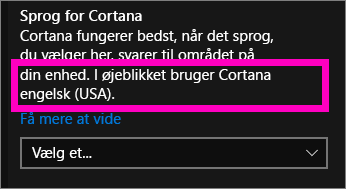
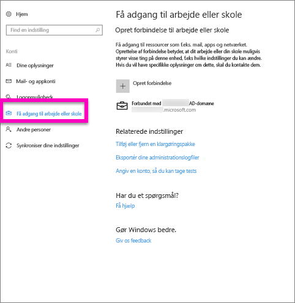
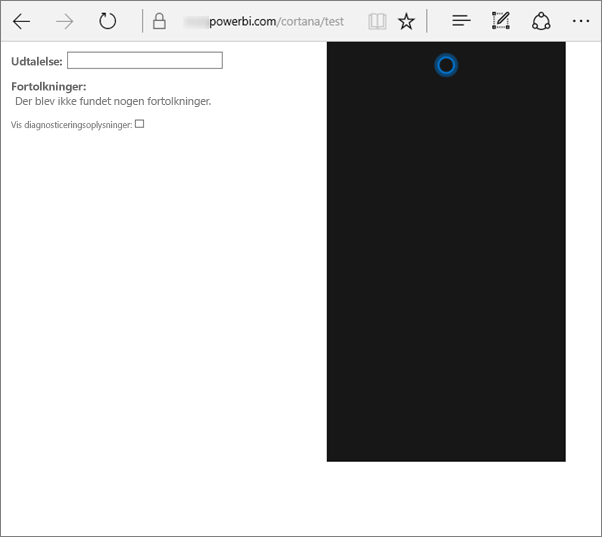
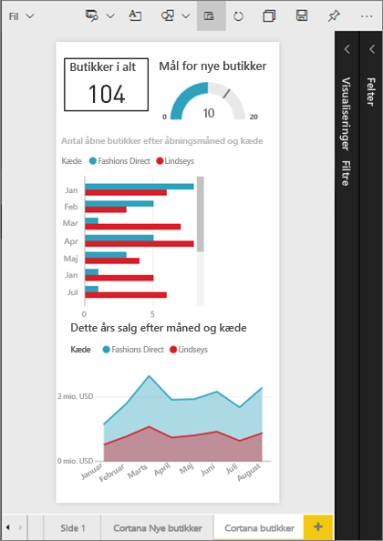
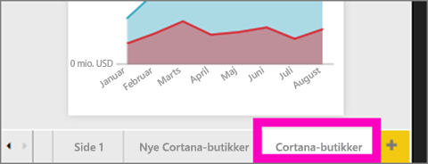
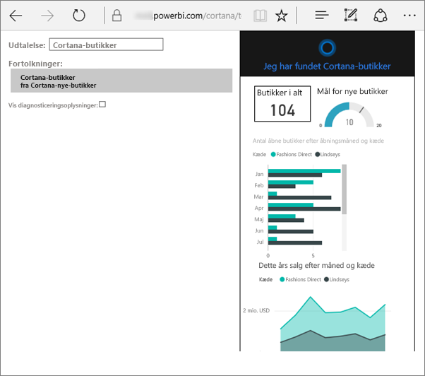
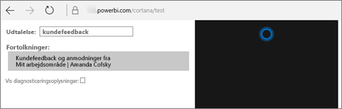

# Fejlfinding i Cortana til Power BI
Denne artikel er en del af en serie. Hvis du ikke allerede har gjort det, anbefaler vi, at du læser de følgende tre artikler.

**Artikel 1**: [Om hvordan Cortana og Power BI arbejder sammen for at søge efter Power BI-dashboards og -rapporter](service-cortana-intro.md)

**Artikel 2**: [Søgning i rapporter: Aktivér Windows-integration mellem Cortana og Power BI](service-cortana-enable.md)

**Artikel 3**: [Søgning i rapporter: Opret særlige *Cortana-svarkort*](service-cortana-answer-cards.md)

Hvis du stadig har problemer med at integrere Cortana i Power BI, er du kommet til det rette sted. Benyt følgende fremgangsmåde til at diagnosticere og løse problemet.

## Hvorfor kan Cortana ikke finde svar fra mine Power BI-rapporter eller -dashboards?
1. Har du en Power BI-konto?  Hvis ikke, så [tilmeld dig gratis](service-self-service-signup-for-power-bi.md).
2. Fungerer Cortana?  Kan du se Cortana-ikonet på proceslinjen?
   
    
   
    Når du vælger det, åbnes Cortana med et felt, hvor du kan skrive?
3. Brugte du mindst 2 ord i søgningen? Cortana skal bruge udtryk på mindst 2 ord for at finde svar i Power BI. Prøv at tilføje "Show" i starten af dit spørgsmål. 
4. Hvis dit dashboard har en titel med mere end ét ord, returner Cortana kun dette dashboard, hvis din søgning stemmer overens med mindst to af ordene. For et dashboard med navnet "Sales FY16": 
   
   * returnerer "show sales" *ikke* et resultat fra Power BI.   
   * "show me sales fy16", "sales fy16", "show sales fy16" og "show me sales f" *returnerer* et resultat fra Power BI.    
   * Tilføjelse af ordene "powerbi" tæller som et af de to påkrævede ord, så "powerbi sales" *returnerer* et resultat fra Power BI.
5. Har du adgangs- eller redigeringsrettigheder til rapporter eller dashboards? For rapporter skal du sikre, at det indhold, du prøver at søge efter, har et [svarkort](service-cortana-answer-cards.md).  For dashboards skal du sikre, at det indhold du prøver at søge efter, er i **Delt med mig**, et apparbejdsområde eller **My workspace**. [Brug fejlfindingsværktøjet](#try-the-cortana-troubleshooting-tool) til at hjælpe med at identificere problemet.
6. Bruger du en mobilenhed?  I øjeblikket understøtter vi kun integration af Cortana i Power BI på Windows-mobilenheder.
7. Er Cortana konfigureret til engelsk?  Den aktuelle integration af Cortana i Power BI understøtter kun engelsk. Åbn Cortana, og vælg tandhjulsikonet for at få vist Indstillinger. Rul ned til **Cortana-sprog**, og kontrollér, at det er indstillet til en af mulighederne for engelsk.
   
   
8. Har du mere end 100 rapporter aktiveret for Cortana?  Cortana søger kun i op til 100 i alt.  For at sikre at rapporten er inkluderet, skal du flytte eller kopiere den til **My workspace**, da Cortana søger der først.
9. Du skal muligvis blot give det lidt tid. Første gang du indtaster en forespørgsel, kan modellen være *kold*. Vent et øjeblik, så dataene kan indlæses i hukommelsen, og prøv derefter igen. 
10. Det kan tage op til 24 timer, før dashboards bliver tilgængelige for Cortana.    
11. Når et nyt datasæt eller brugerdefineret svarkort er føjet til Power BI og aktiveret for Cortana, kan det tage op til 30 minutter, før resultater for rapporter begynder at blive vist i Cortana. Hvis du logger på og af Windows 10, eller på anden måde genstarter Cortana-processen i Windows 10, kan nyt rapportindhold vises med det samme.  
12. Din Power BI-administrator kan "opt out". Kontakt administratoren for at se, om det er tilfældet.

## Kun rapporter: Hvorfor finder Cortana ikke svar blandt mine Power BI-rapporter
1. Hvis du søger efter svar i rapporter, har du nogen rapporter med Cortana-**svarkort**? Svarkort er den eneste måde, hvorpå Cortana kan finde svar i dine Power Bi-rapporter.  Få mere at vide om, hvordan du opretter et svarkort ved at læse [Opret Cortana-svarkort i Power BI-tjenesten og Power BI Desktop](service-cortana-answer-cards.md).
2. Kører du Windows-version 1511 eller nyere?  Find ud af det ved at åbne Windows-indstillinger, og vælg **System > Om**. Hvis det ikke er tilfældet, skal du opdatere din version af Windows.
3. Er dine Windows- og Power Bi-konti forbundne? Dette kan være forvirrende. Følg vejledningen i [Aktivér Cortana til Power BI](service-cortana-enable.md#add-your-power-bi-credentials-to-windows).
4. Er de underliggende datasæt blevet aktiveret for Cortana? En kollega har måske delt et datasæt, som allerede er blevet aktiveret for Cortana. Men, hvis ikke, kan du læse [Find ud af, hvordan du selv aktiverer datasæt for Cortana](service-cortana-enable.md). Det er hurtigt og nemt.

## Kun dashboards: Hvorfor finder Cortana ikke svar blandt mine Power BI-dashboards
1. Sørg for, at du er forbundet til din arbejdskonto. Power BI skal bruge denne forbindelse, så den kan godkende dine adgangstilladelser til data. Kontrollér, om du er forbundet eller ej, ved at bruge søgefeltet i Windows til at navigere til "Opret forbindelse til arbejde eller skole" for at forbinde din arbejdskonto.  
   
    
2. Har du adgang til Cortana? Vælg søgefeltet i Windows, og giv Cortana adgangsrettigheder til dine oplysninger.

## Prøv værktøjet til fejlfinding af Cortana
Har du stadig problemer?  Nu er et godt tidspunkt til at køre værktøjet til fejlfinding af Cortana og begrænse de mulige problemer. 

### Har du problemer med at hente svar fra en rapport?
1. For rapporter skal du, før du kører fejlfindingsværktøjet, sørge for at angive filtrene på **Sideniveau** på dine Cortana svarkort til **Kræv enkeltvalg**. Få hjælp til at gøre dette ved at læse [Opret Cortana-svarkort](service-cortana-answer-cards.md).
2. Åbn fejlfindingsværktøjet ved at tilføje "/cortana/test" i slutningen af din URL-adresse til Power BI-tjenesten. Din URL-adresse skal se sådan ud:
   
   app.powerbi.com/cortana/test
   
   
3. I feltet **Utterance** skal du skrive navnet på et Cortana-svarkort ***præcis, som det vises under Power BI-fanen*** for at fejlfinde rapporter.
   
   
   
    
   
   
4. Nogle gange sker der ikke noget, første gang du skriver noget i feltet **Utterance**. Tænk på det som, at du primer systemet. Du fortæller fejlfindingsværktøjet, at det er på tide at aktivere. Klip og indsæt, eller skriv i feltet **Utterance** igen. I dette eksempel er navnet på svarkortet **Cortana stores**. Når du indsætter eller skriver **Cortana stores** i værktøjet, oprettes der et enkelt resultat, der vises i feltet **Interpretations**. Klik for at se svarkortet, der vises i Cortana-vinduet – i dette tilfælde **Cortana stores**.
   
   
   
   Da vi fik et resultat, ved vi nu, at Cortana **er** aktiveret i Power BI. Dette indsnævrer problemet til noget på Windows-siden eller sprogindstillingen for Cortana, eller at der er mere end 100 datasæt aktiveret for Cortana.

### Har du problemer med at hente svar fra et dashboard?
Søger du efter et dashboard, der er blevet delt med dig?  Åbn Power BI > **Delt med mig**, og find navnet på dashboardet.  Skriv derefter navnet i feltet *Utterances**.

    

#### Kendte problemer for fejlfindingsværktøjet
* Hvis værktøjet ikke henter resultaterne første gang, kan du i stedet for indsætte forespørgslen i tekstfeltet Utterance.
* Forespørgslen skal være på 2 eller flere ord.  Hvis din forespørgsel er for kort, kan du tilføje ordet "show".
* Nogle forespørgselsstrenge med forholdsord fungerer muligvis ikke (f.eks. sales by item). Prøv andre søgeord, der ikke bruger forholdsord og er meningsfulde/entydige.

Har du flere spørgsmål? [Prøv Power BI-community'et](http://community.powerbi.com/)

