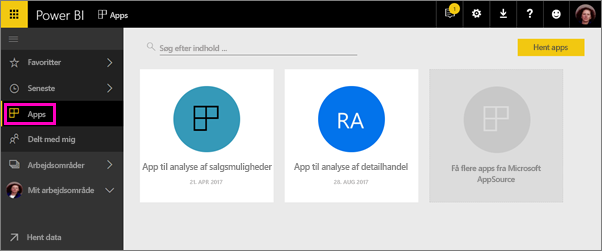
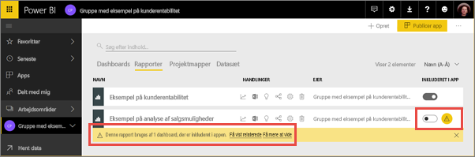
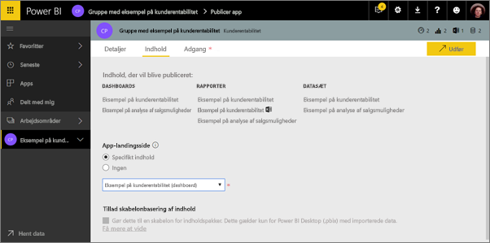
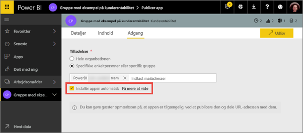
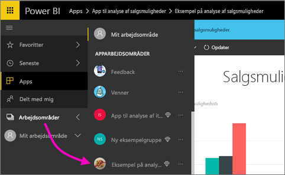
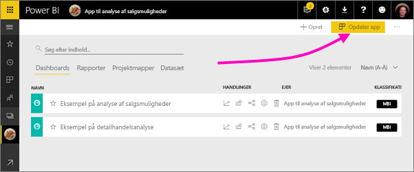
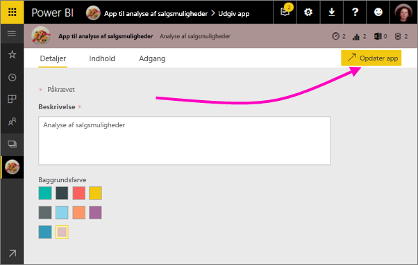

# Publicer apps med dashboards og rapporter i Power BI

I Power BI kan du publicere *apps* med samlinger af relaterede dashboards og rapporter. Du opretter apps i *apparbejdsområder*, hvor du kan samarbejde om Power BI-indhold med dine kollegaer. Du kan derefter publicere de færdige apps til store grupper af personer i din organisation. Læs mere om [oprettelse af apparbejdsområder](service-create-workspaces.md).

Forretningsbrugere har ofte brug for flere Power BI-dashboards og -rapporter for at kunne drive deres virksomhed. Med Power BI-apps kan du oprette samlinger af dashboards og rapporter og publicere disse apps til hele organisationen eller til bestemte personer eller grupper. Hvis du er forfatter af rapporten eller administrator, gør apps det nemmere for dig at administrere tilladelser til disse samlinger.

Forretningsbrugere kan få dine apps på flere måder. Hvis Power BI-administratoren giver dig tilladelse, kan du automatisk installere apps i dine kollegaers Power BI-konti. Ellers kan de installere dine apps fra Microsoft AppSource, eller du kan sende dem et direkte link. De kan nemt finde og vende tilbage til dit indhold, fordi det hele er samlet på ét sted. De kan ikke ændre indholdet af appen, men de kan interagere med det enten i Power BI-tjenesten eller en af mobilappsene – og selv filtrere, markere og sortere data. De får automatisk opdateringer, og du kan styre, hvor ofte dataene opdateres. Læs mere om [appoplevelsen for forretningsbrugere](consumer/end-user-apps.md).

**Vidste du det?** Power BI udgiver en ny prøveversion af arbejdsområdeoplevelsen. Læs [Opret nye arbejdsområder (prøveversion)](service-create-the-new-workspaces.md) for at se, hvordan arbejdsområder ændres i fremtiden. 

## Apps og organisationsindholdspakker
Apps er en udviklet form af organisationsindholdspakker. Indholdspakker er ikke tilgængelige i prøveversionen af de nye arbejdsområdeoplevelser. Når den nye arbejdsområdeoplevelse er offentligt tilgængelig, kan du ikke bruge indholdspakker i arbejdsområder, du opretter derefter. Hvis du ikke allerede har gjort det, kan du begynde at overføre dine indholdspakker til apps.

## Video: Apps og apparbejdsområder
<iframe width="640" height="360" src="https://www.youtube.com/embed/Ey5pyrr7Lk8?showinfo=0" frameborder="0" allowfullscreen></iframe>

## Licenser til apps
Alle medlemmer af et apparbejdsområde skal have en Power BI Pro-licens. Der er to muligheder for appbrugere.

* Mulighed 1: Alle forretningsbrugere skal have licens til **Power BI Pro** for at få vist din app. 
* Mulighed 2: Hvis din app er placeret i en Power BI Premium-kapacitet, kan gratisbrugere i din organisation få vist appindhold. Læs [Hvad er Power BI Premium?](service-premium.md) for at få flere oplysninger.

## Publicer din app
Når dashboards og rapporter i dit arbejdsområde er klar, skal du vælge, hvilke dashboards og rapporter du vil publicere, og derefter publicerer du dem som en app. Du kan sende et direkte link til denne større målgruppe, eller de kan finde din app under fanen Apps ved at gå til **Download and explore more apps from AppSource** (Download og udforsk flere apps fra AppSource). 

1. I listevisning i arbejdsområdet bestemmer du, hvilke dashboards og rapporter der skal medtages i appen.

     

     Hvis du vælger ikke at publicere en rapport, får du vist en advarsel ud for rapporten og dens relaterede dashboard. Du kan stadig publicere appen, men det relaterede dashboard mangler felterne fra den pågældende rapport.

     

2. Vælg knappen **Publicer app** øverst til højre for at starte processen til deling af alt indhold i dette arbejdsområde.
   
     

3. Under **Detaljer** skal du udfylde beskrivelsen, som skal hjælpe brugerne med at finde appen. Du kan angive en baggrundsfarve for at tilpasse den.
   
     

4. Under **Indhold** får du vist det indhold, der skal publiceres som del af appen – alt det, du har valgt i dette arbejdsområde. Du kan også konfigurere appens landingsside – det dashboard eller den rapport, som brugere får vist først, når de går til din app. Du kan vælge **Ingen**. Brugere føres i så fald til en liste over alt indholdet i appen. 
   
     

5. Under **Adgang** skal du beslutte, hvem der skal have adgang til appen: enten alle i organisationen, specifikke personer eller Active Directory-sikkerhedsgrupper. Hvis du har de rette tilladelser, kan du vælge at installere appen til modtagerne automatisk. En Power BI-administrator kan aktivere denne indstilling på Power BI-administrationsportal. Læs mere om [automatisk installation af en app](#how-to-install-an-app-automatically-for-end-users).

    

6. Når du vælger **Udfør**, får du vist en meddelelse med en bekræftelse af, at den er klar til at blive publiceret. I dialogboksen, der vises efter udførelse, kan du indsætte URL-adressen, der er et direkte link til denne app, og sende den til personer, som du har delt den med.
   
     

Læs mere om [appoplevelsen for forretningsbrugere](consumer/end-user-apps.md).

## Skift din publicerede app
Når du publicerer din app, vil du muligvis ændre eller opdatere den. Det er nemt at opdatere den, hvis du er administrator eller medlem af apparbejdsområdet eller bidragyder i et nyt apparbejdsområde. 

1. Åbn apparbejdsområdet, der svarer til appen. 
   
     
2. Åbn dashboardet eller rapporten. Du kan se, at du kan foretage alle de ændringer, du vil.
   
     Apparbejdsområdet er dit testområde, så dine ændringer sendes ikke live i appen, før du publicerer igen. Her kan du foretage ændringer, uden at det påvirker publicerede apps.  
 
3. Gå tilbage til apparbejdsområdets liste over indhold, og vælg **Opdater app**.
   
     

4. Opdater **Oplysninger**, **Indhold** og **Adgang**, hvis du vil, og vælg derefter **Opdater app**.
   
     

De personer, du har publiceret appen for, får automatisk vist den opdaterede version af appen. 

## Installér automatisk apps for slutbrugere
Apps leverer data, som dine slutbrugere har behov for for at udføre deres job. Hvis en administrator giver dig tilladelse til det, kan du automatisk installere apps for slutbrugere, hvilket gør det lettere at distribuere de rette apps til de rette personer eller grupper. Din app vises automatisk på dine slutbrugeres appindholdsliste, så de ikke behøver at søge efter dem i Microsoft AppSource eller følge et installationslink. Det gør det lettere for dig at rulle Power BI-standardindhold ud til dine brugere.

### Sådan installerer du automatisk en app for slutbrugere
Når administratoren har givet dig tilladelser, har du en ny indstilling, hvor du kan **installere appen automatisk**. Når du markerer afkrydsningsfeltet og vælger **Afslut** (eller **Opdater app** for eksisterende apps), pushes appen til alle de brugere eller grupper, der er defineret i sektionen **Tilladelser** under fanen **Adgang** i appen.

### Sådan får brugerne de apps, der er pushet til dem
Når du har pushet en app, vises den automatisk på Apps-listen. Du kan levere de apps, som specifikke brugere eller jobroller i organisationen har brug for at have lige ved hånden.

### Overvejelser i forbindelse med automatisk installation af apps
Her er nogle ting, du skal huske på, når du pusher apps til slutbrugerne:

* Automatisk installation af en app til brugerne kan tage tid. De fleste apps installeres for brugerne med det samme, men det kan tage tid at pushe apps.  Det afhænger af antallet af elementer i appen og antallet af personer med adgang. Vi anbefaler, at apps pushes efter almindelig arbejdstid, hvor der er god tid til, brugerne skal bruge dem. Få bekræftelse hos flere brugere, før du sender en generel meddelelse til alle om, at appsene er tilgængelige.

* Opdater browseren. Det kan være nødvendigt for en bruger at opdatere eller lukke og genåbne browseren, før vedkommende kan se den pushede app på Apps-listen.

* Hvis brugeren ikke kan se appen på Apps-listen med det samme, skal browseren opdateres eller lukkes og genåbnes.

* Prøv ikke at overvælde brugerne. Pas på ikke at pushe for mange apps, da brugerne skal have en opfattelse af, at de forudinstallerede apps er nyttige for dem. Det er bedst at kontrollere, hvem der kan pushe apps til slutbrugerne, for at koordinere timingen. Du kan etablere en kontakt i organisationen i forbindelse med push af apps til slutbrugerne.

* Gæstebrugere, der ikke har accepteret en invitation, får ikke installeret apps automatisk.  

## Annuller publicering af en app
Et medlem af et apparbejdsområde kan annullerer publicering af appen.

* I et apparbejdsområde skal du vælge de tre prikker (**...** ) i øverste højre hjørne > **Annuller publicering af app**.
  
     

Denne handling fjerner installationen af appen for alle, du har udgivet den til, så de ikke længere har adgang til den. Den sletter ikke apparbejdsområdet eller dets indhold.

## Næste trin
* [Opret et apparbejdsområde](service-create-workspaces.md)
* [Installér og brug apps i Power BI](consumer/end-user-apps.md)
* [Power BI-apps til eksterne tjenester](service-connect-to-services.md)
* [Power BI-administrationsportal](https://docs.microsoft.com/power-bi/service-admin-portal)
* Har du spørgsmål? [Prøv at spørge Power BI-community'et](http://community.powerbi.com/)
