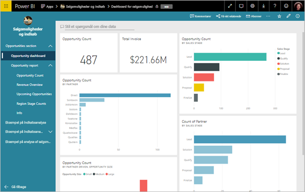
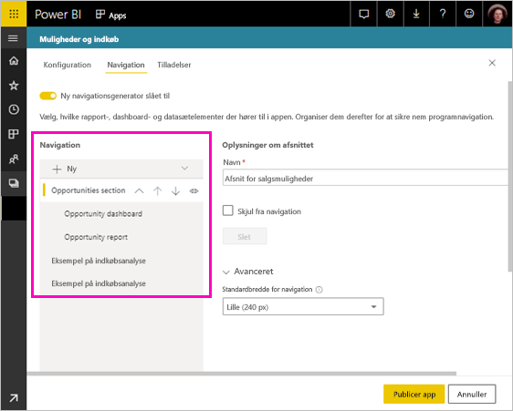
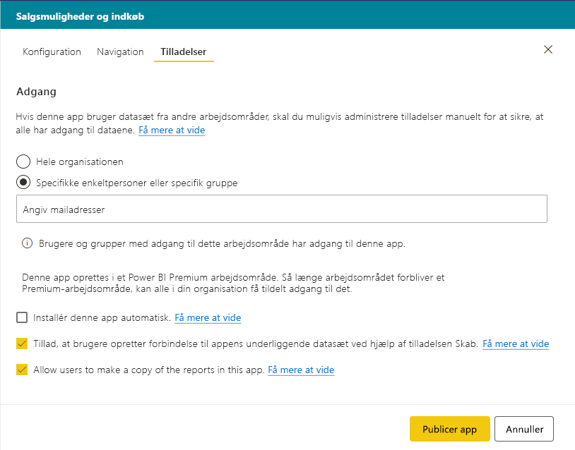

# Publicer en app i Powerbi

I Power BI, du kan oprette official pakket indholdet og derefter distribuere den til en bred målgruppe som en *app*. Du opretter apps i *apparbejdsområder*, hvor du kan samarbejde om Power BI-indhold med dine kollegaer. Du kan derefter publicere de færdige apps til store grupper af personer i din organisation. 

Forretningsbrugere har ofte brug for flere Power BI-dashboards og -rapporter for at kunne drive deres virksomhed. Med Power BI-apps kan du oprette samlinger af dashboards og rapporter og publicere disse apps til hele organisationen eller til bestemte personer eller grupper. Hvis du er forfatter af rapporten eller administrator, gør apps det nemmere for dig at administrere tilladelser til disse samlinger.

Forretningsbrugere kan få dine apps i et par forskellige måder:

- De kan finde og installere din app fra Microsoft AppSource
- Du kan sende dem et direkte link.
- Du kan automatisk installere dem i dine kollegaers Power BI-konti, hvis Power BI-administratoren giver dig tilladelse til det.

Du kan oprette appen med sit eget indbygget navigation, så brugerne nemt kan finde rundt i dit indhold. De kan ikke ændre indholdet af appen. De kan interagere med det enten i Power BI-tjenesten eller en af mobilappsene – – filtrering, fremhævning og sortere data sig selv. De får automatisk opdateringer, og du kan styre, hvor ofte dataene opdateres. Læs mere om [appoplevelsen for forretningsbrugere](consumer/end-user-apps.md).

## Licenser til apps
Du opretter eller opdaterer en app, skal du en Power BI Pro-licens. For app *forbrugere*, der er to muligheder.

* Mulighed 1: Alle forretningsbrugere skal have licens til **Power BI Pro** for at få vist din app. 
* Mulighed 2: Hvis dit apparbejdsområde er placeret i en Power BI Premium-kapacitet, kan gratis brugere i organisationen kan få vist appindhold. Læs [Hvad er Power BI Premium?](service-premium.md) for at få flere oplysninger.

## Publicer din app
Når dashboards og rapporter i dit arbejdsområde er klar, skal du vælge, hvilke dashboards og rapporter du vil publicere, og derefter publicerer du dem som en app. 

1. Beslut, hvilke dashboards og rapporter, du vil i listevisningen arbejdsområde, **inkluderet i app**.

     

     Hvis du vælger ikke at indeholde en rapport, der har et relateret dashboard, får du vist en advarsel ud for rapporten. Du kan stadig udgive appen, men relaterede dashboardet, har ikke felterne fra rapporten.

     

2. Vælg den **Publicer app** knappen øverst til højre til at starte processen til oprettelse og udgivelse af en app fra arbejdsområdet.
   
     

3. På **installationsprogrammet**, udfylde navn og beskrivelse, der hjælper brugerne med at finde appen. Du kan angive et tema for at tilpasse den. Du kan også tilføje et link til et supportwebsted.
   
     

4. På **Navigation**, du vælger indholdet, der skal publiceres som en del af appen. Derefter kan du tilføje app navigation, for at organisere indhold i afsnit. Se [designe navigationsoplevelse til din app](#design-the-navigation-experience-for-your-app) i denne artikel for at få flere oplysninger.
   
     

5. På **adgang**, beslutte, hvem der har adgang til appen. 
    - I [klassiske arbejdsområder](service-create-workspaces.md): alle i din organisation, specifikke personer eller sikkerhedsgrupper i Azure Active Directory (AAD).
    - I den [nye oplevelse arbejdsområder](service-create-the-new-workspaces.md): bestemte personer, AAD-sikkerhedsgrupper og distributionslister og Office 365-grupper.

6. Hvis du har tilladelser, kan du installere appen automatisk til modtagerne. En Power BI-administrator kan aktivere denne indstilling på Power BI-administrationsportal. Læs mere om [installerer en app automatisk](#automatically-install-apps-for-end-users) i denne artikel.

     

7. Når du vælger **Publicer app**, vises der en meddelelse, der bekræfter, at den er klar til at publicere. I den **del denne app** dialogboksen, kan du kopiere den URL-adresse, der er et direkte link til denne app.
   
     

Du kan sende, som direkte link til personerne, du har delt den med, eller de kan finde din app under fanen Apps ved at gå til **Download og udforsk flere apps fra AppSource**. Læs mere om [appoplevelsen for forretningsbrugere](consumer/end-user-apps.md).

## Skift din publicerede app
Når du publicerer din app, vil du muligvis ændre eller opdatere den. Det er nemt at opdatere den, hvis du er administrator eller medlem i nye app-arbejdsområdet. 

1. Åbn apparbejdsområdet, der svarer til appen. 
   
     

2. Foretage de ønskede ændringer i dashboards eller rapporter.
 
     Apparbejdsområdet er dit testområde, så dine ændringer sendes ikke live i appen, før du publicerer igen. Her kan du foretage ændringer, uden at det påvirker publicerede apps.  
 
    > [!IMPORTANT]
    > Hvis du fjerner en rapport og opdatere appen, selvom du føjer rapporten tilbage til appen, mister dine app-forbrugere alle tilpasninger, f.eks bogmærker, kommentarer osv.  
 
3. Gå tilbage til apparbejdsområdets liste over indhold, og vælg **Opdater app** i øverste højre hjørne.
   
1. Opdater **installationsprogrammet**, **Navigation**, og **tilladelser**, hvis du vil, og vælg derefter **Opdater app**.
   
De personer, du har publiceret appen for, får automatisk vist den opdaterede version af appen. 

## Design navigationsoplevelse til din app
Den **nye navigation builder** indstilling gør det muligt for dig at udvikle en brugerdefineret navigationen i appen. Den brugerdefinerede navigation gør det nemmere for brugerne at finde og bruge indhold i appen. Eksisterende apps har denne indstilling, der er slået fra, og standarden for nye apps til indstillingen på.

Når indstillingen er slået fra, kan du vælge den **applandingsside** skal være enten **specifikt indhold**, for eksempel et dashboard eller rapport, eller Vælg **ingen** til at vise en grundlæggende oversigt over indhold til brugeren.

Når du slår **nye navigation builder**, du kan designe en brugerdefineret navigation. Som standard vises alle de rapporter, dashboards og Excel-projektmapper, du har medtaget i din app som en flad liste. 

Du kan tilpasse appen navigationen af yderligere:
* Omarrangere de elementer, der er ved at bruge op / ned pile. 
* Omdøbning af elementer i den **oplysninger**, **Dashboard detaljer**, og **projektmappedetaljer**.
* Skjule bestemte elementer fra navigationen.
* Ved hjælp af den **ny** mulighed for at tilføje **afsnit** til gruppe relateret indhold.
* Ved hjælp af den **ny** mulighed for at tilføje en **link** til en ekstern ressource til den venstre navigationslinje. 

Når du tilføjer en **link**i **Link detaljer** kan du vælge hvor linket åbnes. Som standard åbne links i den **aktuelle fane**, men du kan vælge **ny fane**, eller **indhold område**. 

### Overvejelser ved brug af den nye navigation builder indstilling
Her er generelt ting at huske på, når du bruger den nye navigation builder:
* Rapportsider vises som et afsnit, der kan udvides i området app navigation
* Hvis du slå den nye navigation builder og derefter publicere eller opdatere din app, mister du de tilpasninger, du har foretaget. Eksempelvis mistes afsnit, arrangere i rækkefølge, links og brugerdefinerede navne for navigationselementer alle.

Når du tilføjer links til din app-navigation og vælge indstillingen indholdsområde:
* Sørg for, at linket kan integreres. Nogle tjenester blokere for integrering af deres indhold i tredjeparts websteder, som Power BI.
* Integrerer Power BI-tjenesteindhold som rapporter eller dashboards i andre arbejdsområder, understøttes ikke. 
* Integrer Power BI Report Server indhold via sin oprindelige Integrer URL-adresse til indhold fra en på installation i det lokale miljø. Udfør trinnene i [oprettelse af Webadressen til Power BI Report Server](https://docs.microsoft.com/power-bi/report-server/quickstart-embed#creating-the-power-bi-report-server-report-url) til at få URL-adressen. Vær opmærksom på, at anvende almindelig godkendelse regler, så du får vist indholdet, der kræver en VPN-forbindelse til serveren i det lokale miljø. 
* Der vises en sikkerhedsadvarsel i toppen af det integrerede indhold til at angive indhold, der er ikke i Power BI.

## Installér automatisk apps for slutbrugere
Hvis en administrator giver dig tilladelser, du kan installere apps automatisk, *overføre* dem til slutbrugere. Denne funktionalitet til push gør det lettere at distribuere de rette apps til de rette personer eller grupper. Din app vises automatisk i dine slutbrugere Apps indholdsliste. De behøver ikke at finde det fra Microsoft AppSource eller følge et installationslink. Se, hvordan administratorer aktivere [pusher apps til slutbrugerne](service-admin-portal.md#push-apps-to-end-users) i portalen artiklen Power BI-administrator.

### Sådan pushet en app automatisk for slutbrugere
Når administratoren har givet dig tilladelser, har du en ny indstilling, hvor du kan **installere appen automatisk**. Når du skal du markere afkrydsningsfeltet og vælge **Publicer app** (eller **Opdater app**), pushes appen til alle brugere eller grupper, der er defineret i den **tilladelser** afsnit af appen på **Adgang** fanen.

### Sådan får brugerne de apps, som du skubber til dem.
Når du har pushet en app, vises den på deres liste over Apps automatisk. På denne måde, kan du levere apps, bestemte brugere eller jobroller i din organisation behovet for at have lige ved hånden.

### Overvejelser i forbindelse med automatisk installation af apps
Her er nogle ting, du skal huske på, når du pusher apps til slutbrugerne:

* Automatisk installation af en app til brugerne kan tage tid. De fleste apps, der kan tage tid at installere med det samme for brugere, men push af apps.  Det afhænger af antallet af elementer i appen og antallet af personer med adgang. Vi anbefaler, at apps pushes efter almindelig arbejdstid, hvor der er god tid til, brugerne skal bruge dem. Få bekræftelse hos flere brugere, før du sender en generel meddelelse til alle om, at appsene er tilgængelige.

* Opdater browseren. Det kan være nødvendigt for en bruger at opdatere eller lukke og genåbne browseren, før vedkommende kan se den pushede app på Apps-listen.

* Hvis brugere ikke kan straks se appen på Apps-listen, skal de opdatere eller lukke og genåbne browseren.

* Prøv ikke at overvælde brugerne. Pas på ikke at pushe for mange apps, da brugerne skal have en opfattelse af, at de forudinstallerede apps er nyttige for dem. Det er bedst at kontrollere, hvem der kan pushe apps til slutbrugerne, for at koordinere timingen. Etablere en kontakt apps i din organisation, der sendes til slutbrugere.

* Gæstebrugere, der ikke har accepteret en invitation få ikke automatisk installeret apps.  

## Annuller publicering af en app
Et medlem af et apparbejdsområde kan annullerer publicering af appen.

>[!IMPORTANT]
>Når du annullerer publiceringen af en app, mister app-brugere deres tilpasninger. De mister personlige bogmærker, kommentarer eller abonnementer, der er knyttet til indholdet i appen. Annuller kun publicering af en app, hvis du har brug at fjerne den.
> 
> 

* I et apparbejdsområde skal du vælge de tre prikker ( **...** ) i øverste højre hjørne > **Annuller publicering af app**.
  
     

Denne handling fjerner installationen af appen for alle, du har udgivet den til, så de ikke længere har adgang til den. Den sletter ikke apparbejdsområdet eller dets indhold.

## Få vist din publicerede app

Når din app-forbrugere åbner din app, kan de se den navigation, du har oprettet, i stedet for standard Power BI i navigationsruden til venstre. Navigationen app indeholder en liste over rapporter og dashboards i de afsnit, du har defineret. Det viser også de enkelte sider i hver enkelt rapport, i stedet for, lige navnet på rapporten.

## Næste trin
* [Opret et apparbejdsområde](service-create-workspaces.md)
* [Installér og brug apps i Power BI](consumer/end-user-apps.md)
* [Power BI-apps til eksterne tjenester](service-connect-to-services.md)
* [Power BI-administrationsportal](https://docs.microsoft.com/power-bi/service-admin-portal)
* Har du spørgsmål? [Prøv at spørge Power BI-community'et](http://community.powerbi.com/)
