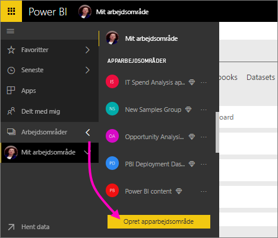
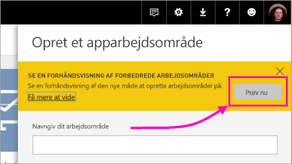
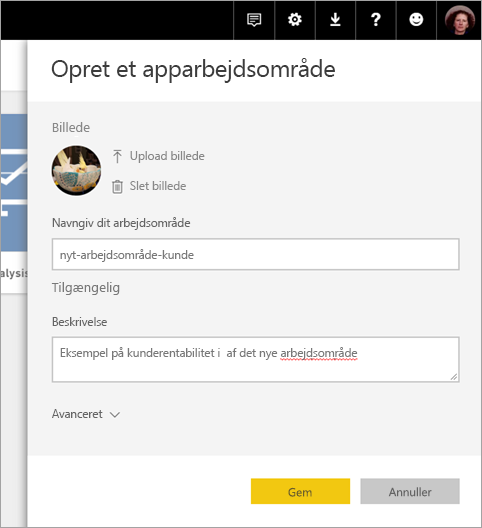
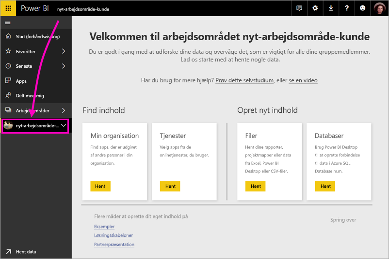
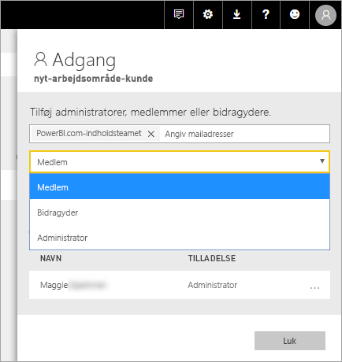
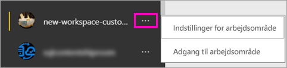

# Opret de nye arbejdsområder (prøveversion) i Power BI

Power BI introducerer en ny arbejdsområdeoplevelse som en prøveversion. Arbejdsområder er stadig det sted, hvor du skal samarbejde med kollegaer. Her kan du oprette samlinger af dashboards og rapporter, som du kan bundte i *apps* og distribuere til hele organisationen eller til bestemte personer eller grupper. 

Med prøveversionen af de nye arbejdsområder kan du nu:

- Tildele arbejdsområderoller til brugergrupper: sikkerhedsgrupper, distributionslister, Office 365-grupper og enkeltpersoner.
- Oprette et arbejdsområde i Power BI uden at oprette en Office 365-gruppe.
- Bruge mere detaljerede arbejdsområderoller til administration af mere fleksible tilladelser i et arbejdsområde.
 
Når du opretter et af de nye arbejdsområder, opretter du ikke en underliggende tilknyttet Office 365-gruppe. Al administration af arbejdsområder sker i Power BI, ikke i Office 365. Du kan stadig føje en Office 365-gruppe til arbejdsområdet, hvis du fortsat vil administrere brugeradgang til indhold via Office 365-grupper. Men du kan derudover bruge sikkerhedsgrupper, distributionslister og tilføje enkeltpersoner direkte i Power BI, hvilket giver dig større fleksibilitet, når du administrerer adgang til arbejdsområder. Da administration af arbejdsområder nu foregår i Power BI, beslutter Power BI-administratorer, hvem i en organisation kan oprette arbejdsområder. Se [artiklen om Power BI-administrationsportal i afsnittet Arbejdsområder](service-admin-portal.md#workspace-settings) for at få flere oplysninger. 

Du kan føje brugergrupper eller enkeltpersoner til de nye arbejdsområder som medlemmer, bidragydere eller administratorer. Alle i en brugergruppe får den rolle, du har defineret. Hvis en person er i flere brugergrupper, får personen det højeste tilladelsesniveau, der er angivet af rollen.  Se [Roller i de nye arbejdsområder](#roles-in-the-new-workspaces) senere i denne artikel for at få en forklaring på de forskellige roller.

Alle de brugere, du føjer til et apparbejdsområde, skal have en Power BI Pro-licens. I arbejdsområdet kan disse brugere samarbejde om dashboards og rapporter, som du vil publicere til en større målgruppe eller måske til hele organisationen. Hvis du vil distribuere indhold til andre i din organisation, kan du tildele Power BI Pro-licenser til disse brugere eller anbringe arbejdsområdet i en Power BI Premium-kapacitet.

Med de nye arbejdsområder giver vi nogle af funktionerne et nyt design. Se [Funktioner for apparbejdsområder, som fungerer anderledes](#app-workspace-features-that-work-differently) senere i denne artikel for at få en forklaring på de ændringer, du kan forvente vil være permanente sammen med prøveversionen. Da dette er en funktion i prøveversion, er der nogle begrænsninger, som du skal være opmærksom på. Se [Kendte problemer](#known-issues) senere i denne artikel for at få en forklaring på de aktuelle begrænsninger. 

## Udrul nye apparbejdsområder

I prøveperioden kan gamle og nye arbejdsområder fungere side om side, og du kan enten oprette den ene eller den anden. Når prøveperioden for nye arbejdsområder er slut, og de er offentligt tilgængelige, kan du stadig have gamle arbejdsområder i et stykke tid. Du kan ikke oprette dem, og du skal forberede en overførsel af dine arbejdsområder til infrastrukturen for de nye arbejdsområder. Men bare rolig, du har flere måneder til at gennemføre overførslen.

## Opret et af de nye apparbejdsområder

1. Start med at oprette apparbejdsområdet. Vælg **Arbejdsområder** > **Opret apparbejdsområde**.
   
     

2. I **eksempelvisningen af forbedrede arbejdsområder** skal du vælge **Prøv nu**.
   
     

2. Giv arbejdsområdet et navn. Hvis navnet ikke er tilgængeligt, skal du redigere det, så der angives et entydigt id.
   
     Appen har samme navn som arbejdsområdet.
   
1. Tilføj eventuelt et billede. Filstørrelsen skal være mindre end 45 KB.
 
    

1. Vælg **Gem**.

    Her på **velkomst**skærmen for dit nye arbejdsområde kan du tilføje data. 

    

1. Vælg f.eks. **Eksempler** > **Eksempel på kunderentabilitet**.

    På listen over indhold på arbejdsområdet kan du nu se **Ny eksempelvisning for arbejdsområder**. Da du er administrator, kan du også se den nye handling **Adgang**.

    

1. Vælg **Adgang**.

1. Føj sikkerhedsgrupper, distributionslister, Office 365-grupper eller enkeltpersoner til disse arbejdsområder som medlemmer, bidragydere eller administratorer. Se [Roller i de nye arbejdsområder](#roles-in-the-new-workspaces) senere i denne artikel for at få en forklaring på de forskellige roller.

    

9. Vælg **Tilføj** > **Luk**.

1. Power BI opretter arbejdsområdet og åbner det. Det vises på listen over de arbejdsområder, du er medlem af. Da du er administrator, kan du vælge ellipsen (…) for at gå tilbage og ændre indstillinger for arbejdsområdet, tilføje nye medlemmer eller ændre deres tilladelser.

     

## Føj indhold til dit apparbejdsområde

Når du har oprettet et apparbejdsområde i den nye stil, skal du føje indhold til det. Du tilføjer indhold på samme måde i de nye og gamle arbejdsområder med en enkelt undtagelse. Fra begge apparbejdsområder kan du uploade eller oprette forbindelse til filer på samme måde som i Mit arbejdsområde. I de nye arbejdsområder kan du ikke oprette forbindelse til organisationsindholdspakker eller indholdspakker fra tredjepart, f.eks. Microsoft Dynamics CRM, Salesforce eller Google Analytics. I de aktuelle arbejdsområder kan du oprette forbindelse til indholdspakker.

Når du får vist indhold på indholdslisten for et apparbejdsområde, vises navnet på apparbejdsområdet som ejeren.

### Opret forbindelse til tredjepartstjenester i nye arbejdsområder (prøveversion)

I den nye arbejdsområdeoplevelse laver vi en ændring for at fokusere på apps. Apps til tredjepartstjenester gør det nemt for brugerne at hente data fra de tjenester, de bruger, f.eks. Microsoft Dynamics CRM, Salesforce eller Google Analytics.
Organisationsapps giver dine brugere de interne data, de har brug for. Vi har planer om at føje funktioner til organisationsapps, så brugere kan tilpasse det indhold, som de finder i appsene. Derved fjernes behovet for indholdspakker. 

Med prøveversionen af nye arbejdsområder kan du ikke oprette eller forbruge organisationsindholdspakker. Du kan i stedet bruge de apps, der leveres, til at oprette forbindelse til tredjepartstjenester eller bede dine interne teams om at levere apps til en indholdspakke, du bruger i øjeblikket. 

## Roller i de nye arbejdsområder

Du kan bruge roller til at administrere, hvem der kan gøre hvad i et arbejdsområde, så teams kan samarbejde. Nye arbejdsområder gør det muligt at tildele roller til enkeltpersoner og til brugergrupper: sikkerhedsgrupper, Office 365-grupper og distributionslister. 

Når du tildeler roller til en brugergruppe, har enkeltpersoner i gruppen adgang til indhold. Hvis du indlejrer brugergrupper, har alle brugere i grupperne tilladelse. En bruger, der er medlem af flere brugergrupper med forskellige roller, får tildelt det højeste tilladelsesniveau. 

De nye arbejdsområder tilbyder tre roller: administratorer, medlemmer og bidragydere.

**Administratorer kan:**

- Opdatere og slette arbejdsområdet. 
- Tilføje/fjerne personer, herunder andre administratorer.
- Gøre alt det, medlemmer kan gøre.

**Medlemmer kan:** 

- Tilføje medlemmer eller andre med lavere tilladelser.
- Publicer og opdater en app.
- Del et element, eller del en app.
- Give andre tilladelse til at dele elementer igen.
- Gøre alt det, bidragydere kan gøre.

**Bidragsydere kan:** 

- Oprette, redigere og slette indhold i arbejdsområdet. 
- Publicere rapporter til arbejdsområdet, slette indhold.
- Kan ikke give nye personer adgang til indhold og kan ikke dele nyt indhold, men kan dele med en person, som arbejdsområdet, elementet eller appen allerede er delt med. 
- Kan ikke ændre medlemmerne af gruppen.
 
Vi udvikler arbejdsprocesser til anmodning om adgang i hele tjenesten, så brugere, der ikke har adgang, kan anmode om det. Der findes i øjeblikket arbejdsprocesser til anmodning om adgang til dashboards, rapporter og apps.

## Distribuer en app

Når indholdet er klar, skal du vælge, hvilke dashboards og rapporter du vil publicere, og derefter skal du publicere det som en *app*. Du kan oprette en app fra hvert arbejdsområde. Dine kollegaer kan hente dine apps på flere måder. Du kan automatisk installere dem i dine kollegaers Power BI-konti, hvis Power BI-administratoren giver dig tilladelse til det. Ellers kan de søge efter og installere dine apps fra Microsoft AppSource, eller du kan sende dem et direkte link. De får automatisk opdateringer, og du kan styre, hvor ofte dataene opdateres. Se [Publicer apps med dashboards og rapporter i Power BI](consumer/end-user-create-apps.md) for at få flere oplysninger.

## Konvertér gamle apparbejdsområder til nye apparbejdsområder

I prøveperioden kan du ikke automatisk konvertere dine gamle apparbejdsområder til nye. Du kan dog oprette et nyt apparbejdsområde og publicere dit indhold på den nye placering. 

Når de nye arbejdsområder er offentligt tilgængelige, kan du vælge at overføre de gamle automatisk. På et tidspunkt efter den offentlige tilgængelighed er du nødt til at overføre dem.

## Ofte stillede spørgsmål om Power BI-apps

### Hvordan adskiller de nye apparbejdsområder sig fra aktuelle apparbejdsområder?
* Hvis du opretter apparbejdsområder, oprettes der ikke tilsvarende objekter i Office 365, som det er tilfældet med aktuelle apparbejdsområder. Du kan stadig føje en Office 365-gruppe til dit arbejdsområde ved at tildele den en rolle. 
* I de aktuelle apparbejdsområder kan du kun føje enkeltpersoner til medlems- og administratorlisterne. I de nye apparbejdsområder kan du føje flere Active Directory-sikkerhedsgrupper, distributionslister eller Office 365-grupper til disse lister for at lette administrationen af brugere. 
- Du kan oprette en organisationsindholdspakke ud fra et aktuelt apparbejdsområde. Du kan ikke oprette en ud fra de nye apparbejdsområder.
- Du kan forbruge en organisationsindholdspakke fra et aktuelt apparbejdsområde. Du kan ikke forbruge en fra de nye apparbejdsområder.
- I prøveperioden er nogle af funktionerne ikke aktiveret endnu for nye apparbejdsområder. I næste afsnit, [Andre planlagte funktioner for nye arbejdsområdet](service-create-the-new-workspaces.md#other-planned-new-app-workspace-preview-features) kan du finde flere oplysninger.

## Planlagte funktioner i prøveversionen for nye apparbejdsområder

Der udvikles stadig flere funktioner i prøveversionen for nye arbejdsområder, men de er ikke tilgængelige endnu på det tidspunkt, hvor vi lancerer prøveversionen:

- Knappen **Forlad arbejdsområde** findes ikke.
- Forbrugsdata understøttes ikke endnu.
- Sådan fungerer Premium: Du kan tildele og oprette arbejdsområder i en Premium-kapacitet, men hvis du vil flytte et arbejdsområde mellem kapaciteter, skal du gå til indstillingerne for arbejdsområdet.
- Integration af SharePoint-webdelen understøttes ikke endnu.
- Knappen **OneDrive** til Office 365-grupper under Hent data/filer findes ikke.

## Funktioner for apparbejdsområder, som fungerer anderledes

Nogle funktioner fungerer anderledes i forhold til aktuelle apparbejdsområder i de nye apparbejdsområder. Disse forskelle er tilsigtede baseret på feedback, vi har modtaget fra kunder, og de giver en mere fleksibel tilgang til samarbejdet via arbejdsområder:

- Medlemmer kan eller kan ikke dele igen: erstattet af rollen som bidragyder
- Skrivebeskyttede arbejdsområder: I stedet for at tildele brugere til skrivebeskyttet adgang til et arbejdsområde skal du tildele brugere til en kommende Fremviser-rolle, hvilket gør det muligt for lignende skrivebeskyttet adgang til indholdet i et arbejdsområde.

## Kendte problemer

Følgende problemer er kendte, og vi arbejder på en løsning:

- Gratisbrugere eller -brugergrupper, der er tilføjet som modtagere af abonnementer i mails, modtager muligvis ikke mails, selvom de skulle. Problemet opstår, når den nye arbejdsområdeoplevelse er i en Premium-kapacitet, men Mit arbejdsområde for den bruger, der opretter abonnementet, ikke findes i en Premium-kapacitet. Hvis Mit arbejdsområde er i en Premium-kapacitet, kan gratisbrugere og -brugergrupper modtage mails.
- Når et arbejdsområde er flyttet fra en Premium-kapacitet til en delt kapacitet, modtager gratisbrugere og -brugergrupper i nogle tilfælde fortsat mails, selvom de ikke skulle. Problemet opstår, når Mit arbejdsområde for den bruger, der opretter abonnementet, er i en Premium-kapacitet.

## Næste trin

- [Opret de aktuelle arbejdsområder](service-create-workspaces.md)
* [Installér og brug apps i Power BI](consumer/end-user-apps.md)
* Har du spørgsmål? [Prøv at spørge Power BI-community'et](http://community.powerbi.com/)
