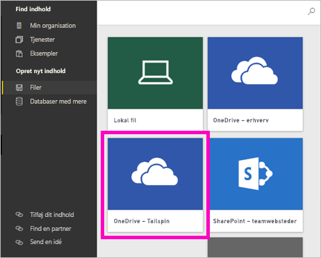

# Opret nye arbejdsområder i Power BI

Power BI introducerer en ny arbejdsområdeoplevelse. Arbejdsområder er stadig det sted, hvor du samarbejder med kolleger om at oprette samlinger af dashboards, rapporter og sideinddelte rapporter. Derefter kan du gruppere disse samlinger i en *app*, som du kan distribuere til hele organisationen eller til bestemte personer eller grupper. 

Her er forskellene. I de nye arbejdsområder kan du:

- Tildele arbejdsområderoller til brugergrupper: sikkerhedsgrupper, distributionslister, Office 365-grupper og enkeltpersoner.
- Oprette et arbejdsområde i Power BI uden at oprette en Office 365-gruppe.
- Bruge mere detaljerede arbejdsområderoller til administration af mere fleksible tilladelser i et arbejdsområde.

> [!NOTE]
> Hvis du vil gennemtvinge sikkerhed på rækkeniveau for Power BI Pro-brugere, der gennemser indhold i et arbejdsområde, skal du tildele brugerne læseadgang.

Du kan få mere baggrundsviden i artiklen [nye arbejdsområder](service-new-workspaces.md).

## Opret et af de nye apparbejdsområder

1. Start med at oprette arbejdsområdet. Vælg **Arbejdsområder** > **Opret arbejdsområde**.
   
     

2. Du opretter automatisk et opgraderet arbejdsområde, medmindre du vælger at **gå tilbage til klassisk**.
   
     
     
     Hvis du vælger **Gå tilbage til klassisk**, opretter du et [arbejdsområde, der er baseret på en Office 365-gruppe](service-create-workspaces.md). 

2. Giv arbejdsområdet et navn. Hvis navnet ikke er tilgængeligt, skal du redigere det, så der angives et entydigt navn.
   
     Appen til arbejdsområdet har det samme navn og ikon som arbejdsområdet.
   
1. Her er nogle valgfrie elementer, du kan angive for dit arbejdsområde:

    Upload et **billede til arbejdsområdet**. Filer kan være .png- eller .jpg-format. Filstørrelsen skal være mindre end 45 KB.
    
    [Tilføj en **liste over kontakter**](#workspace-contact-list). Administratorer af arbejdsområder er som standard kontakter. 
    
    [Angiv et **OneDrive-arbejdsområde**](#workspace-onedrive) ved blot at skrive navnet på en eksisterende Office 365-gruppe og ikke URL-adressen. Nu kan dette arbejdsområde bruge lagringsplaceringen for Office 365-gruppens filer. 

    

    Hvis du vil tildele arbejdsområdet til en **dedikeret kapacitet**, skal du på fanen **Premium** vælge **Dedikeret kapacitet**.
     
    

1. Vælg **Gem**.

    Power BI opretter arbejdsområdet og åbner det. Det vises på listen over de arbejdsområder, du er medlem af. 

## Liste over arbejdsområdekontakter

Du kan angive, hvilke brugere der skal modtage en meddelelse om de problemer, der opstår i arbejdsområdet. Som standard får alle brugere eller grupper, der er angivet som administrator af arbejdsområdet besked, men du kan tilpasse listen ved at føje dem til *listen over kontakter*. Brugere eller grupper på listen over kontakter vises i brugergrænsefladen for at hjælpe brugerne med at få hjælp til arbejdsområdet.

1. Få adgang til den nye indstilling **Liste over kontakter** på en af to måder:

    I ruden **Opret et arbejdsområde**, når du opretter det første gang.

    I navigationsruden skal du vælge pilen ud for **Arbejdsområder** og vælge **Flere indstillinger** (...) ud for navnet på arbejdsområdet > **Indstillinger for arbejdsområde**. Ruden **Indstillinger** åbnes.

    

2. Under **Avanceret** > **Liste over kontakter** skal du acceptere standarden, **Administratorer af arbejdsområde** eller tilføje din egen liste over **Specifikke brugere eller grupper**. 

    

3. Vælg **Gem**.

## Arbejdsområde for OneDrive

Funktionen Arbejdsområde for OneDrive giver dig mulighed for at konfigurere en Office 365-gruppe, hvis SharePoint-dokumentbiblioteks fillagring er tilgængelig for arbejdsområdebrugere. Du opretter gruppen uden for Power BI først. 

Power BI synkroniserer ikke tilladelser for brugere eller grupper, der er konfigureret til at have adgang til arbejdsområdet med medlemskabet af Office 365-gruppen. Bedste praksis er at give den samme Office 365-gruppe, hvis fillager du konfigurerer i denne indstilling for Office 365-gruppen, [adgang til arbejdsområdet](#give-access-to-your-workspace). Administrer derefter adgangen til arbejdsområdet ved at administrere medlemskabet af Office 365-gruppen. 

1. Få adgang til den nye indstilling for **OneDrive-arbejdsområdet** på en af to måder:

    I ruden **Opret et arbejdsområde**, når du opretter det første gang.

    I navigationsruden skal du vælge pilen ud for **Arbejdsområder** og vælge **Flere indstillinger** (...) ud for navnet på arbejdsområdet > **Indstillinger for arbejdsområde**. Ruden **Indstillinger** åbnes.

    

2. Under **Avanceret** > **OneDrive-arbejdsområde** skal du skrive navnet på den Office 365-gruppe, du oprettede tidligere. Power BI registrerer automatisk OneDrive for gruppen.

    

3. Vælg **Gem**.

### Få adgang til arbejdsområdets OneDrive-placering

Når du har konfigureret placeringen af OneDrive, kommer du dertil på samme måde, som du kommer til andre datakilder i Power BI-tjenesten.

1. I navigationsruden skal du vælge **Hent data** og derefter i feltet **Filer** vælge **Hent**.

    

1.  Posten **OneDrive – Business** er dit eget OneDrive for Business. Det andet OneDrive er det, du har tilføjet.

    

### Opret forbindelse til tredjepartstjenester i nye arbejdsområder

I den nye arbejdsområdeoplevelse laver vi en ændring for at fokusere på *apps*. Apps til tredjepartstjenester gør det nemt for brugerne at hente data fra de tjenester, de bruger, f.eks. Microsoft Dynamics CRM, Salesforce eller Google Analytics.

I den nye arbejdsområdeoplevelse kan du ikke oprette eller bruge organisationsindholdspakker. Du kan i stedet bruge de apps, der leveres, til at oprette forbindelse til tredjepartstjenester eller bede dine interne teams om at levere apps til en indholdspakke, du bruger i øjeblikket. 

## Giv adgang til dit arbejdsområde

1. Da du er administrator kan du på indholdslisten for arbejdsområder se en ny handling, **Adgang**.

    

1. Føj sikkerhedsgrupper, distributionslister, Office 365-grupper eller enkeltpersoner til disse arbejdsområder som seere, medlemmer, bidragydere eller administratorer. Se [Roller i de nye arbejdsområder](service-new-workspaces.md#roles-in-the-new-workspaces) for at få en forklaring på de forskellige roller.

    

9. Vælg **Tilføj** > **Luk**.

## Distribuer en app

Hvis du vil distribuere officielt indhold til en stor målgruppe i din organisation, kan du publicere en app fra dit arbejdsområde.  Når indholdet er klar, skal du vælge, hvilke dashboards og rapporter du vil publicere, og derefter skal du publicere dem som en *app*. Du kan oprette en app fra hvert arbejdsområde.

Læs om [publicering af en app fra de nye arbejdsområder](service-create-distribute-apps.md)

## Næste trin
* Læs om [organisering af arbejde i den nye arbejdsområdeoplevelse i Power BI](service-new-workspaces.md)
* [Opret klassiske arbejdsområder](service-create-workspaces.md)
* [Publicer en app fra de nye arbejdsområder i Power BI](service-create-distribute-apps.md)
* Har du spørgsmål? [Prøv at spørge Power BI-community'et](https://community.powerbi.com/)
