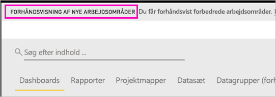
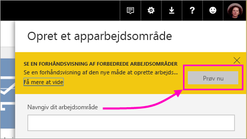
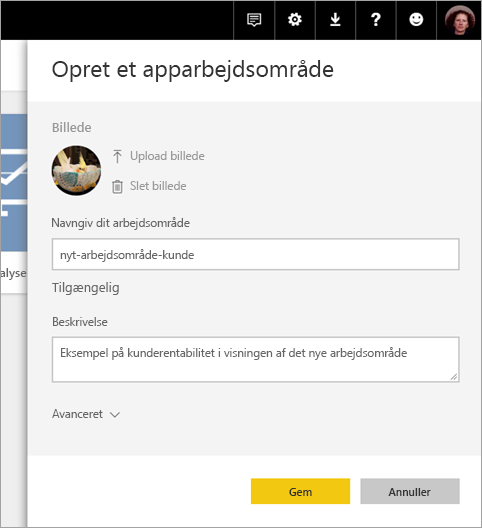
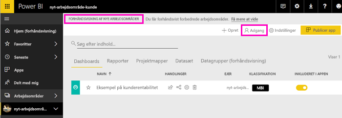
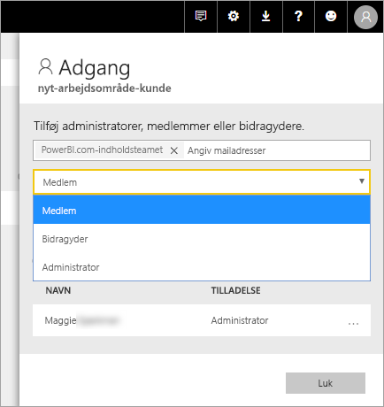
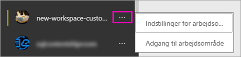

# Opret de nye arbejdsområder (prøveversion) i Power BI

Power BI introducerer en ny arbejdsområdeoplevelse som en prøveversion. Arbejdsområder er stadig det sted, hvor du skal samarbejde med kollegaer. Her kan du oprette samlinger af dashboards og rapporter, som du kan bundte i *apps* og distribuere til hele organisationen eller til bestemte personer eller grupper. 

Med prøveversionen af de nye arbejdsområder kan du nu:

- Tildele arbejdsområderoller til brugergrupper: sikkerhedsgrupper, distributionslister, Office 365-grupper og enkeltpersoner.
- Oprette et arbejdsområde i Power BI uden at oprette en Office 365-gruppe.
- Bruge mere detaljerede arbejdsområderoller til administration af mere fleksible tilladelser i et arbejdsområde.

Du kan få mere baggrundsviden i artiklen [Nye arbejdsområder (prøveversion)](service-new-workspaces.md).

## Opret et af de nye apparbejdsområder

1. Start med at oprette apparbejdsområdet. Vælg **Arbejdsområder** > **Opret apparbejdsområde**.
   
     

2. I **eksempelvisningen af forbedrede arbejdsområder** skal du vælge **Prøv nu**.
   
     

2. Giv arbejdsområdet et navn. Hvis navnet ikke er tilgængeligt, skal du redigere det, så der angives et entydigt id.
   
     Appen har samme navn som arbejdsområdet.
   
1. Tilføj eventuelt et billede. Filstørrelsen skal være mindre end 45 KB.
 
    

1. Vælg **Gem**.

    Her på **velkomst**skærmen for dit nye arbejdsområde kan du tilføje data. 

    

1. Vælg f.eks. **Eksempler** > **Eksempel på kunderentabilitet**.

    På listen over indhold på arbejdsområdet kan du nu se **Ny eksempelvisning for arbejdsområder**. Da du er administrator, kan du også se den nye handling **Adgang**.

    

1. Vælg **Adgang**.

1. Føj sikkerhedsgrupper, distributionslister, Office 365-grupper eller enkeltpersoner til disse arbejdsområder som medlemmer, bidragydere eller administratorer. Se [Roller i de nye arbejdsområder](#roles-in-the-new-workspaces) senere i denne artikel for at få en forklaring på de forskellige roller.

    

9. Vælg **Tilføj** > **Luk**.

1. Power BI opretter arbejdsområdet og åbner det. Det vises på listen over de arbejdsområder, du er medlem af. Da du er administrator, kan du vælge ellipsen (…) for at gå tilbage og ændre indstillinger for arbejdsområdet, tilføje nye medlemmer eller ændre deres tilladelser.

     

## Føj indhold til dit apparbejdsområde

Når du har oprettet et apparbejdsområde i den nye stil, skal du føje indhold til det. Du tilføjer indhold på samme måde i de nye og gamle arbejdsområder med en enkelt undtagelse. Fra begge apparbejdsområder kan du uploade eller oprette forbindelse til filer på samme måde som i Mit arbejdsområde. I de nye arbejdsområder kan du ikke oprette forbindelse til organisationsindholdspakker eller indholdspakker fra tredjepart, f.eks. Microsoft Dynamics CRM, Salesforce eller Google Analytics. I de aktuelle arbejdsområder kan du oprette forbindelse til indholdspakker.

Når du får vist indhold på indholdslisten for et apparbejdsområde, vises navnet på apparbejdsområdet som ejeren.

### Opret forbindelse til tredjepartstjenester i nye arbejdsområder (prøveversion)

I den nye arbejdsområdeoplevelse laver vi en ændring for at fokusere på *apps*. Apps til tredjepartstjenester gør det nemt for brugerne at hente data fra de tjenester, de bruger, f.eks. Microsoft Dynamics CRM, Salesforce eller Google Analytics.
Organisationsapps giver dine brugere de interne data, de har brug for. Vi har planer om at føje funktioner til organisationsapps, så brugere kan tilpasse det indhold, som de finder i appsene. Denne funktion fjerner behovet for indholdspakker. 

Med prøveversionen af nye arbejdsområder kan du ikke oprette eller forbruge organisationsindholdspakker. Du kan i stedet bruge de apps, der leveres, til at oprette forbindelse til tredjepartstjenester eller bede dine interne teams om at levere apps til en indholdspakke, du bruger i øjeblikket. 

## Distribuer en app

Når indholdet er klar, skal du vælge, hvilke dashboards og rapporter du vil publicere, og derefter skal du publicere det som en *app*. Du kan oprette en app fra hvert arbejdsområde. Dine kollegaer kan hente dine apps på flere måder. Du kan automatisk installere dem i dine kollegaers Power BI-konti, hvis Power BI-administratoren giver dig tilladelse til det. Ellers kan de søge efter og installere dine apps fra Microsoft AppSource, eller du kan sende dem et direkte link. De får automatisk opdateringer, og du kan styre, hvor ofte dataene opdateres. Se [Publicer apps med dashboards og rapporter i Power BI](service-create-distribute-apps.md) for at få flere oplysninger.

## Konvertér gamle apparbejdsområder til nye apparbejdsområder

I prøveperioden kan du ikke automatisk konvertere dine gamle apparbejdsområder til nye. Du kan dog oprette et nyt apparbejdsområde og publicere dit indhold på den nye placering. 

Når de nye arbejdsområder er offentligt tilgængelige, kan du vælge at overføre de gamle automatisk. På et tidspunkt efter den offentlige tilgængelighed er du nødt til at overføre dem.

## Næste trin
* Læs mere om at [organisere arbejde i nye arbejdsområder (prøveversion) i Power BI](service-new-workspaces.md)
* [Opret de aktuelle arbejdsområder](service-create-workspaces.md)
* [Installér og brug apps i Power BI](service-create-distribute-apps.md)
* Har du spørgsmål? [Prøv at spørge Power BI-community'et](http://community.powerbi.com/)
