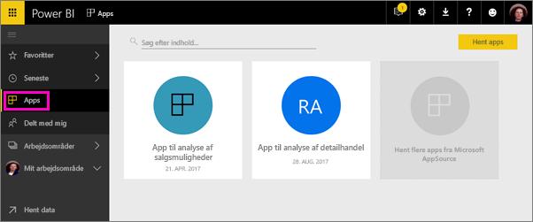

# Opret arbejdsområder med dine kollegaer i Power BI

I Power BI kan du oprette *arbejdsområder*, hvor du kan samarbejde med kollegaer om at oprette og tilpasse samlinger af dashboards og rapporter. Derefter kan du bundte dem sammen i *apps*, som du kan distribuere til hele organisationen eller til bestemte personer eller grupper. 

Når du opretter et arbejdsområde, opretter du en underliggende tilknyttet Office 365-gruppe. Al administration af arbejdsområder foregår i Office 365. Du kan føje kollegaer til disse arbejdsområder som medlemmer eller administratorer. I arbejdsområdet kan alle samarbejde i dashboards, rapporter og andre artikler, som du vil publicere til en større målgruppe. Alle de brugere, du føjer til et apparbejdsområde, skal have en Power BI Pro-licens. 

**Vidste du det?** Power BI udgiver en ny prøveversion af arbejdsområdeoplevelsen. Læs [Opret nye arbejdsområder (prøveversion)](service-create-the-new-workspaces.md) for at se, hvordan arbejdsområder ændres i fremtiden. 

## Video: Apps og apparbejdsområder
<iframe width="640" height="360" src="https://www.youtube.com/embed/Ey5pyrr7Lk8?showinfo=0" frameborder="0" allowfullscreen></iframe>

## Opret et apparbejdsområde baseret på en Office 365-gruppe

Når du opretter et apparbejdsområde, oprettes det ud fra en Office 365-gruppe.

[!INCLUDE [powerbi-service-create-app-workspace](./includes/powerbi-service-create-app-workspace.md)]

Bemærk, at når du opretter arbejdsområdet første gang, skal du muligvis vente omkring en time, før det er overført til Office 365. 

### Føj et billede til dit Office 365-apparbejdsområde (valgfrit)
Power BI opretter som standard en lille farvet cirkel for din app med appens forbogstaver. Det kan også være, at du vil tilpasse den med et billede. Hvis du vil tilføje et billede, skal du have en Exchange Online-licens.

1. Vælg **Arbejdsområder**, vælg de tre prikker (...) ud for navnet på arbejdsområdet og derefter **Medlemmer**. 
   
     
   
    Outlook til Office 365-kontoen til arbejdsområdet åbnes i et nyt browservindue.
2. Når du peger på den farvede cirkel øverst til venstre, bliver den til et blyantsikon. Vælg det.
   
     
3. Vælg blyantsikonet igen, og find det billede, du vil bruge.
   
     

4. Vælg **Gem**.
   
     
   
    Billedet erstatter den farvede cirkel i Office 365 Outlook-vinduet. 
   
     
   
    Efter nogle få minutter vises det også i appen i Power BI.
   
     

## Føj indhold til dit apparbejdsområde

Når du har oprettet et apparbejdsområde, skal du føje indhold til det. Det foregår på samme måde, som når du føjer indhold til Mit arbejdsområde, bortset fra at andre personer i arbejdsområdet også kan se det og arbejde med det. Den store forskel er, at når du er færdig, kan du publicere indholdet som en app. Når du får vist indhold på indholdslisten for et apparbejdsområde, vises navnet på apparbejdsområdet som ejeren.

### Opret forbindelse til tredjepartstjenester i apparbejdsområder

Apps leveres til alle de tredjepartstjenester, som Power BI understøtter, hvilket gør det nemt for dig at hente data fra de tjenester, du bruger, f.eks. Microsoft Dynamics CRM, Salesforce eller Google Analytics. Du kan publicere organisationsapps for at give dine brugere de data, de har brug for.

I de aktuelle arbejdsområder kan du også oprette forbindelse via organisationsindholdspakker og indholdspakker fra tredjepart, f.eks. Microsoft Dynamics CRM, Salesforce eller Google Analytics. Du kan overveje at overføre organisationsindholdspakker til apps.

## Distribuer en app

Når indholdet er klar, skal du vælge, hvilke dashboards og rapporter du vil publicere, og derefter skal du publicere det som en *app*. Dine kollegaer kan hente dine apps på flere måder. Du kan automatisk installere dem i dine kollegaers Power BI-konti, hvis Power BI-administratoren giver dig tilladelse til det. Ellers kan de søge efter og installere dine apps fra Microsoft AppSource, eller du kan sende dem et direkte link. De får automatisk opdateringer, og du kan styre, hvor ofte dataene opdateres. Se [Publicer apps med dashboards og rapporter i Power BI](service-create-distribute-apps.md) for at få flere oplysninger.

## Ofte stillede spørgsmål om Power BI-apps

### Hvordan adskiller apps sig fra organisationsindholdspakker?
Apps er en udviklet form af organisationsindholdspakker. Hvis du allerede har organisationsindholdspakker, vil de fortsætte med at fungere side om side med apps. Der er et par større forskelle mellem apps og indholdspakker. 

* Når forretningsbrugere installerer en indholdspakke, mister den sin grupperede identitet: Den er bare en liste over dashboards og rapporter blandet med andre dashboards og rapporter. Apps bevarer på den anden side deres gruppering og identitet, også efter installationen. Det gør det nemt for forretningsbrugere at fortsætte med at navigere til dem hen over tid.
* Du kan oprette flere indholdspakker fra et vilkårligt arbejdsområde, men en app har en en til en-relation til dens arbejdsområde. 
* Vi vil over tid fraråde organisationsindholdspakker, og vi anbefaler derfor, at du begynder at oprette apps fra nu af.  
* Med den nye prøveversion af arbejdsområdeoplevelsen tager vi det første skridt mod udfasning af organisationsindholdspakker. Du kan ikke forbruge eller oprette dem i arbejdsområder i prøveversion.

Se [Sådan adskiller de nye apparbejdsområder sig fra eksisterende apparbejdsområder](service-create-the-new-workspaces.md#how-are-the-new-app-workspaces-different-from-current-app-workspaces) for at sammenligne de aktuelle og nye apparbejdsområder. 

## Næste trin
* [Installér og brug apps i Power BI](service-create-distribute-apps.md)
- [Opret de nye arbejdsområder (prøveversion)](service-create-the-new-workspaces.md)
* Har du spørgsmål? [Prøv at spørge Power BI-community'et](http://community.powerbi.com/)
