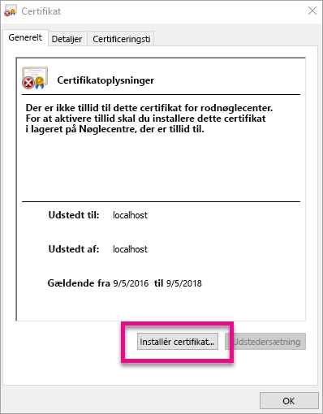
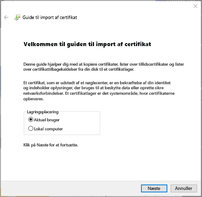
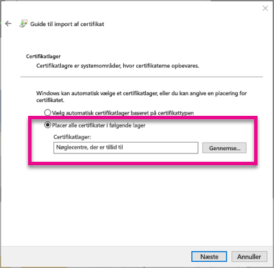
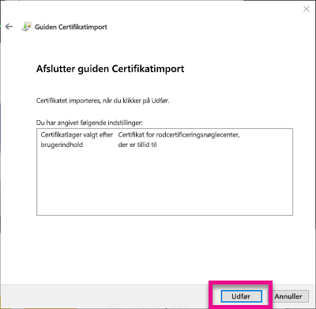
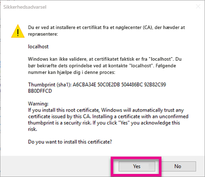
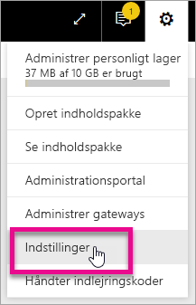
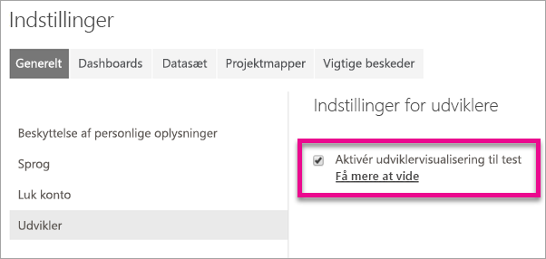
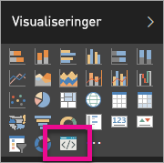

# <a name="use-developer-tools-to-create-custom-visuals"></a>Brug udviklerværktøjer til at oprette brugerdefinerede visuals
Du kan bruge visuals til at opfylde dine brugeres behov og matche din apps design. Få mere at vide om, hvordan du opretter brugerdefinerede visuals til Power BI med udviklerværktøjer.

> [!NOTE]
> Du kan bruge dette dokument til at komme i gang. Du kan få mere dybdegående oplysninger i referencematerialet i [Power BI Visuals git repo](https://github.com/Microsoft/PowerBI-visuals).
> 
> 

## <a name="requirements"></a>Krav
* NodeJS 4.0+ påkrævet (5.0 eller nyere anbefales) [Download NodeJS](https://nodejs.org)

## <a name="install-nodejs-and-the-power-bi-tools"></a>Installer NodeJS og Power BI-værktøjerne
For at oprette et brugerdefineret visual skal du installere NodeJS. NodeJS er påkrævet for at køre kommandolinjeværktøjerne.

1. Download og installer [NodeJS](https://nodejs.org). Version 4.0 eller senere er påkrævet, men det anbefales at have 5.0 eller nyere.
2. Installer kommandolinjeværktøjerne. Kør den følende kommando fra en kommandoprompt.

        npm install -g powerbi-visuals-tools
3. Du kan bekræfte, at værktøjerne er installeret ved at køre den følgende kommando uden nogen parametre.

        pbiviz

    Du bør se hjælp-outputtet.

    <pre><code>
         +syyso+/
    oms/+osyhdhyso/
    ym/       /+oshddhys+/
    ym/              /+oyhddhyo+/
    ym/                     /osyhdho
    ym/                           sm+
    ym/               yddy        om+
    ym/         shho /mmmm/       om+
     /    oys/ +mmmm /mmmm/       om+
    oso  ommmh +mmmm /mmmm/       om+
   ymmmy smmmh +mmmm /mmmm/       om+
   ymmmy smmmh +mmmm /mmmm/       om+
   ymmmy smmmh +mmmm /mmmm/       om+
   +dmd+ smmmh +mmmm /mmmm/       om+
         /hmdo +mmmm /mmmm/ /so+//ym/
               /dmmh /mmmm/ /osyhhy/
                 //   dmmd
                       ++

       PowerBI Custom Visual Tool

    Usage: pbiviz [options] [command]

    Commands:

    new [name]        Create a new visual
    info              Display info about the current visual
    start             Start the current visual
    package           Package the current visual into a pbiviz file
    update [version]  Updates the api definitions and schemas in the current visual. Changes the version if specified
    help [cmd]        display help for [cmd]

    Options:

    -h, --help      output usage information
    -V, --version   output the version number
    --install-cert  Install localhost certificate
    </code></pre>

<a name="ssl-setup"></a>

### <a name="server-certificate-setup"></a>Server Certificate-opsætning
For at aktivere en direkte eksempelvisning af dine visuals skal du bruge en https-server, der er tillid til. Før du kan starte, skal du installere et SSL-certifikat, som vil give visuelle aktiver adgang til at blive indlæst i din webbrowser. 

> [!NOTE]
> Dette er en engangsopsætning for din udviklerarbejdsstation.
> 
> 

Du skal køre følgende kommando for at *oprette* et certifikat.

    pbiviz --create-cert

> [!NOTE]
> Du får vist en meddelelse med placeringsstien til certifikatet og et nyligt oprettet adgangsudtryk.
> 
> 


Kør følgende kommandeo for at *installere* certifikatet.

    pbiviz --install-cert

> [!NOTE]
> Du bør få vist en meddelelse om, at du skal bruge det nyligt oprettede adgangsudtryk til at installere et PFX-certifikat.
> 
> 

**Windows OS**

1. Vælg **Installer certificat...**.

    
2. Vælg **Aktuel bruger**, og vælg derefter **Næste**.

    
3. Vælg **Placer alle certifikater i følgende certifikatlager**, og vælg **Gennemse...**.
4. Vælg **Nøglecentre, der er tillid til**, og vælg **OK**. Vælg **Næste**.

    
5. Vælg **Udfør**.

    
6. Vælg **Ja** i dialogboksen med en sikkerhedsadvarsel.

    
7. Luk alle åbne browsere.

> [!NOTE]
> Hvis certifikatet ikke genkendes, skal du muligvis genstarte computeren.
> 
> 

**OSX**

1. Hvis låsen øverst til venstre er låst, så skal du vælge den for at låse den op. Find *localhost*, og dobbeltklik på certifikatet.

    
2. Vælg **Hav altid tillid til**, og luk vinduet.

    
3. Indtast dit brugernavn og din adgangskode. Vælg **Opdater indstillinger**.

    
4. Luk alle åbne browsere.

> [!NOTE]
> Hvis certifikatet ikke genkendes, skal du muligvis genstarte computeren.
> 
> 

## <a name="enable-live-preview-of-developer-visual"></a>Aktivér direkte eksempelvisning af visuelt udviklerelement
For at aktivere en direkte eksempelvisning af dit brugerdefinerede visual, skal du benytte følgende fremgangsmåde. Den giver adgang til, at dit visual kan bruges i Power BI-tjenesten under redigering af rapporter.

1. Gennemse og log på [app.powerbi.com](https://app.powerbi.com).
2. Vælg **tandhjulsikonet**, og vælg derefter **Indstillinger**.

    
3. Vælg **Udvikler**, og vælg derefter **Aktivér udviklervisual til afprøvning**.

    
4. Vælg dit **Udviklervisualt** i ruden **Visualisering**.

    

   > [!NOTE]
   > Dette kræver, at du har kørt `pbiviz start` fra mappen med visuelle elementer på din udviklercomputer. Du kan få flere oplysninger om, hvordan du opretter et visual under [Opret et nyt visual](#create-a-new-visual) i denne artikel.
   > 
   > 
5. Vælg dit visual i rapportlærredet. Du kan binde data på samme måde som andre visuals.

Du kan nu begynde at udvikle dit visual.

## <a name="create-a-new-visual"></a>Opret et nyt visual
Du kan oprette et nyt visuelt projekt ved at køre den følgende kommando.

```
pbiviz new MyVisualName
```

Du kan erstatte *MyVisualName* med det ønskede navn på visualiseringen. Dette kan ændres senere ved at redigere felterne `name` og `displayName` i den genererede `pbiviz.json`-fil.

Denne kommando opretter en ny mappe i den direkte eksempelvisning, hvor kommandoen blev kørt. Den genererer en grundlæggende startskabelon for dit visual. Når kommandoen er udført, kan du åbne mappen og bruge dit foretrukne redigeringsprogram til at begynde arbejdet på det nye visual.

## <a name="testing-your-visual-in-power-bi"></a>Afprøvning af dit visual i Power BI
Du kan afprøve dit visual i Power BI-tjenesten internt i rapporter og dashboards.

<a name="running-your-visual"></a>

### <a name="running-your-visual"></a>Afspil dit visual
Du kan afspille dit visual ved at gøre følgende.

1. Åbn en prompt.
2. Skift din mappe til mappen med dit visual. Dette er mappen, der indeholder `pbiviz.json`-filen.
3. Kør følgende kommando.

    ```
    pbiviz start
    ```

    

Hvis du er på den forkerte placering, får du vist en fejl svarende til den nedenstående.

```
    error  LOAD ERROR Error: pbiviz.json not found. You must be in the root of a visual project to run this command.
        at e (C:\Users\[user]\AppData\Roaming\npm\node_modules\powerbi-visuals-tools\lib\VisualPackage.js:67:35)
        at Function.loadVisualPackage (C:\Users\[user]\AppData\Roaming\npm\node_modules\powerbi-visuals-tools\lib\VisualPackage.js:62:16)
        at Object.<anonymous> (C:\Users\[user]\AppData\Roaming\npm\node_modules\powerbi-visuals-tools\bin\pbiviz-start.js:43:15)
        at Module._compile (module.js:556:32)
        at Object.Module._extensions..js (module.js:565:10)
        at Module.load (module.js:473:32)
        at tryModuleLoad (module.js:432:12)
        at Function.Module._load (module.js:424:3)
        at Module.runMain (module.js:590:10)
        at run (bootstrap_node.js:394:7)
```

### <a name="viewing-your-visual-in-power-bi"></a>Visning af dit visual i Power BI
Du kan få vist dit visual i en rapport ved at gå til den pågældende rapport og vælge dit visual i ruden **Visualiseringer**.

> [!NOTE]
> Du skal køre `pbiviz start`-kommandoen, før du gør som beskrevet i afsnittet [Afspil dit visual](#running-your-visual).
> 
> 


Du får derefter vist startskabelonen for det visuelle element.


| Element på værktøjslinje | Beskrivelse |
| --- | --- |
| Opdater visual |Opdater dit visual manuelt, hvis automatisk genindlæsning er deaktiveret. |
| Slå automatisk genindlæsning til/fra |Når funktionen er slået til, så opdateres dit visual automatisk, hver gang du gemmer det. |
| Vis datavisning |Viser dit visuals underliggende datavisning med henblik på fejlfinding |
| Få hjælp |Dokumentation inden for GitHub |
| Send feedback |Giv os besked, hvis vi på nogen måde kan forbedre oplevelsen! (Kræver GitHub-konto) |

## <a name="package-your-visual-for-use-in-power-bi-desktop-and-distribution"></a>Pak dit visual til brug i Power BI Desktop og distribution
Før du kan indlæse dit visual i [Power BI Desktop](https://powerbi.microsoft.com/desktop/), eller dele det med community'et i [Power BI Visual-galleriet](https://visuals.powerbi.com), så skal du oprette en `pbiviz`-fil.

Du kan pakke dit visual ved at gøre følgende.

1. Åbn en prompt.
2. Skift din mappe til mappen med dit visual. Dette er mappen, der indeholder `pbiviz.json`-filen.
3. Kør følgende kommando.

    ```
    pbiviz package
    ```

Denne kommando vil oprette et `pbiviz` i `dist/`-mappen i dit visual. Hvis der allerede findes en `pbiviz`-fil, bliver den overskrevet.

## <a name="updating-the-visuals-api-version"></a>Opdatering af dit visuals API-version
Når du opretter et visual ved hjælp af `pbiviz new`, kopieres en kopi af den relevante API-types definitioner og json-skemaer ind i mappen med visuals. Du kan bruge `pbiviz update`-kommandoen til at opdatere disse filer efter behov. Det kan være en fordel, hvis vi udsender en rettelse til en tidligere API-version, eller hvis du vil opdatere til den seneste API-version.

### <a name="updating-your-existing-api-version"></a>Opdatering af den eksisterende API-version
Hvis vi udgiver en opdatering til en eksisterende API, så kan du få den seneste version ved at gøre følgende.

```
#Update your version of pbiviz
npm install -g powerbi-visuals-tools

#Run update from the root of your visual project, where pbiviz.json is located
pbiviz update
```

Dette vil downloade de nyeste værktøjer fra npm, som omfatter de opdaterede typedefinitioner og skemaer. Hvis du bruger `pbiviz update`, overskrives `apiVersion`-egenskaben i *pbiviz.json*-feltet med den nyeste version.

### <a name="upgrading-to-a-different-api-version"></a>Opgradering til en anden API-version
Du kan opdatere til en anden API-version ved at bruge den samme fremgangsmåde som den, der er beskrevet ovenfor. Du kan eksplicit angive, hvilken API-version du vil bruge.

```
#Update your version of pbiviz
npm install -g powerbi-visuals-tools

#Run update from the root of your visual project, where pbiviz.json is located
pbiviz update 1.2.0
```

Dette vil opdatere dit visual til API-version 1.2.0. Du kan udskifte `1.2.0` med en vilkårlig version, du vil bruge.

> [!WARNING]
> Standard-API-versionen, der bruges af værktøjerne, vil altid være den stabile version af API'en. Alle versioner, der er ældre end standard-API-versionen, er ustabile og kan ændres. Deres funktionsmåde kan bære præg at være utilregnelig og anderledes mellem Power BI-tjenesten og Power BI Desktop. Se [ændringslog](https://github.com/Microsoft/PowerBI-visuals/blob/master/ChangeLog.md) for den aktuelle, stabile API-version. Se [oversigten](https://github.com/Microsoft/PowerBI-visuals/blob/master/Roadmap/README.md) for at få mere at vide om foreløbige versioner.
> 
> 

## <a name="inside-the-visual-project"></a>Inden i det visuelle projekt
Det visuelle projekt er mappen, der bliver oprettet, når du afspiller `pbiviz new`-kommandoen. 

### <a name="file-structure"></a>Filstruktur

| Element | Beskrivelse |
| --- | --- |
| assets/ |Bruges til at lagre visuelle aktiver (ikon, skærmbilleder, osv.). |
| dist/ |Når du afspiller `pbiviz package`, så genereres pbiviz-filen her. |
| src/ |Typescript-kode for det visuelle element. |
| style/ |Less-typografier til det visuelle element. |
| .gitignore |Giver git besked om at ignorere filer, der ikke skal spores i lageret. |
| capabilities.json |Bruges til at definere dit visuals [egenskaber](https://github.com/Microsoft/PowerBI-visuals/blob/master/Capabilities/Capabilities.md). |
| package.json |Bruges af [npm](https://www.npmjs.com/) til at administrere moduler. |
| pbiviz.json |Primær konfigurationsfil. |
| tsconfig.json |Typescript compiler-indstillinger. Få mere at vide om [tsconfig.json](https://www.typescriptlang.org/docs/handbook/tsconfig-json.html). |

### <a name="pbivizjson"></a>pbiviz.json
Denne fil er den primære konfigurationsfil for dit visual. Den indeholder metadata samt oplysninger om dine filer, der skal bruges til at bygge dit visual.

```
{
    "visual": {
        "name": "myVisual", // internal visual name (should not contain spaces)
        "displayName": "My Visual!", // visual name displayed to user (used in gallery)
        "guid": "PBI_CV_xxxxxxx", // a unique id for this visual MUST BE UNIQUE
        "visualClassName": "Visual" // the entry class for your visual
        "version": "1.0.0", // visual version. Should be semantic version (increment if you update the visual)
        "description": "", // description used in gallery
        "supportUrl": "", // url to where users can get support for this visual
        "gitHubUrl": "" // url to the source in github (if applicable)
    },
    "apiVersion": "1.0.0", //API version this visual was created with
    "author": {
        "name": "", // your name
        "email": "" // your e-mail
    },
    "assets": {
        "icon": "assets/icon.png" // relative path to your icon file (20x20 png)
    },
    "style": "style/visual.less", // relative path to your less file
    "capabilities": "capabilities.json" // relative path to your capabilities definition 
}
```

### <a name="visual-source-typescript"></a>Visuel kilde (TypeScript)
Visuel kode bør i TypeScript, hvilket er en delmængde af JavaScript, som understøtter nogle mere avancerede funktioner og tidlig adgang til ES6/ES7-funktionalitet.

Alle TypeScript-files bør lagres i `src/`-mappen og føjes til `files`-matrixen i `tsconfig.json`. Dette giver TypeScript-compileren mulighed for at indlæse dem og i en bestemt rækkefølge.

Når dit visual er bygget, bliver al TypeScriptet kompileret til en enkelt JavaScript-fil. Dette gør det muligt for dig at referere til eksporterede elementer fra andre filer, uden at du manuelt skal `require` dem, så længe begge filer står opført i tsconfig.

Du kan oprette så mange filer og klasser, som du skal bruge for at oprette dit visual.

Få mere at vide om [TypeScript](http://www.typescriptlang.org/).

### <a name="visual-style-less"></a>Visuel typografi (Less)
Formatering af visualiseringer håndteres ved hjælp af overlappende typografiark. For nemheds skyld bruger vi præcompileren Less, der understøtter nogle avancerede funktioner, f.eks. indlejring, variabler, mixin'er, betingelser, løkker osv. Hvis du ikke vil bruge nogen af disse funktioner, kan du bare skrive almindelige overlappende typografiark i Less-filen.

All Less-filer bliver lagret i `style/`-mappen. Den angivne fil under `style`-feltet i `pbiviz.json`-filen bliver indlæst. Alle yderligere filer bør indlæses ved hjælp af `@import`.

Få mere at vide om [Less](http://lesscss.org/).

## <a name="debugging"></a>Fejlfinding
Se [fejlfindingsvejledningen](https://github.com/Microsoft/PowerBI-visuals/blob/master/tools/debugging.md) for tips til fejlfinding af et brugerdefineret visual.

## <a name="submit-your-visual-to-appsource"></a>Overfør din visual til AppSource
Du kan angive din visual, så andre kan bruge den, ved at sende den til AppSource. Se [Publicer brugerdefinerede visuals til AppSource](developer/office-store.md) for at få flere oplysninger om denne proces.

## <a name="troubleshooting"></a>Fejlfinding
**Pbivi-kommando blev ikke fundet (eller tilsvarende fejl)**

Hvis du kører `pbiviz` på terminal / kommandolinjen, bør du se hjælpeskærmbilledet. Hvis ikke, er den ikke installeret korrekt. Sørg for, at du har mindst 4.0-versionen af NodeJS installeret.

Se [Installer NodeJS og Power BI-værktøjerne](#install-nodejs-and-the-power-bi-tools) for at få flere oplysninger.

**Kan ikke finde visual for fejlfinding på fanen Visualiseringer**

Visual for fejlfinding ligner et prompt-ikon på fanen **Visualiseringer**.


Hvis du ikke kan se det, skal du sørge for, at det er aktiveret i Power BI-indstillingerne. 

> [!NOTE]
> Visual for fejlfinding findes kun i Power BI-tjenesten og ikke i Power BI Desktop eller mobilappen. Det pakkede visual fungerer stadig overalt.
> 
> 

Se [Aktivér direkte eksempelvisning af visuelt udviklerelement](#enable-live-preview-of-developer-visual) for at få flere oplysninger.

**Det var ikke muligt at kontakte serveren med dit visual**

Kør serveren med dit visual med kommandoen `pbiviz start` på terminal / kommandolinjen fra roden af det visuelle projekt. Hvis serveren kører, kan det være, at SSL-certifikaterne ikke er installeret korrekt.

Se [Afspil dit visual](#running-your-visual) eller [Server Certificate-opsætning](#ssl-setup) for at få flere oplysninger.

## <a name="next-steps"></a>Næste trin
[Visualiseringer i Power BI](visuals/power-bi-report-visualizations.md)  
[Brugerdefinerede visualiseringer i Power BI](power-bi-custom-visuals.md)  
[Publicer brugerdefinerede visualiseringer i Office Store](developer/office-store.md)  
[TypeScript](http://www.typescriptlang.org/)  
[Less CSS](http://lesscss.org/)  

Har du flere spørgsmål? [Prøv at spørge Power BI-community'et](http://community.powerbi.com/)

