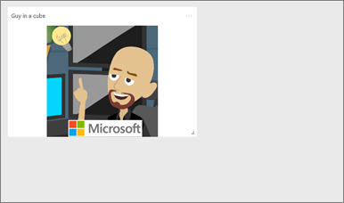
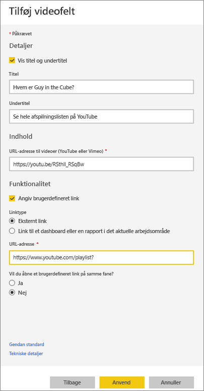
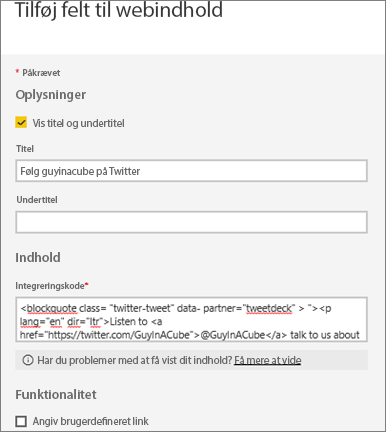
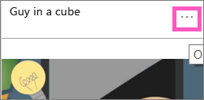
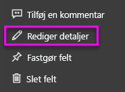

# <a name="add-image-text-video-and-more-to-your-dashboard"></a>Føj billede, tekst, video og mere til dit dashboard
<iframe width="560" height="315" src="https://www.youtube.com/embed/e2PD8m1Q0vU" frameborder="0" allowfullscreen></iframe>


## <a name="add-tile"></a>Tilføj felt
Med kontrolelementet **Tilføj felt** kan du direkte føje et billede, et tekstfelt, en video, streamingdata eller en webkode til dit dashboard.

1. Vælg **Tilføj felt** fra den øverste menulinje. Afhængigt af pladsbegrænsninger kan du måske kun se plustegnet .
   
    
2. Vælg, hvilken type felt du vil tilføje: **Billede**, **Tekstfelt**, **Video**, **Webindhold** eller **Brugerdefineret streamingdata**.
   
    

## <a name="add-an-image"></a>Tilføj et billede
Lad os antage, at du vil have dit firmalogo på dashboardet eller et andet billede. Du skal gemme billedfilen online og oprette en kæde til den. Kontrollér, at der ikke kræves særlige legitimationsoplysninger for at få adgang til billedfilen. Eksempelvis kræver OneDrive og SharePoint godkendelse, så billeder, der er gemt der, kan ikke føjes til et dashboard på denne måde.  

1. Vælg **Billede** > **Næste**.
2. Føj billedoplysninger til ruden **Tilføj billedfelt**.
   
    
   
   * Hvis du vil have vist en titel over billedet, skal du vælge *Vis titel og undertitel* og skrive en titel og/eller undertitel.
   * Angiv URL-adressen til billedet
   * Hvis feltet skal være et hyperlink, skal du vælge **Angiv tilpasset link** og angive URL-adressen.  Når kollegaer klikker på dette billede eller denne titel, føres de til denne URL-adresse.
   * Vælg **Anvend**.  Tilpas størrelsen på, og flyt billedet efter behov på dashboardet.
     
     

## <a name="add-a-text-box-or-dashboard-heading"></a>Tilføj et tekstfelt eller en dashboardoverskrift
1. Vælg **Tekstfelt > Næste**.
   
   > **BEMÆRK**! Du kan tilføje en dashboardoverskrift ved at skrive overskriften i tekstfeltet og forøge skrifttypen.
   > 
2. Formatér tekstfeltet:
   
   * Hvis du vil have vist en titel over tekstfeltet, skal du vælge **Vis titel og undertitel** og skrive en titel og/eller undertitel.
   * Angiv og formatér indholdet for tekstfeltet.  
   * Angiv eventuelt et tilpasset link til titlen. Et brugerdefineret link kan være et eksternt websted eller et dashboard eller en rapport i arbejdsområdet. Vi har dog i dette eksempel tilføjet hyperlinks i selve tekstfeltet, så lad bare feltet **Angiv tilpasset link** være umarkeret.

     
   
3. Vælg **Anvend**.  Tilpas størrelsen på, og flyt tekstfeltet efter behov på dashboardet.
   
   

## <a name="add-a-video"></a>Tilføj en video
Når du føjer et YouTube- eller Vimeo-videofelt til dit dashboard, afspilles videoen direkte på dashboardet.

1. Vælg **Video > Næste**.
2. Føj videooplysninger til ruden **Tilføj videooplysninger**.
   
    
   
   * Hvis du vil have vist en titel og undertitel øverst i videofeltet, skal du vælge *Vis titel og undertitel* og skrive en titel og/eller undertitel. I dette eksempel vil vi tilføje en undertitel og derefter ændre den til et hyperlink tilbage til hele afspilningslisten på YouTube.
   * Angiv URL-adressen til videoen
   * Tilføj et hyperlink til titlen og undertitlen.  Når dine kollegaer ser den integrerede video, vil du muligvis gerne have, at de ser hele afspilningslisten på YouTube – tilføj et link til afspilningslisten her.
   * Vælg **Anvend**.  Tilpas størrelsen på, og flyt videofeltet efter behov på dashboardet.
     
      
3. Vælg videofeltet for at afspille videoen.
4. Vælg undertitlen for at besøge afspilningslisten på YouTube.

## <a name="add-streaming-data"></a>Tilføj streamingdata
<iframe width="560" height="315" src="https://www.youtube.com/embed/kOuINwgkEkQ" frameborder="0" allowfullscreen></iframe>

## <a name="add-web-content"></a>Tilføj webindhold
Indsæt eller skriv HTML-indhold.  Power BI føjer det til dit dashboard som et felt. Angiv integreringskoden manuelt, eller kopiér/indsæt fra websteder som Twitter, YouTube, embed.ly og flere.

1. Vælg **Webindhold > Næste**.
2. Føj oplysninger til ruden **Tilføj felt til webindhold**.
   
    
   
   * Hvis du vil have vist en titel over feltet, skal du vælge *Vis titel og undertitel* og skrive en titel og/eller undertitel.
   * Angiv integreringskoden. I dette eksempel skal vi kopiere og indsætte et Twitter-feed.
3. Vælg **Anvend**.  Tilpas størrelsen på, og flyt feltet til videoindholdet som nødvendigt på dashboardet.
     
      

## <a name="tips-for-embedding-web-content"></a>Tip til at integrere webindhold
* Til iframes skal du bruge en sikker kilde. Hvis du angiver din iframe-integreringskode og får et tomt felt, skal du undersøge, om du bruger **http** til iframe-kilden.  Hvis det er tilfældet, skal du ændre den til **https**.
  
  ```
  <iframe src="https://xyz.com">
  ```
* Rediger oplysninger for bredde og højde. Denne integreringskode integrerer en video og indstiller videoafspilleren til 560 x 315 pixel.  Denne størrelse ændres ikke, når du ændrer størrelsen på feltet.
  
  ```
  <iframe width="560" height="315"
  src="https://www.youtube.com/embed/Cle_rKBpZ28" frameborder="0"
   allowfullscreen></iframe>
  ```
  
  Hvis afspillerens størrelse skal tilpasses feltets størrelse, skal du indstille bredden og højden til 100 %.
  
  ```
  <iframe width="100%" height="100%"
  src="https://www.youtube.com/embed/Cle_rKBpZ28" frameborder="0"
   allowfullscreen></iframe>
  ```
* Denne kode integrerer et tweet og bevarer, som separate links på dashboardet, links til **AFK**-podcasten, **@GuyInACube's Twitter-side**, **Follow**, **#analytics**, **reply**, **retweet** og **like**.  Hvis du vælger selve feltet, føres du til podcasten på Twitter.
  
  ```
  <blockquote class="twitter-tweet" data-partner="tweetdeck">
  <p lang="en" dir="ltr">Listen to
  <a href="https://twitter.com/GuyInACube">@GuyInACube</a> talk to
  us about making videos about Microsoft Business Intelligence
  platform
  <a href="https://t.co/TmRgalz7tv">https://t.co/TmRgalz7tv </a>
  <a href="https://twitter.com/hashtag/analytics?src=hash">
  #analytics</a></p>&mdash; AFTK Podcast (@aftkpodcast) <a
  href="https://twitter.com/aftkpodcast/status/693465456531771392">
  January 30, 2016</a></blockquote> <script async src="//platform.twitter.com/widgets.js" charset="utf-8"></script>
  ```

## <a name="edit-a-tile"></a>Rediger et felt
Sådan foretager du ændringer af et felt...

1. Lad markøren hvile over feltets øverste højre hjørne, og vælg ellipsen.
   
    
2. Vælg redigeringsikonet for at åbne ruden **Feltoplysninger** igen og foretage ændringer.
   
    

## <a name="considerations-and-troubleshooting"></a>Overvejelser og fejlfinding
* Du kan gøre det lettere at flytte feltet på dashboardet ved at tilføje en titel og/eller undertitel.
* Hvis du vil integrere indhold fra et websted, men webstedet ikke giver dig integreringskoden, der skal kopieres og indsættes, skal du tjekke embed.ly for at få hjælp til at generere integreringskoden.

## <a name="next-steps"></a>Næste trin
[Dashboardfelter](service-dashboard-tiles.md)

Har du flere spørgsmål? [Prøv at spørge Power BI-community'et](http://community.powerbi.com/).

