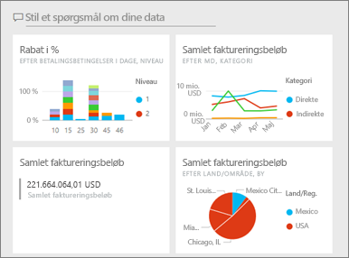
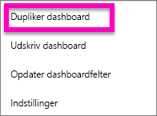
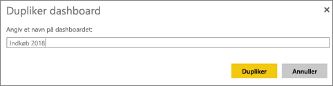
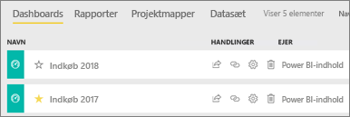

# Opret en kopi af et Power BI-dashboard

Der er mange forskellige grunde til at lave en kopi af et dashboard, som du ejer. Kopien gemmes i det aktive (det samme) arbejdsområde. Måske vil du foretage ændringer og teste ydeevnen i forhold til originalen, eller måske vil du oprette forskellige versioner til at dele ud til hhv. kollegaer, områder eller teams. Måske kan en kollega godt lide dit dashboard design og ønsker at bruge det i rapporter til hendes overordnede. En anden årsag kunne være, hvis du har en ny database med samme datastruktur og datatyper, og du gerne vil genbruge det dashboard, du allerede har oprettet – det kan også lade sig gøre, men det kræver noget arbejde i Power BI Desktop. 

Dashboards, der er blevet delt med dig som en app, kan ikke duplikeres.

1. Åbn dashboardet.
2. Fra øverste højre hjørne skal du vælge ellipsen (...) og vælge **Dupliker dashboard**.
   
   
3. Giv dashboardet et navn, og vælg **Dupliker**. 
   
   
4. Det nye dashboard gemmes i det samme arbejdsområde som originalen. 
   
   

## Næste trin
* [Rediger, flyt og tilpas størrelsen af felter](service-dashboard-edit-tile.md) 
* [Tip til udformning af et fantastisk dashboard](service-dashboards-design-tips.md) 

Har du flere spørgsmål? [Prøv Power BI-community'et](http://community.powerbi.com/)

