# Opret et Power BI-dashboard fra en rapport
Du har læst [Dashboards i Power BI](service-dashboards.md), og nu vil du oprette dit eget. Der er mange forskellige måder at oprette et dashboard på – fra en rapport, fra bunden, fra et datasæt, ved at kopiere et eksisterende dashboard og meget mere.  

Det kan virke overvældende, når du starter for første gang, så vi begynder med hurtigt og nemt at oprette et dashboard ved at fastgøre visualiseringer fra en rapport, der allerede er oprettet. Når du er færdig med denne hurtige introduktion, vil du have en god forståelse af relationen mellem dashboards og rapporter, åbning af Redigeringsvisning i rapporteneditoren, fastgørelse af felter og skift mellem et dashboard og en rapport. Derefter skal du bruge linkene i Indholdsfortegnelse til venstre eller **Næste trin** nederst for at fortsætte til mere avancerede emner.

## Hvem kan oprette et dashboard?
Oprettelse af et dashboard er en **opretter**funktion og kræver redigeringsrettigheder til rapporten. Redigeringstilladelser er tilgængelige for rapportoprettere og de kolleger, opretteren giver adgang til. Hvis David f.eks. opretter en rapport i workspaceABC og derefter tilføjer dig som medlem af dette arbejdsområde, har både du og David redigeringsrettigheder. På anden side, hvis en rapport er blevet delt med dig direkte eller som en del af en [Power BI-app](service-install-use-apps.md) (du **bruger** rapporten), kan du ikke fastgøre felter til et dashboard.

> **BEMÆRK!** Dashboards er en funktion i Power BI-tjenesten ikke Power BI Desktop. Der kan ikke oprettes dashboards på Power BI-mobilenheder, men du kan [få dem vist og dele dem](mobile-apps-view-dashboard.md).
>
> 

## Video: Opret et dashboard ved at fastgøre visualiseringer og billeder fra en rapport
Se Amanda oprette et nyt dashboard ved at fastgøre visualiseringer fra en rapport. Prøv det derefter på egen hånd vha. Indkøbsanalyse-eksemplet ved at følge trinnene under videoen.

<iframe width="560" height="315" src="https://www.youtube.com/embed/lJKgWnvl6bQ" frameborder="0" allowfullscreen></iframe>

### Forudsætninger
Hvis du vil følge med, skal du downloade eksemplet "Indkøbsanalyse" til Excel-projektmappen og åbne det i Power BI-tjenesten (app.powerbi.com).

## Importér et datasæt med en rapport
Vi importerer et af eksempeldatasættene i Power BI og bruger det til at oprette vores nye dashboard. Det eksempel, vi bruger, er en Excel-projektmappe med to PowerView-ark. Når du importerer projektmappen til Power BI, føjes der et datasæt og en rapport til dit arbejdsområde.  Rapporten oprettes automatisk ud fra PowerView-arkene.

1. [Vælg dette link](http://go.microsoft.com/fwlink/?LinkId=529784) for at downloade og gemme Excel-filen med eksempel på indkøbsanalyse. Det anbefales, at du gemme den i din OneDrive for Business.
2. Åbn Power BI-tjenesten i din browser (app.powerbi.com).
3. Vælg **Mit arbejdsområde**.
4. Vælg **Hent data** i navigationen til venstre.

    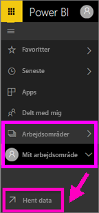
5. Vælg **Filer**.

   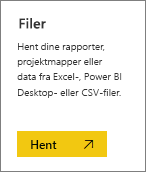
6. Naviger til den placering, hvor du har gemt Excel-filen med eksempel på indkøbsanalyse. Markér den, og vælg **Opret forbindelse**.

   
7. Til denne øvelse skal du vælge **Importér**.

    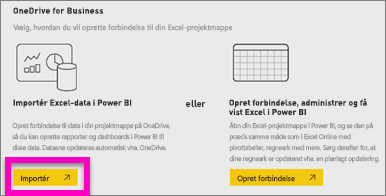
8. Når du får vist meddelelsen om, at processen lykkedes, skal du klikke på **x** for at lukke den.

   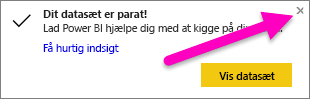

### Åbn rapporten, og fastgør nogle felter på et dashboard
1. Bliv i samme arbejdsområde, og vælge fanen **Rapporter**. Den nyligt importerede rapport vises med en gul stjerne. Markér navnet på rapporten for at åbne den.

    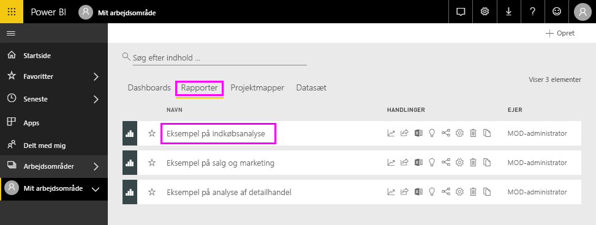
2. Rapporten åbnes i [læsevisning](service-reading-view-and-editing-view.md). Bemærk, at den har to faner nederst: Discount Analysis (Rabatanalyse) og Spend Overview (Udgiftsoversigt). Hver fane repræsenterer en side i rapporten.
    Vælg **Rediger rapport** for at åbne rapporten i Redigeringsvisning.

    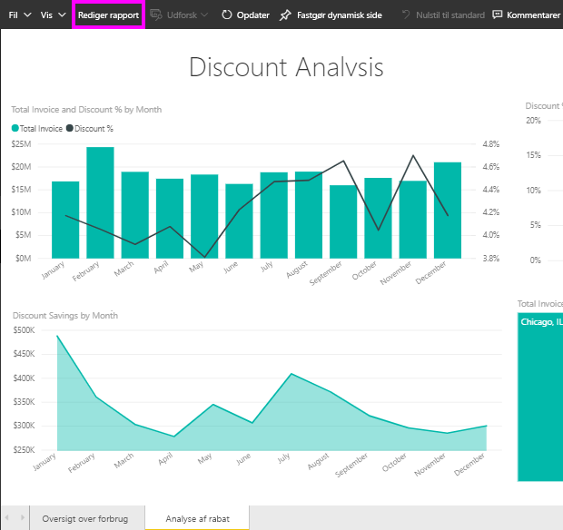
3. Peg på en visualisering for at få vist de tilgængelige indstillinger. Hvis du vil føje en visualisering til et dashboard, skal du vælge ikonet til fastgørelse .

    
4. Da vi opretter et nyt dashboard, skal du markere indstillingen for **nyt dashboard** og give den et navn.

   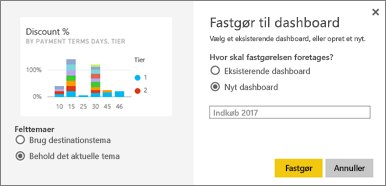
5. Når du vælger **Fastgør**, opretter Power BI det nye dashboard i det aktuelle arbejdsområde. Når meddelelsen **Fastgjort til dashboard** vises, skal du vælge **Gå til dashboard**. Hvis du bliver bedt om at gemme rapporten, skal du vælge **Gem**.

     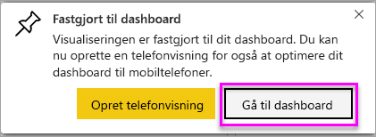
6. I Power BI åbnes det nye dashboard, og der er ét felt – den visualisering, du lige har fastgjort.

   
7. Markér feltet for at vende tilbage til rapporten. Fastgør nogle flere felter til det nye dashboard. Når vinduet **Fastgør til dashboard** vises, skal du denne gang vælge **Eksisterende dashboard**.  

   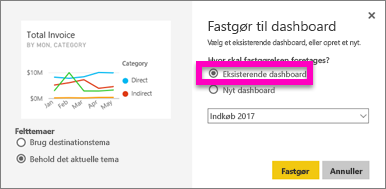

## Fastgør en hel rapportside til dashboardet
I stedet for at fastgøre én visualisering ad gangen, kan du [fastgøre en hel rapportside som et *dynamisk felt*](service-dashboard-pin-live-tile-from-report.md). Lad os gøre det.

1. I rapporteditoren skal du vælge fanen **Udgiftsoversigt** for at åbne side 2 i rapporten.

   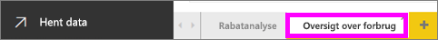

2. Du vil have alle disse visualiseringer på dit dashboard.  I øverste højre hjørne af menulinjen skal du vælge **Fastgør en dynamisk side**. På et dashboard opdateres felter for dynamiske sider hver gang, siden opdateres.

   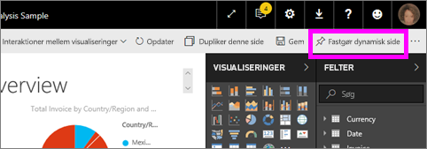

3. Når vinduet **Fastgør til dashboard** vises, skal du vælge **Eksisterende dashboard**.

   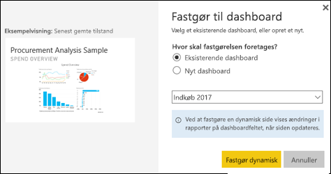

4. Når du får vist en meddelelse om, at handlingen er udført, skal du vælge **Gå til dashboard**. Der kan du se de felter, du har fastgjort fra rapporten. I nedenstående eksempel har vi fastgjort to felter fra side 1 i rapporten, og ét dynamisk felt, som udgør side 2 i rapporten.

   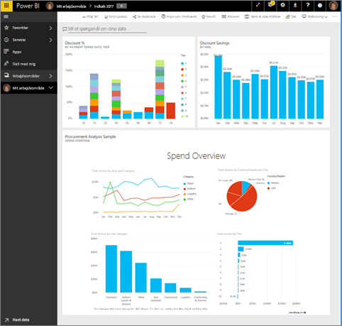

Tillykke med oprettelsen af dit første dashboard! Nu, hvor du har et dashboard, er der så utroligt meget, du kan bruge det til.  Prøv en af de foreslåede **Næste trin** nedenfor, eller begynd at afspille og udforske på egen hånd.   

## Næste trin
* [Tilpas størrelsen af felter, og flyt dem](service-dashboard-edit-tile.md)
* [Alt om dashboardfelter](service-dashboard-tiles.md)
* [Del dit dashboard ved at oprette en app](service-create-distribute-apps.md)
* [Power BI – Grundlæggende begreber](service-basic-concepts.md)
* [Tip til udformning af et fantastisk dashboard](service-dashboards-design-tips.md)

Har du flere spørgsmål? [Prøv at spørge Power BI-community'et](http://community.powerbi.com/)
