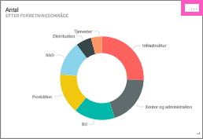
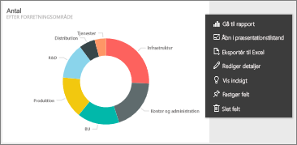

# Rediger eller fjern et dashboard-felt
Du kan ændre, hvordan et felt ser ud og fungerer på i et dashboard.

<iframe width="560" height="315" src="https://www.youtube.com/embed/lJKgWnvl6bQ" frameborder="0" allowfullscreen></iframe>

Denne artikel omhandler følgende.

* [Fastgør et felt til et andet dashboard](#different)
* [Omdøb et felt](#rename)
* [Flyt et felt](#move)
* [Tilpas feltstørrelse](#resize)
* [Føj et hyperlink til et felt](#hyperlink)
* [Slet et felt](#delete)
  
  > [!TIP]
  > Hvis du vil ændre visualiseringen, der vises på selve feltet, skal du slette feltet og tilføje et nyt [dashboard-felt](service-dashboard-tiles.md).
  > 
  > 

## Sådan kommer du i gang
1. Åbn et [dashboard](service-dashboards.md) med mindst ét felt. 
   
   
2. Peg på et dashboard-felt, og vælg ellipsen for at få vist indstillingerne.
   
   

## Fastgør feltet til et dashboard
1. Vælg ikonet **Fastgør felt** .
2. Find ud af, om du vil fastgøre til et eksisterende dashboard eller et nyt dashboard. 
   
   
3. Vælg **Fastgør**.

- - -

## Omdøb feltet og rediger feltoplysningerne
Vælg ikonet Feltoplysninger  for at redigere titlen og visningen af tidspunktet for den seneste opdatering.

- - -

## Flyt feltet
Vælg, og hold feltet for at trække det til en ny placering på dashboardlærredet.

- - -

## Tilpas feltets størrelse
Et felt kan tilpasses til mange forskellige størrelser – fra 1x1 feltenheder og op til 5x5. Vælg, og træk i håndtaget (i nederste højre hjørne) for at tilpasse feltets størrelse.
    

- - -

## Rediger standardlinket
Når du vælger et felt, føres du som standard hen til rapporten, hvor feltet blev oprettet, eller til spørgsmål og svar (hvis feltet er oprettet i spørgsmål og svar). Hvis du vil oprette et link til et andet dashboard eller rapport (i det samme arbejdsområde), en SSRS-rapport eller andet online-indhold, så skal du indsætte et brugerdefineret link:

1. Vælg ikonet **Rediger oplysninger**  for at redigere feltet.
2. Sæt en markering ud for **Indsæt brugerdefineret link**, og vælg linktypen.    
   
   * Angiv URL-adressen for et eksternt link.     
   * Hvis du vil indsætte et link til et dashboard eller en rapport i det aktuelle arbejdsområde, kan du vælge det i rullemenuen.
   
   

- - -

## Slet feltet
* Vælg ikonet **Slet felt**  for at slette feltet. Når du sletter et felt, slettes den underliggende rapport eller visualiseringen ikke.

- - -
## Næste trin
[Dashboard-felter i Power BI](service-dashboard-tiles.md)

[Dashboards i Power BI](service-dashboards.md)

[Power BI – Grundlæggende begreber](service-basic-concepts.md)

Har du flere spørgsmål? [Prøv Power BI-community'et](http://community.powerbi.com/)

