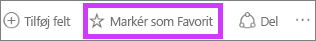
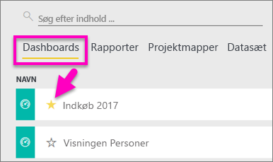
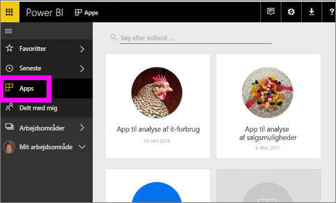
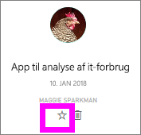
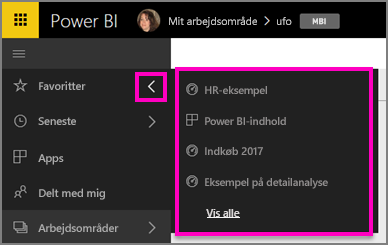
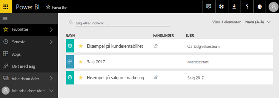
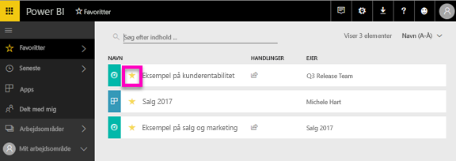

# Foretrukne dashboards, rapporter og apps i Power BI-tjenesten
Når du gør indhold til en *favorit*, kan du få adgang til det fra alle dine arbejdsområder.  Favoritter er normalt det indhold, du besøger oftest.

> [!NOTE]
> Dette emne gælder for Power BI-tjenesten, og ikke Power BI Desktop.
> 
> 

Du kan også vælge et enkelt dashboard som et [udvalgt dashboard](service-dashboard-featured.md) i Power BI-tjenesten.

## Tilføj et dashboard eller en rapport som en *favorit*
Se Amanda føje favoritter til sit arbejdsområde, og følg derefter den trinvise vejledning under videoen for selv at prøve det.

<iframe width="560" height="315" src="https://www.youtube.com/embed/G26dr2PsEpk" frameborder="0" allowfullscreen></iframe>

1. Åbn et dashboard eller en rapport, som du ofte bruger. Selv indhold, der er blevet delt med dig, kan være en *favorit*.
2. Vælg **Favorit** eller ikonet Stjerne  i øverste højre hjørne af Power BI-tjenesten.
   
   
   
   Du kan også gøre et dashboard eller en rapport til favorit fra fanen **Dashboards** eller indholdsvisningen **Rapporter** i arbejdsområdet.
   
   

## Tilføj en app som en *favorit*

1. Vælg **Apps** i venstre navigationsrude.

   

2. Hold musen over en app til at få vist flere detaljer.  Vælg ikonet Stjerne   for at gøre det til favorit.
   
   

## Arbejd med *favoritter*
1. Du kan få adgang til dine favoritter fra et hvilket som helst arbejdsområde ved at vælge pilen til højre for **Favoritter**.  Herfra kan du vælge en favorit for at åbne den. Kun fem favoritter vises (alfabetisk). Hvis du har mere end fem, skal du vælge **Se alle** for at åbne skærmbilledet Favoritter (se nr. 2 herunder). 
   
   
2. Hvis du vil se **alt** det indhold, du har tilføjet som favoritter, skal du i venstre navigationsrude vælge **Favoritter** eller ikonet Favoritter .  
   
    
   
   Her kan du udføre handlinger: åbne, identificere ejere og endda dele med dine kollegaer.

## Fjern markering af indhold som favorit
Bruger du ikke længere en rapport så ofte, som du plejede?  Du kan fjerne det fra favoritter. Når du fjerner indhold fra favoritter, fjernes det fra listen med dine favoritter, men ikke fra Power BI.

1. Vælg **Favoritter** i venstre navigationsrude for at åbne skærmbilledet **Favoritter**.
   
   
2. Vælg den gule stjerne ud for det indhold, der skal fjernes som favorit.

> **Bemærk**! Du kan også fjerne et dashboard, en rapport eller en app som favorit. Du skal blot åben og fjerne markeringen det gule ikon.   
> 
> 

## Næste trin
[Introduktion til Power BI](service-get-started.md)

[Power BI – Grundlæggende begreber](service-basic-concepts.md)

Har du flere spørgsmål? [Prøv at spørge Power BI-community'et](http://community.powerbi.com/)

