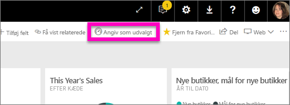
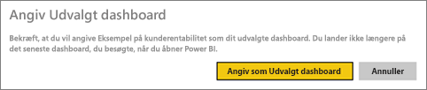
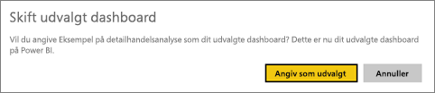
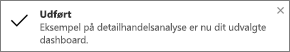
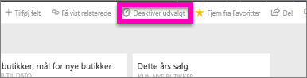

# Udvalgte dashboards i Power BI-tjenesten
## Opret et udvalgt dashboard
Mange af os har ét dashboard, som vi besøger oftere end andre.  Det kan være det dashboard, vi bruger til at køre vores virksomhed, eller det kan være et dashboard, der indeholder en sammenlægning af felter fra mange forskellige dashboards og rapporter.

Når du markerer et dashboard som *udvalgt*, vises dette dashboard, hver gang du åbner Power BI-tjenesten.  

Du kan også vælge et par dashboards og angive dem som *Favoritter*. Se [dashboardfavoritter](service-dashboard-favorite.md).

> [!NOTE] 
>Dette emne gælder for Power BI-tjenesten, og ikke Power BI Desktop.

Hvis du endnu ikke har angivet et udvalgt dashboard, vises det senest anvendte dashboard, når du åbner Power BI.  

### Sådan angiver du et dashboard som **udvalgt**
Se, hvordan Amanda opretter et udvalgt dashboard, og følg derefter vejledningen under videoen for at prøve det selv.

<iframe width="560" height="315" src="https://www.youtube.com/embed/G26dr2PsEpk" frameborder="0" allowfullscreen></iframe>

1. Åbn det dashboard, du vil angive som *udvalgt*. 
2. På den øverste navigationslinje kan du enten se **Angiv som udvalgt** eller blot ikonet for udvalgt . Vælg en af mulighederne.
   
    
3. Bekræft dit valg.
   
    

## Skift det udvalgte dashboard
Hvis du senere skifter mening, kan du angive et nyt dashboard som udvalgt.

1. Følg trin 1 og 2 ovenfor.
   
    
2. Vælg **Angiv som udvalgt**. Hvis du fjerner markeringen "Udvalgt" for et dashboard, fjernes det ikke fra dit arbejdsområde.  
   
    

## Fjern det udvalgte dashboard
Hvis du beslutter dig for, at du ikke vil have et dashboard markeret som "Udvalgt", skal du gøre følgende for at fjerne markeringen.

1. Åbn det dashboard, der er i øjeblikket er markeret som "Udvalgt".
2. Vælg **Deaktiver udvalgt** på den øverste navigationslinje.
   
    

Nu åbner Power BI det senest anvendte dashboard.  

## Næste trin
[Gør et dashboard til favorit](service-dashboard-favorite.md)

Har du flere spørgsmål? [Prøv at spørge Power BI-community'et](http://community.powerbi.com/)

