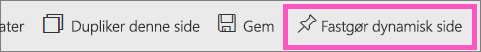
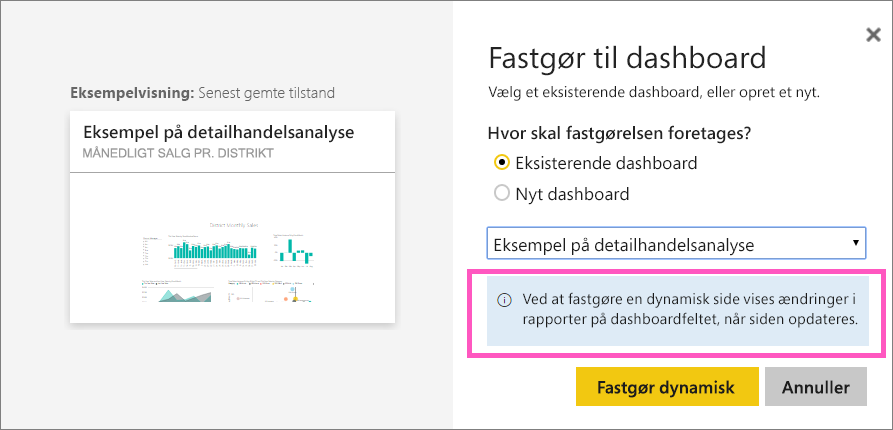
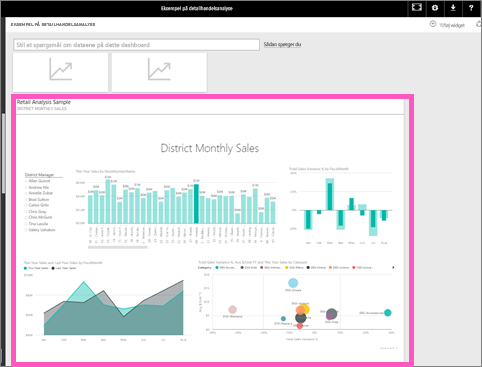

# Fastgør en hel rapportside, som et dynamisk felt, til et Power BI-dashboard
En anden måde at tilføje et nyt [dashboardfelt](consumer/end-user-tiles.md) på er ved at fastgøre en hel rapportside. Dette er en nem metode til at fastgøre mere end én visualisering ad gangen.  Når du fastgør en hel side, er felterne også *dynamiske*, og du kan interagere med dem direkte på dashboardet. Og de ændringer, du foretager af visualiseringerne i rapporteditoren, f.eks. ved at tilføje et filter eller ændre de felter, der bruges i diagrammet, afspejles også i dashboardfeltet.  

Det er kun muligt at fastgøre dynamiske felter fra rapporter på dashboards i Power BI-tjenesten (app.powerbi.com).

> [!NOTE]
> Du kan ikke fastgøre felter fra rapporter, der deles med dig.
> 
> 

## Fastgør en rapportside
Se Amanda fastgøre en dynamisk rapportside til et dashboard, og følg derefter den trinvise vejledning under videoen for selv at prøve det.

<iframe width="560" height="315" src="https://www.youtube.com/embed/EzhfBpPboPA" frameborder="0" allowfullscreen></iframe>

1. Åbn en rapport i [redigeringstilstand](service-interact-with-a-report-in-editing-view.md).
2. Vælg **Fastgør dynamisk side** på menulinjen, uden at der er valgt visualiseringer.
   
    
3. Fastgør feltet til et eksisterende dashboard eller et nyt dashboard. Læg mærke til den fremhævede tekst: *Ved at fastgøre en dynamisk side vises ændringer i rapporter på dashboardfeltet, når siden opdateres.*
   
   * Eksisterende dashboard: Vælg navnet på dashboardet på rullelisten. Dashboards, der er blevet delt med dig, vises ikke på rullelisten.
   * Nyt dashboard: Skriv navnet på det nye dashboard.
     
     
4. Vælg **Fastgør dynamisk**. En meddelelse om fuldførelse (næsten helt oppe i højre hjørne) giver dig besked om, at siden er blevet føjet til dit dashboard som et felt.

## Åbn dashboardet for at se det fastgjorte felt
1. Vælg dashboardet med det nye dynamiske felt i navigationsruden. Her kan du f.eks. [omdøbe, ændre størrelse på, sammenkæde og flytte](service-dashboard-edit-tile.md) den fastgjorte rapportside.  
2. Interager med det dynamiske felt.  På skærmbilledet herunder har valg af en søjle i søjlediagrammet filtreret og fremhævet de andre visualiseringer i feltet i tværgående retning.
   
    

## Næste trin
[Dashboards i Power BI](consumer/end-user-dashboards.md)

Har du flere spørgsmål? [Prøv at spørge Power BI-community'et](https://community.powerbi.com/)

