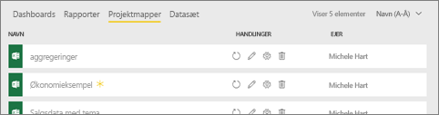
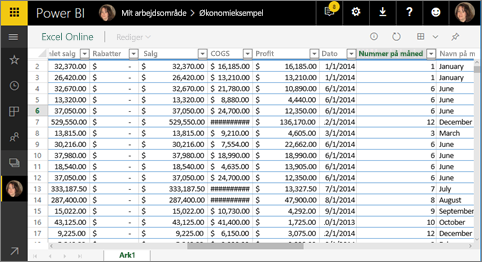
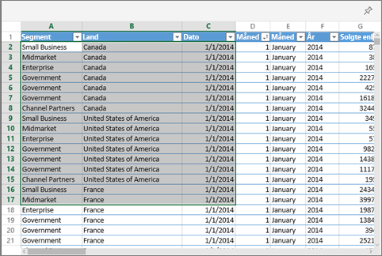
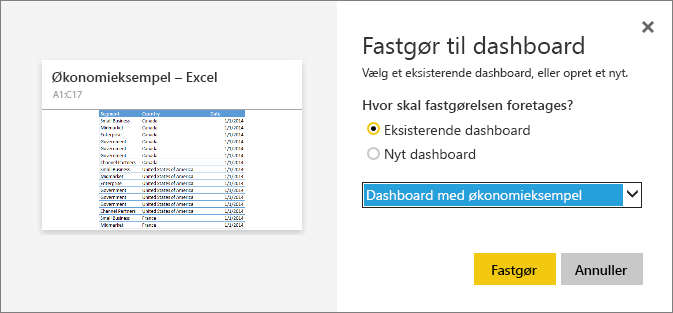

# Fastgør et felt til et Power BI-dashboard fra Excel
Før du kan fastgøre et felt fra din Excel-projektmappe, skal du oprette forbindelse mellem denne projektmappe og Power BI-tjenesten (app.powerbi.com). Når der oprettes forbindelse til en projektmappe, overføres der grundlæggende set en sammenkædet skrivebeskyttet version af denne projektmappe til Power BI-tjenesten, så du kan fastgøre intervaller til dashboards. Du kan endda fastgøre et helt regneark til et dashboard.  
Hvis en projektmappe er blevet delt med dig, kan du få vist de felter, der er fastgjort af ejeren, men ikke selv oprette nogen felter i dashboardet. 

Du kan finde detaljerede oplysninger om, hvordan Excel og Power BI arbejder sammen, under [Hent data fra Excel-projektmappefiler](http://go.microsoft.com/fwlink/?LinkID=521962).

Se Will demonstrere flere metoder til at importere data fra, og oprette forbindelse til, Excel-projektmapper.

<iframe width="560" height="315" src="https://www.youtube.com/embed/l8JoB7w0zJA" frameborder="0" allowfullscreen></iframe>

## Opret forbindelse mellem din Excel-projektmappe fra OneDrive for Business og Power BI
Når du vælger **Opret forbindelse**, vises din projektmappe i Power BI på samme måde, som den ville blive vist i Excel Online. Men i modsætning til Excel Online får du nogle fantastiske funktioner, så du kan fastgøre elementer fra dine regneark direkte i dine dashboards.

Du kan ikke redigere din projektmappe i Power BI. Men hvis du har brug for at foretage ændringer, kan du vælge blyantsikonet under fanen **Projektmapper** i arbejdsområdet og derefter vælge at redigere projektmappen i Excel Online eller åbne den i Excel på din computer. Alle ændringer, du foretager, gemmes i projektmappen på OneDrive.

1. Upload din projektmappe til OneDrive for Business.
2. Fra Power BI skal du [oprette forbindelse til denne projektmappe](service-excel-workbook-files.md) ved at vælge **Hent Data > Filer > OneDrive – Business** og gå til den placering, hvor du har gemt Excel-filen. Markér filen, og vælg **Opret forbindelse > Opret forbindelse**.

   

3. I Power BI føjes projektmappen til fanen **Projektmapper** i arbejdsområdet.  Ikonet  angiver, at dette er en Excel-projektmappe, og en gul stjerne angiver, at den er ny.
   
    
   
4. Åbn projektmappen i Power BI ved at vælge navnet på projektmappen.

    Ændringer, du foretager af projektmappen i Power BI, gemmes ikke og påvirker ikke den oprindelige projektmappe på OneDrive for Business. Hvis du sorterer, filtrerer eller ændrer værdierne i Power BI, kan disse ændringer ikke gemmes eller fastgøres. Hvis du vil foretage ændringer, der skal gemmes, skal du vælge **Rediger** i øverste højre hjørne for at åbne og redigere i Excel Online eller Excel. Det kan tage et par minutter at opdatere felterne på dashboardene med ændringer, der foretages på denne måde.
   
   
   

## Fastgør et celleområde til et dashboard
Én måde at tilføje et nyt [dashboardfelt](service-dashboard-tiles.md) på er i en Excel-projektmappe i Power BI. Områder kan fastgøres fra Excel-projektmapper, der er gemt på OneDrive for Business eller et andet gruppedelt dokumentbibliotek. Områderne kan indeholde data, diagrammer, tabeller, pivottabeller, pivotdiagrammer og andre Excel-dele.

1. Fremhæv de celler, som du vil fastgøre til et dashboard.
   
    
2. Vælg fastgørelsesikonet . 
3. Fastgør feltet til et eksisterende dashboard eller til et nyt dashboard. 
   
   * Eksisterende dashboard: Vælg navnet på dashboardet på rullelisten.
   * Nyt dashboard: Skriv navnet på det nye dashboard.
   
    
4. Vælg **Fastgør**. En meddelelse om fuldførelse (næsten helt oppe i højre hjørne) giver dig besked om, at området er blevet føjet til dit dashboard som et felt. 
   
    
5. Vælg **Gå til dashboard**. Herfra kan du [omdøbe, sammenkæde, flytte og tilpasse størrelsen af](service-dashboard-edit-tile.md) den fastgjorte visualisering. Som standard åbnes projektmappen i Power BI, når du vælger det fastgjorte felt.

## Fastgør en hel tabel eller et pivotdiagram til et dashboard
Følg trinnene herover, bortset fra at du i stedet for at markere et celleområde skal markere en hel tabel eller pivottabel.

Hvis du vil fastgøre en tabel, skal du markere hele tabelområdet og sørge for at medtage overskrifterne.  Hvis du vil fastgøre en pivottabel, skal du medtage alle synlige dele af pivottabellen, herunder filtre, hvis de bruges.

 

Et felt, der er oprettet ud fra en tabel eller en pivottabel, viser hele tabellen.  Hvis du tilføjer/fjerner/filtrerer rækker eller kolonner i den oprindelige projektmappe, vil de også blive tilføjet/fjernet/filtreret i feltet.

## Få vist den projektmappe, der er sammenkædet med feltet
Hvis du vælger et felt til projektmappen, åbnes den sammenkædede projektmappe i Power BI. Da projektmappefilen er placeret på ejerens OneDrive for Business, kræver visning af projektmappen, at du har læsetilladelse til projektmappen. Hvis du ikke har tilladelse, får du vist en fejlmeddelelse.  

 

## Overvejelser og fejlfinding
Funktioner, der ikke understøttes: Power BI bruger Excel Services til at hente felterne i projektmappen. Eftersom nogle funktioner fra Excel ikke understøttes i Excel Services REST API, vil de derfor ikke kunne ses på felter i Power BI. Eksempel: minidiagrammer, betinget formatering angivet via ikoner og klokkeslætsudsnit. Se en fuldstændig liste over ikke-understøttede funktioner i [Ikke-understøttede funktioner i Excel Services REST API](http://msdn.microsoft.com/library/office/ff394477.aspx)

## Næste trin
[Del et dashboard, der indeholder links til en Excel-projektmappe](service-share-dashboard-that-links-to-excel-onedrive.md)

[Hent data fra Excel-projektmapper](service-excel-workbook-files.md)

Har du flere spørgsmål? [Prøv at spørge Power BI-community'et](http://community.powerbi.com/)

