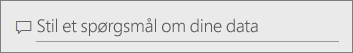
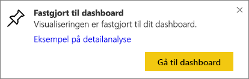

# Fastgør et felt til et dashboard fra Spørgsmål og svar
## Sådan fastgør du et felt fra Spørgsmål og svar
Spørgsmål og svar er Power BI's ad hoc-rapporteringsværktøj. Brug for at finde en bestemt indsigt? Stil et spørgsmål om dine data, og få svar i form af en visualisering.

> **BEMÆRK**! Åbn [eksemplet på detailhandelsanalyse](sample-retail-analysis.md) for at følge med.
> 
> 

1. Åbn et [dashboard](service-dashboards.md) med mindst ét felt fastgjort fra en rapport. Når du stiller et spørgsmål, leder Power BI efter svaret i de datasæt, hvor et felt er fastgjort til dette dashboard.  Du kan få flere oplysninger i [Hent data](service-get-data.md).
2. I spørgsmålsfeltet øverst i dit dashboard skal du begynde at indtaste, hvad du vil vide om dine data.  
   
3. Mens du f.eks. skriver "last year sales by month and territory"...  
   
   
   giver spørgsmålsfeltet dig forslag.
4. Hvis du vil føje diagrammet til dit dashboard som et felt, skal du vælge nålen  øverst til højre på canvasset.
5. Fastgør feltet til et eksisterende dashboard eller til et nyt dashboard. 
   
   * Eksisterende dashboard: Vælg navnet på dashboardet på rullelisten. Dine valg vil være begrænset til kun disse dashboards i det aktuelle arbejdsområde.
   * Nyt dashboard: Skriv navnet på det nye dashboard, og det vil blive føjet til dit aktuelle arbejdsområde.
6. Vælg **Fastgør**.
   
   En meddelelse om fuldførelse (næsten helt oppe i højre hjørne) giver dig besked om, at visualiseringen er blevet føjet til dit dashboard som et felt.  
   
   
7. Vælg **Gå til dashboard** for at se det nye felt. Der kan du [omdøbe, tilpasse størrelsen på, tilføje et hyperlink for og flytte feltet og meget mere](service-dashboard-edit-tile.md) på dit dashboard. 
   
   

## Overvejelser og fejlfinding
* Når du begynder at indtaste et spørgsmål, begynder Spørgsmål og svar straks at søge efter det bedste svar fra alle de datasæt, der er knyttet til det aktuelle dashboard.  Det "aktuelle dashboard" er det dashboard, der er angivet på den øverste navigationslinje. For eksempel er dette spørgsmål blevet stillet i dashboardet **Retail Analysis Sample**, der er en del af **mihart**-apparbejdsområdet.
  
  
* **Hvordan ved Spørgsmål og svar, hvilke datasæt der skal bruges**?  Spørgsmål og svar har adgang til alle datasæt, der har visualiseringer fastgjort til dette dashboard.

## Næste trin
[Omdøb, tilpas størrelse, tilføj et hyperlink, flyt feltet og meget mere](service-dashboard-edit-tile.md)    
[Få vist dit dashboardfelt i fokustilstand](service-focus-mode.md)     
[Tilbage til Spørgsmål og svar i Power BI](service-q-and-a.md)  
Har du flere spørgsmål? [Prøv Power BI-community'et](http://community.powerbi.com/)

